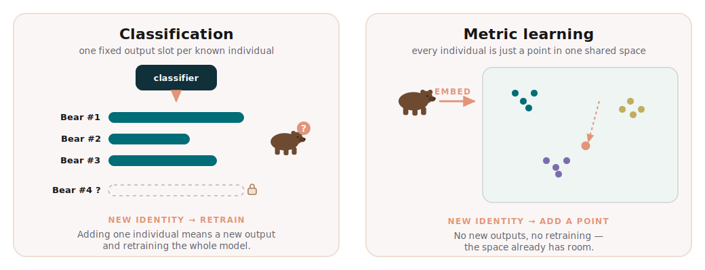
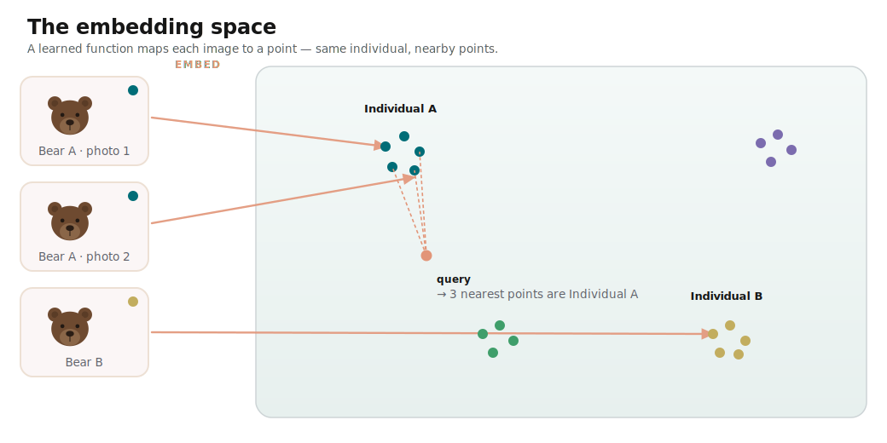

## The problem: a gallery that never stops growing

## Why classification hits a wall

*A classifier needs a slot per identity — a new individual means a retrain. Metric learning just drops another point into the space.*

## The core idea: turn images into points

*Each image becomes a point. Same individual, nearby points — identification turns into nearest-neighbour search.*

## Shaping the space: a short history of losses

## Making it work in practice

## Where this shows up in conservation
