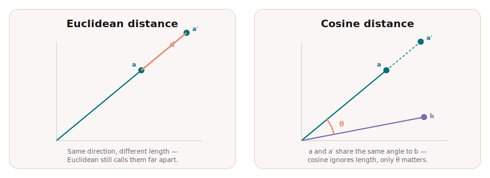
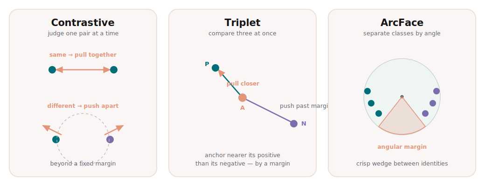
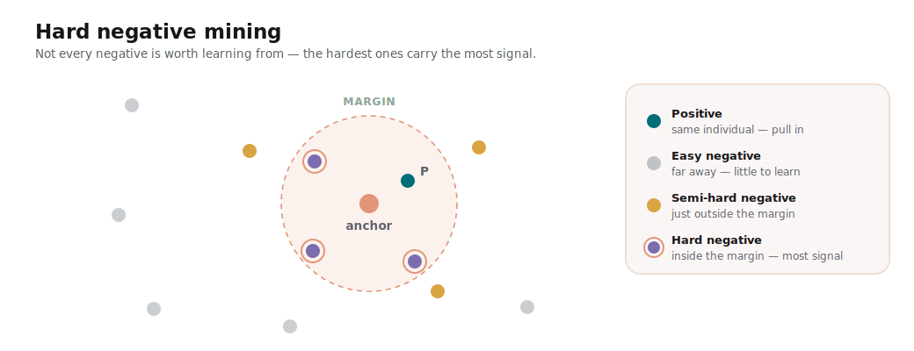

Camera traps and field photos arrive by the thousand, and for conservation the
first question is almost always the same: *have we seen this animal before?*
Answering it — recognising an individual across time, cameras, and seasons — is
called **re-identification**, and it underpins how researchers count
populations, follow movements, and measure whether protection is working.

This is a visual, intuition-first tour of **metric learning**: the idea behind
most modern re-identification systems. No heavy maths — just the shape of the
problem and why this approach fits it so well.

## The problem: a gallery that never stops growing

A wildlife population is not a fixed list. Cubs are born, individuals wander
into a new valley, and a camera at Brooks Falls will happily photograph a bear
no one has ever logged. The set of identities you care about is *open* and
always growing — and at deployment you mostly meet individuals that were never
in your training data.

The visual signal varies too. Brown bears carry no unique fur markings, so the
clue lives in the face; trout and seals wear unique spot and coat patterns.
Either way the task is identical: match this image to a known individual, or
recognise that it is someone new.

## Why classification hits a wall

The obvious first instinct is to train a classifier — one output per
individual. That works for a small, fixed cast. But it breaks the moment the
population grows: adding one individual means adding an output and retraining
the whole model, and a classifier can never recognise someone it was never
trained on. For an open, ever-growing set, that is a dead end.

*A classifier needs a slot per identity — a new individual means a retrain. Metric learning just drops another point into the space.*

We need something that handles identities it has never seen before.

## The core idea: turn images into points

Metric learning changes the question. Instead of predicting a label, we train a
neural network to map each image to a vector — an **embedding** — and we shape
that mapping so two images of the *same* individual land close together while
*different* individuals land far apart.

*Each image becomes a point. Same individual, nearby points — identification turns into nearest-neighbour search.*

That vector space is the **embedding space**, and once it exists,
identification becomes geometry. Embed a new photo, then look at its nearest
neighbours: if they are a known bear, it is probably the same bear; if
everything nearby is far away, it is probably someone new. Adding an individual
needs no retraining at all — you just store one more point. That is exactly why
the approach scales to open populations.

How do we measure "close"? Two choices dominate — tap each:



*Euclidean cares about length; cosine cares only about direction.*

In practice embeddings are usually length-normalised, which makes cosine
similarity the natural fit — only the direction of each vector carries the
identity.

## Shaping the space: a short history of losses

A network only learns this neat geometry if the training signal rewards it.
That signal is the **loss function**, and the good ideas built on each other.



*Pairs pull and push; triplets compare three at once; ArcFace separates identities by angle.*

The story runs roughly like this. **Contrastive** loss starts with pairs —
pull the same individual together, push different ones apart past a margin — but
it judges each pair in isolation. **Triplet** loss adds context by comparing
three images at once, asking only that the anchor sit closer to its positive
than to its negative; relative comparisons turn out to be far more stable than
absolute thresholds. **Circle** loss refines *how hard* each comparison is
pushed, re-weighting by how far it still has to move. And **ArcFace** reframes
everything in terms of angles on a sphere, carving crisp wedges between
identities — which is why it has become the default for faces, including the
bear face recogniser we will point to at the end.

## Making it work in practice

A trained loss is only half the battle; the other half is *which* examples you
show it.

*The hardest negatives — the ones that sneak inside the margin — carry the most learning signal.*

Most pairs are easy — two obviously different animals tell the model nothing it
does not already know. **Hard negative mining** deliberately seeks out the
confusing cases: the lookalikes that slip inside the margin and produce the
biggest learning signal. Strategies range from easy through *semi-hard* to fully
*hard*, and choosing well makes training far more efficient on imbalanced field
data.

Two more practical pieces complete the picture:

- **Evaluation — accuracy@k / recall@k.** Re-identification is a retrieval
  problem, so we ask a retrieval question: is the correct individual among the
  top *k* matches? Tracking accuracy@1, @5, and @10 reflects how the system is
  actually used — surface a short list of candidates for a human to confirm.
- **Seeing the space — UMAP / t-SNE.** Embeddings live in hundreds of
  dimensions, but projecting them down to two lets you *watch* clusters form
  over training. It is the quickest sanity check that the space is taking the
  shape you want.

Architecturally, none of this is exotic: a backbone pretrained for feature
extraction (a ResNet or ConvNeXt) with a small embedder head on top, trained
end-to-end with one of the losses above.

## Where this shows up in conservation

This is the recipe behind our [bear face recognition system]()
— and the reason it generalises. The geometry never changes; only the data and the crop are
species-specific. Swap brown bear faces for trout flanks or seal coats and the
same machinery re-identifies a different animal.

It also sits alongside other identification approaches rather than replacing
them. Where individuals carry rich local texture, matching keypoints directly
with [local feature matching]()
is a strong alternative; metric learning instead learns a single global
embedding per image. And whichever route you take, the result is only as good
as the data feeding it — [careful preparation of the crops and splits]()
is what keeps the evaluation honest.


