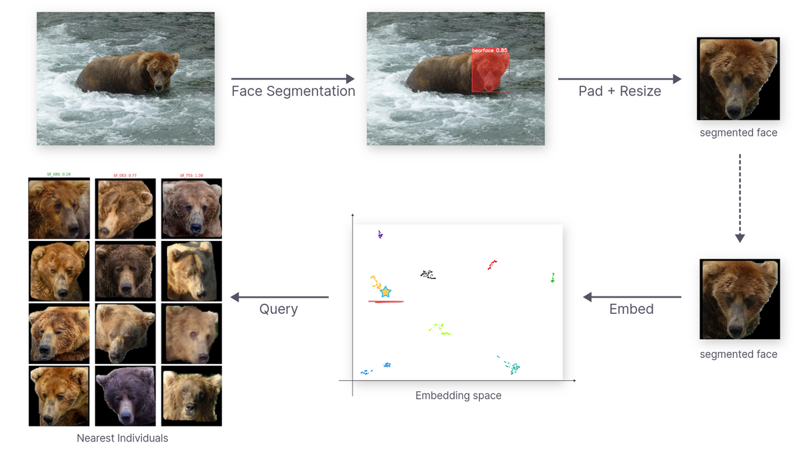
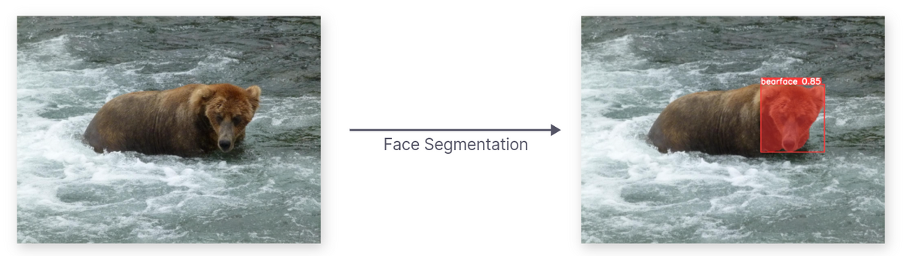
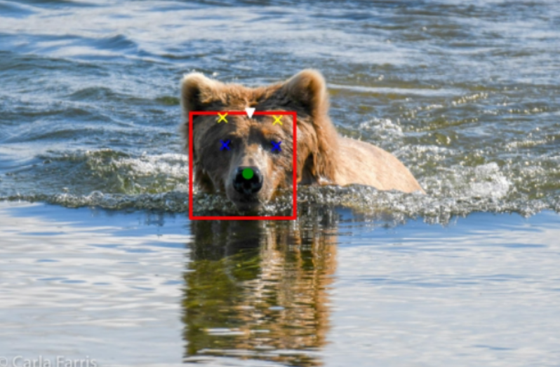
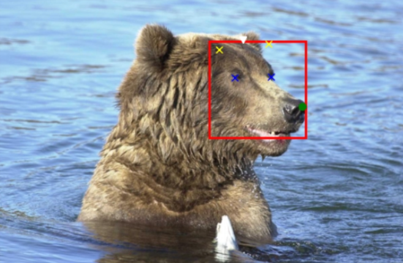
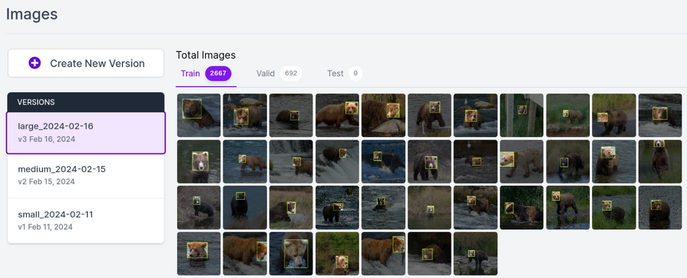
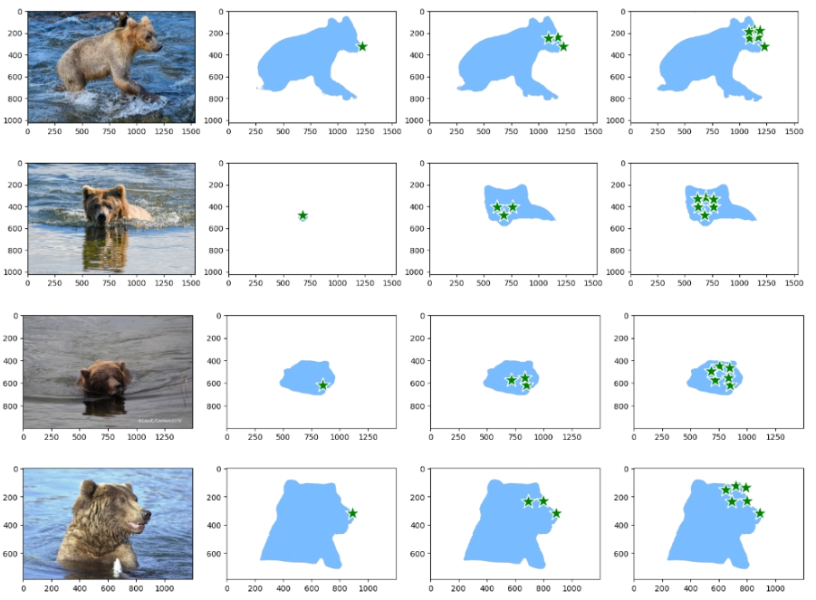

Intro
Overview of the pipeline
Explain the face segmentation stage

1. Annotating a Dataset with a labelling tool: Roboflow, Labelbox, etc.
2. Leveraging SAM to segment out bears from pictures
3. Combining body masks and face bboxes to get face masks

4. Dataset

Number of pictures
Bursts of pictures

Datasplit:

Split by date to avoid train/test leakage

5. Modelling approach

Evaluation metrics
YOLOv8n instance segmentation task
Data augmentation

6. Results and Performances

Conclusion

In this blog post we'll delve into the technical development of a bear face segmentation system which is a critical component of the bear identification system developed in close collaboration with the [BearID Project](https://bearresearch.org/) NGO.

> Our research and software tool will provide a replicable technique and
> general approach that can be applied to other species beyond bears, which
> could aid conservation efforts worldwide.
>
> <cite>– BearID Project</cite>

For a comprehensive understanding of this project, please click on the pipeline
overview below:

<a href='' title="Project Details">
  
</a>
 
 

## Project Scope

While many species boast distinctive fur patterns for identification,
brown bears lack consistent and unique markings. Furthermore, their
weight can fluctuate significantly between seasons and throughout their
lifetimes. Consequently, facial recognition emerges as a valuable
alternative for individual identification.

In this article, our focus lies on the initial stage of the bear
identification system, which involves bear face instance segmentation.

*Bear Face Instance Segmentation*

The computer vision model responsible for localizing and segmenting bear
faces must operate with high accuracy. Consistency in providing the
system with accurate bear face data is crucial for the development of a
robust bear face identification system.

## Provided Dataset

The [BearID Project](https://bearresearch.org) has compiled a collection
of approximately 3400 bear images, showcasing their facial features,
captured over recent years in forests across British Columbia and Brooks
Falls.

  

    
    
    
    
  

  <em>Gallery / Different individuals from the <a href="https://bearresearch.org" target="_blank">BearID Project</a></em>

### Exploratory Data Analysis

Exploratory Data Analysis (EDA) is an approach to analyzing datasets to
summarize their main characteristics, often employing visual methods. The
primary goal of EDA is to uncover patterns, relationships, and anomalies in the
data, which can then inform subsequent analysis or modeling tasks.

EDA typically involves the following steps:

1. __Data Collection__: Gathering the relevant dataset(s) from various sources.
2. __Data Cleaning__: Identifying and handling missing values, outliers, and
   inconsistencies in the data.
3. __Summary Statistics__: Computing descriptive statistics such as mean,
   median, mode, standard deviation, etc., to understand the central tendencies
and variability of the data.
4. __Data Visualization__: Creating visual representations of the data using
   plots, charts, histograms, scatter plots, etc., to explore patterns,
distributions, correlations, and trends within the data.
5. __Exploratory Modeling__: Building simple models or using statistical
   techniques to further understand relationships within the data.
6. __Hypothesis Testing__: Formulating and testing hypotheses about the data to
   validate assumptions or gain insights.
7. __Iterative Analysis__: Iteratively exploring the data, refining analysis
   techniques, and generating new hypotheses as insights emerge.

EDA is a crucial initial step in any data analysis or modeling project as it
helps analysts gain a deeper understanding of the dataset, identify potential
challenges or biases, and inform subsequent analytical decisions. It provides a
foundation for more advanced analyses, such as predictive modeling, hypothesis
testing, or machine learning, by guiding feature selection, model building, and
evaluation strategies.

#### Data quality issues

##### Inaccurate bounding boxes and facial landmarks

Each bear image is accompanied by the following labels:

- Bear identification string: such as Amber, Beatrice, Bella, etc.
- Bounding boxes outlining bear heads.
- Facial landmarks: including the left eye, right eye, nose, mouth, left
ear, and right ear.

  

    
    
  

  <em>Gallery / Provided labels by <a href="https://bearrearch.org">The BearID Project</a> - Amber (left) and Bella (right)</em>

The provided bounding boxes and facial landmarks, generated by the [Dlib](http://dlib.net/) library, may not always be highly accurate. Further information about the development process and its backstory can be found [here](https://bearresearch.org/2018/04/bearid-backstory/).

##### Bursts of images

When encountering a bear, photographs or camera traps often capture
multiple images of the same individual in very similar poses. Proper
handling of these bursts of images during data splitting is crucial.
Neglecting this step may lead to train/test data leakage, which can
cause the model to inaccurately overreport its performance.

### Data Annotation

#### Bounding Boxes

To effectively train a bear face segmentation model, we first require high quality 
bounding boxes for each provided image. 

During this stage, we evaluated several options for generating bear bounding boxes, including [Roboflow](https://roboflow.com/) and
[GroundingDINO](https://github.com/IDEA-Research/GroundingDINO).

##### Manual Annotations - Roboflow

To facilitate the relabeling of the bear dataset, we utilized
[Roboflow](https://roboflow.com/), a platform designed to streamline the
labeling process. The labeling task was delegated to a team of four
annotators, each provided with clear instructions on how to accurately
segment a bear's face.

> Adjust the bounding box to accurately encompass __the entire bear
> head__, ensuring it covers __both ears__, the __nose__ and the
> __mouth__.
> Strive for a compact bounding box that encapsulates the complete head
> and fur while minimizing unnecessary space.
>
> <cite>Labeling Instrunctions</cite>

*Gallery / Roboflow annotation session*

##### GroundingDINO

<b>GroundingDINO</b> is a multimodal framework that combines Vision
Transformers (ViTs) with language grounding for image-text matching tasks. It
leverages the power of transformer-based models for both image and text
modalities, enabling efficient processing of visual and textual information. By
grounding textual descriptions with visual features, GroundingDINO achieves
improved performance in tasks such as image retrieval and cross-modal
understanding.

 
 

#### Segmentation Masks with SAM

To effectively train a bear face segmentation model, we require a
segmentation mask for each provided image. The relabeled bounding boxes
represent the initial step toward obtaining segmented bear heads.

The __Segment Anything Model__ (SAM) produces high quality object masks
from input prompts such as points or boxes, and it can be used to
generate masks for all objects in an image. It has been trained on a
dataset of 11 million images and 1.1 billion masks, and has strong
zero-shot performance on a variety of segmentation tasks.

*SAM Github / SAM output example*

We utilized a subset of the provided facial landmarks to instruct SAM in
segmenting the complete bear bodies. Our assessment revealed that using
the three facial landmarks—nose, left eye, and right eye—proved accurate
enough to generate high-quality bear body masks.

*Prompting SAM with facial landmarks to segment bear bodies*
