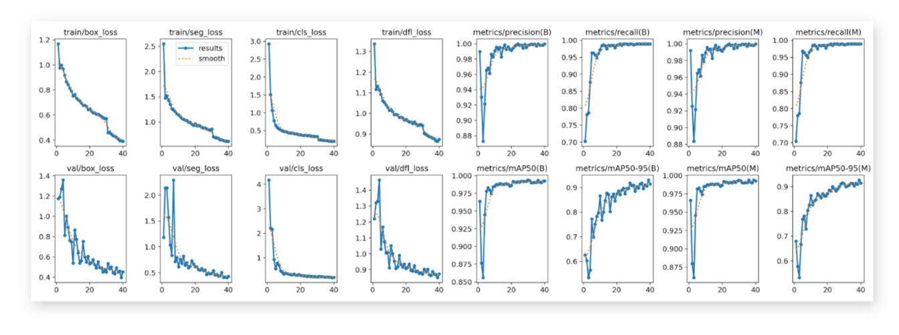

In this blog post we'll delve into the technical development of a bear face
segmentation system which is a critical component of the bear identification
system developed in close collaboration with the [BearID
Project](https://bearresearch.org/) NGO.

> Our research and software tool will provide a replicable technique and
> general approach that can be applied to other species beyond bears, which
> could aid conservation efforts worldwide.
>
> <cite>– BearID Project</cite>

For a comprehensive understanding of this project, please click on the pipeline
overview below:

<a href='' title="Project Details">
  
</a>
 
 

## Project Scope

While many species boast distinctive fur patterns for identification,
brown bears lack consistent and unique markings. Furthermore, their
weight can fluctuate significantly between seasons and throughout their
lifetimes. Consequently, facial recognition emerges as a valuable
alternative for individual identification.

In this article, our focus lies on the initial stage of the bear
identification system, which involves bear face instance segmentation.

*Bear Face Instance Segmentation*

The computer vision model responsible for localizing and segmenting bear
faces must operate with high accuracy. Consistency in providing the
system with accurate bear face data is crucial for the development of a
robust bear face identification system.

## Provided Dataset

The [BearID Project](https://bearresearch.org) has compiled a collection
of approximately 3400 bear images, showcasing their facial features,
captured over recent years in forests across British Columbia and Brooks
Falls.

  

    
    
    
    
  

  <em>Gallery / Different individuals from the <a href="https://bearresearch.org" target="_blank">BearID Project</a></em>

### Exploratory Data Analysis

Exploratory Data Analysis (EDA) is an approach to analyzing datasets to
summarize their main characteristics, often employing visual methods. The
primary goal of EDA is to uncover patterns, relationships, and anomalies in the
data, which can then inform subsequent analysis or modeling tasks.

EDA typically involves the following steps:

1. __Data Collection__: Gathering the relevant dataset(s) from various sources.
2. __Data Cleaning__: Identifying and handling missing values, outliers, and
   inconsistencies in the data.
3. __Summary Statistics__: Computing descriptive statistics such as mean,
   median, mode, standard deviation, etc., to understand the central tendencies
and variability of the data.
4. __Data Visualization__: Creating visual representations of the data using
   plots, charts, histograms, scatter plots, etc., to explore patterns,
distributions, correlations, and trends within the data.
5. __Exploratory Modeling__: Building simple models or using statistical
   techniques to further understand relationships within the data.
6. __Hypothesis Testing__: Formulating and testing hypotheses about the data to
   validate assumptions or gain insights.
7. __Iterative Analysis__: Iteratively exploring the data, refining analysis
   techniques, and generating new hypotheses as insights emerge.

EDA is a crucial initial step in any data analysis or modeling project as it
helps analysts gain a deeper understanding of the dataset, identify potential
challenges or biases, and inform subsequent analytical decisions. It provides a
foundation for more advanced analyses, such as predictive modeling, hypothesis
testing, or machine learning, by guiding feature selection, model building, and
evaluation strategies.

#### Data quality issues

##### Inaccurate bounding boxes and facial landmarks

Each bear image is accompanied by the following labels:

- Bear identification string: such as Amber, Beatrice, Bella, etc.
- Bounding boxes outlining bear heads.
- Facial landmarks: including the left eye, right eye, nose, mouth, left
ear, and right ear.

  

    
    
  

  <em>Gallery / Provided labels by <a href="https://bearrearch.org">The BearID Project</a> - Amber (left) and Bella (right)</em>

The provided bounding boxes and facial landmarks, generated by the
[Dlib](http://dlib.net/) library, may not always be highly accurate. Further
information about the development process and its backstory can be found
[here](https://bearresearch.org/2018/04/bearid-backstory/).

##### Bursts of images

When encountering a bear, photographs or camera traps often capture
multiple images of the same individual in very similar poses. Proper
handling of these bursts of images during data splitting is crucial.
Neglecting this step may lead to train/test data leakage, which can
cause the model to inaccurately overreport its performance.

  

    
    
    
    
  

  <em>Gallery / Provided labels by <a href="https://bearrearch.org">The BearID Project</a> - A burst of images with the same individual</em>

### Data Annotation

#### Bounding Boxes

To effectively train a bear face segmentation model, we first require high
quality bounding boxes for each provided image.

During this stage, we evaluated several options for generating bear bounding
boxes, including [Roboflow](https://roboflow.com/) and
[GroundingDINO](https://github.com/IDEA-Research/GroundingDINO).

##### Manual Annotations - Roboflow

To facilitate the relabeling of the bear dataset, we utilized
[Roboflow](https://roboflow.com/), a platform designed to streamline the
labeling process. The labeling task was delegated to a team of four
annotators, each provided with clear instructions on how to accurately
segment a bear's face.

> Adjust the bounding box to accurately encompass __the entire bear
> head__, ensuring it covers __both ears__, the __nose__ and the
> __mouth__.
> Strive for a compact bounding box that encapsulates the complete head
> and fur while minimizing unnecessary space.
>
> <cite>Labeling Instrunctions</cite>

*Gallery / Roboflow annotation session*

##### GroundingDINO

<b>GroundingDINO</b> is a multimodal framework that combines Vision
Transformers (ViTs) with language grounding for image-text matching tasks. It
leverages the power of transformer-based models for both image and text
modalities, enabling efficient processing of visual and textual information. By
grounding textual descriptions with visual features, GroundingDINO achieves
improved performance in tasks such as image retrieval and cross-modal
understanding.

 
 

We initiated GroundingDINO with the textual prompt: "head of bear", and
evaluated its ability to localize bear heads by comparing its outputs with the
manually annotated dataset. Intersection over Union (IoU)
$$\mathit{IoU} = \dfrac{A \cap B}{A \cup B}$$
was employed to assess the accuracy of GroundingDINO-generated bounding boxes.

A histogram illustrating the distribution of IoU scores
was generated. Remarkably, 95% of GroundingDINO's
predictions exhibited an IoU greater than 68%,
indicating its proficiency in localizing bear faces

*GroundingDINO IoU Evaluation / Green bboxes are manual labels while red bboxes
are generated by GDINO*

In future projects akin to this one, the labor-intensive
task of manually labeling bounding boxes around bear
faces could potentially be automated using tools akin to
GroundingDINO, given its demonstrated high accuracy.

#### Segmentation Masks with SAM

To effectively train a bear face segmentation model, we require a
segmentation mask for each provided image. The relabeled bounding boxes
represent the initial step toward obtaining segmented bear heads.

The __Segment Anything Model__ (SAM) produces high quality object masks
from input prompts such as points or boxes, and it can be used to
generate masks for all objects in an image. It has been trained on a
dataset of 11 million images and 1.1 billion masks, and has strong
zero-shot performance on a variety of segmentation tasks.

*SAM Github / SAM output example*

We utilized a subset of the provided facial landmarks to instruct SAM in
segmenting the complete bear bodies. Our assessment revealed that using
the three facial landmarks—nose, left eye, and right eye—proved accurate
enough to generate high-quality bear body masks.

*Prompting SAM with facial landmarks to segment bear bodies*

The image below summarized the approach taken to generate the bear segmented
heads combining bounding boxes and SAM.

*Generating Bear Face Masks combining bboxes and SAM*

## Data Modeling

### Data Split

To mitigate the risk of train/test data leakage caused by the bursts of
images mentioned earlier, we identified two straightforward options for
conducting the data split: either by date or by individual.

### Instance Segmentation

The task at hand is now framed as an instance segmentation problem,
where the model is tasked with learning to identify and outline bear
faces within input images.

But what exactly is instance segmentation? Let's say you have a picture
of a park filled with people, trees, and benches. While basic object
detection recognizes these elements, instance segmentation takes it a
step further. It not only identifies the presence of people, trees, and
benches but also discerns each individual instance of these objects. For
example, if there are three people in the park photo, instance
segmentation will label and outline each person separately. This
detailed segmentation enables the computer to not only recognize what
objects are in the image but also precisely locate each instance of
those objects.

### Evaluation Metrics

To evaluate the performance of our model, we are monitoring the
following metrics across multiple training runs on both the train and
validation sets:

- Box(P, R, mAP50, mAP50-95): This metric provides insights into the
model's performance in detecting objects:
- Mask(P, R, mAP50, mAP50-95): This metric provides insights into the
model's performance in segmenting objects:
  - P (Precision): The accuracy of the segmented objects, indicating how many detections were correct.
  - R (Recall): The ability of the model to identify all instances of objects in the images.
  - mAP50: Mean average precision calculated at an intersection over union (IoU) threshold of 0.50. It's a measure of the model's accuracy considering only the "easy" detections.
  - mAP50-95: The average of the mean average precision calculated at varying IoU thresholds, ranging from 0.50 to 0.95. It gives a comprehensive view of the model's performance across different levels of detection difficulty.

Further documentation is available [here](https://docs.ultralytics.com/guides/yolo-performance-metrics/#object-detection-metrics).

### YOLOv8

#### Overview

We opted to utilize a pretrained
[YOLOv8](https://github.com/ultralytics/ultralytics) model and fine-tune it for
our specific instance segmentation task. Renowned for its speed, accuracy, and
user-friendly interface, YOLOv8 stands out as an ideal solution for various
tasks, including object detection, tracking, instance segmentation, image
classification, and pose estimation.

*YOLOv8 Computer Vision Tasks*

#### Training

After initially training a baseline model for a few epochs on the dataset, we
selected a model size of 'nano' and fine-tuned it for 40 epochs using the
default augmentation settings provided by the YOLOv8 framework.

#### Evaluation

We analyze the precision-recall curve on the test set to evaluate the
model's performance objectively. Additionally, we examine the predicted
masks to qualitatively assess the model's performance.

*Quantitative Results / Precision Recall Curve*

*Qualitative Results / Samples of Predicted Masks*

Thus, the fine-tuned YOLOv8 model showcases exceptional accuracy in bear
face instance segmentation, laying the foundation for a robust bear
identification system.

## Conclusion

The state-of-the-art instance segmentation model,
tailored specifically for segmenting bear faces from
images, establishes a robust foundation for a bear
identification system. This adaptable approach can be
extended to various species and holds promising
potential for advancing conservation efforts.

*Segmented bear faces by the ML model*
