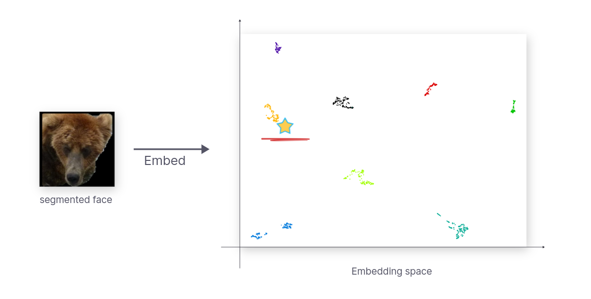
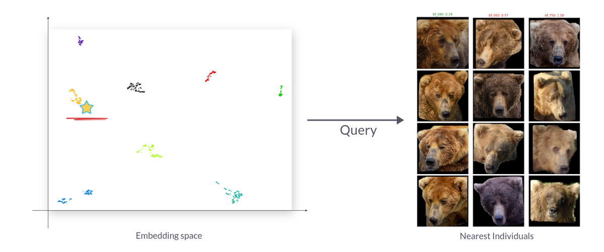
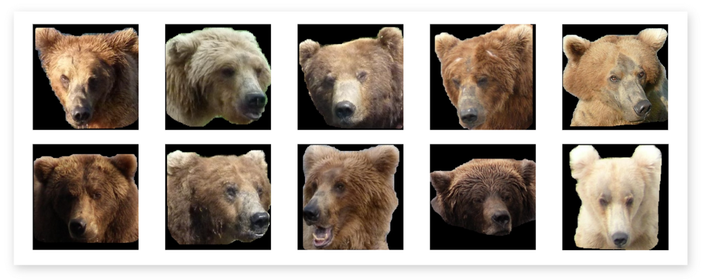
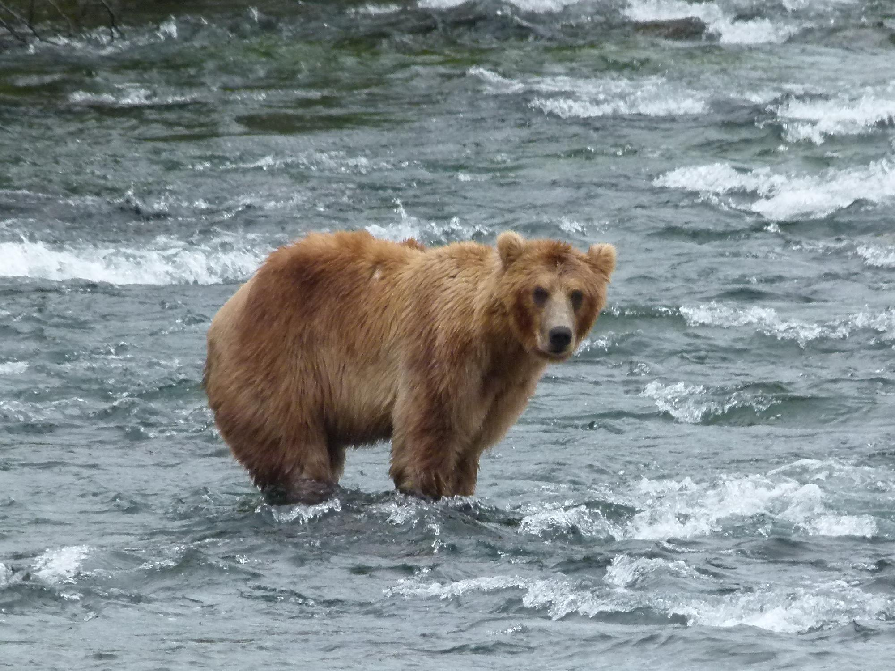
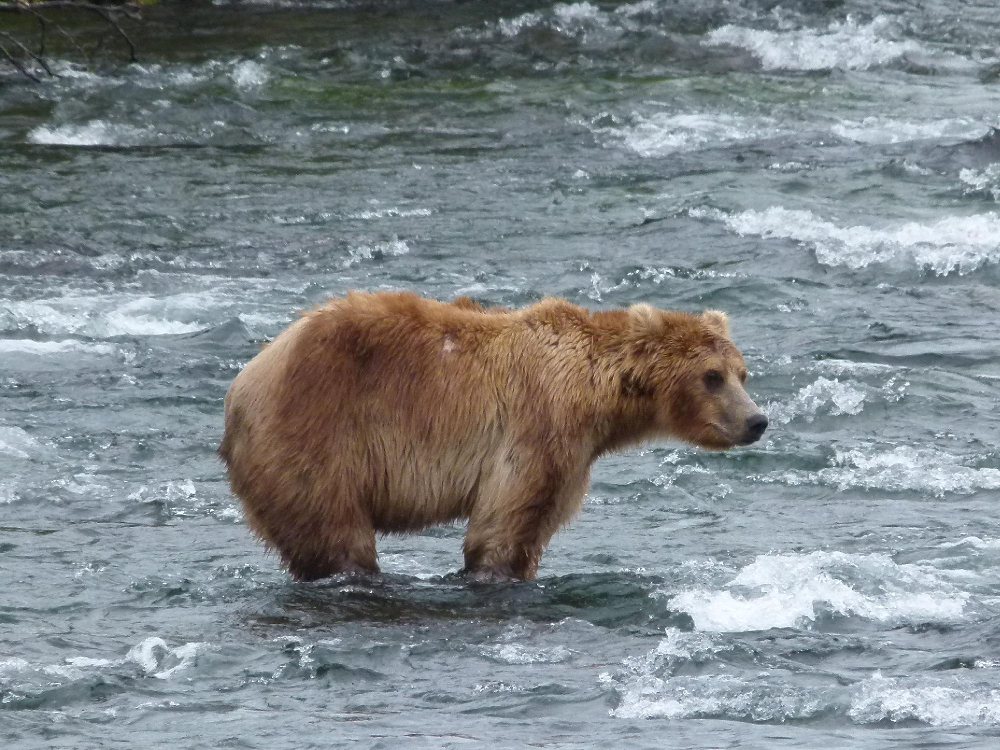
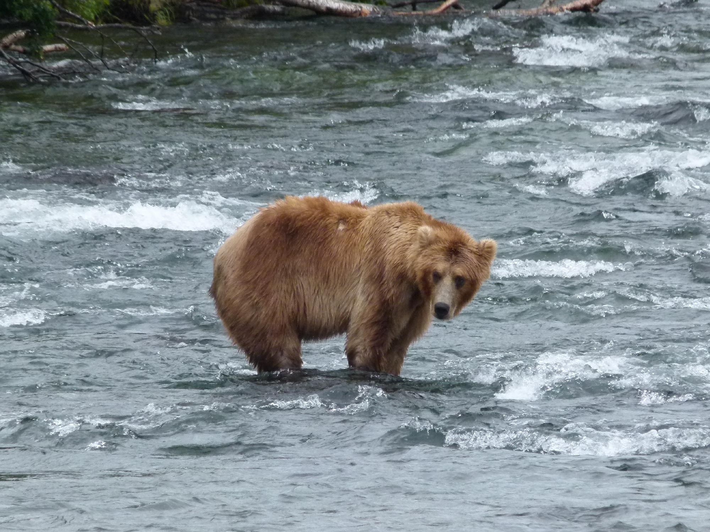
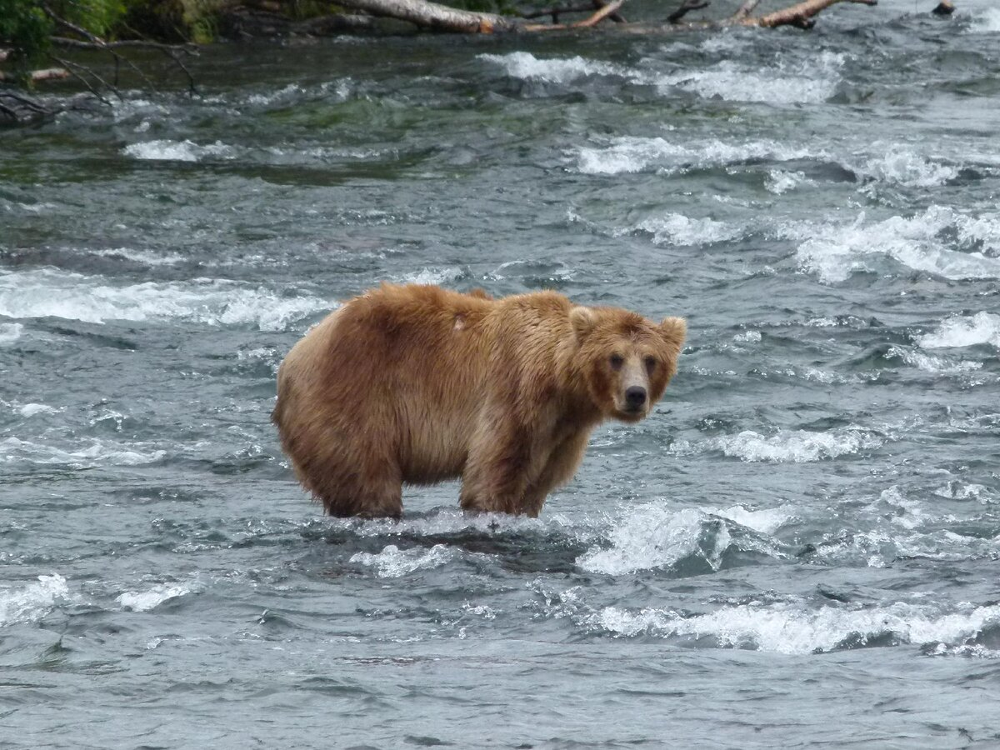
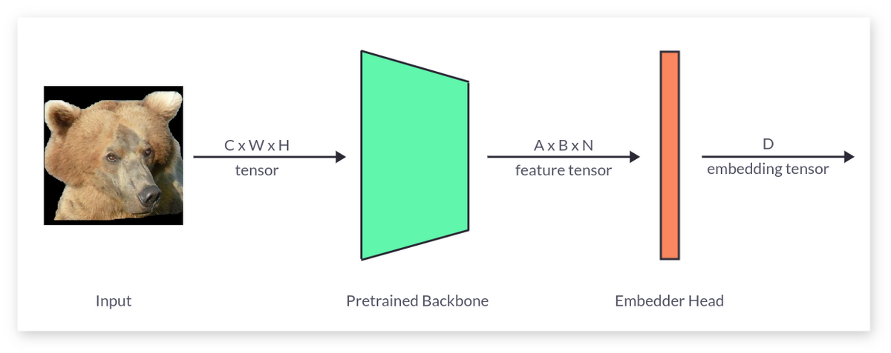

In this post we'll walk through the technical development of a bear face
recognition system — a critical component of the bear identification system
built in close collaboration with the [BearID
Project](https://bearresearch.org/) NGO.

> Our research and software tool will provide a replicable technique and
> general approach that can be applied to other species beyond bears, which
> could aid conservation efforts worldwide.
>
> <cite>– BearID Project</cite>

For the full picture, here is the bear identification pipeline — tap through for
the project:

*Photo → detect face → embed → match against known bears*

## Project Scope

While many species boast distinctive fur patterns for identification,
brown bears lack consistent and unique markings. Furthermore, their
weight can fluctuate significantly between seasons and throughout their
lifetimes. Consequently, facial recognition emerges as a valuable
alternative for individual identification.

In this article, our attention is directed towards the final phase of
the bear identification system, specifically the recognition of bear
faces.

The initial stage entails acquiring a mapping capable of embedding bear
faces into a high-dimensional space, facilitating the clustering of
individuals.

*Embedding bear faces into a high dimensional space*

Subsequently, we leverage this learned mapping to execute queries and
retrieve the closest matching individuals.

*Retrieving closest individuals from the learned mapping*

Our collaboration with [The BearID Project](https://bearresearch.org)
aims to significantly enhance their current model performance, which
currently stands at accuracy@1 (top-1): 0.649 and accuracy@5 (top-5): 0.707.

## Provided Dataset

The [BearID Project](https://bearresearch.org) has compiled a collection
of bear images, showcasing their facial features,
captured over recent years in forests across British Columbia and Brooks
Falls.

After the development of the bear face segmentation system, as detailed
in [a prior blog post](), we successfully
generated approximately 4700 bear face images,
representing a total of 132 individuals.

*Generated bear faces by the segmentation model*

### Bursts of images

When encountering a bear, photographs or camera traps often capture
multiple images of the same individual in very similar poses. Proper
handling of these bursts of images during data splitting is crucial.
Neglecting this step may lead to train/test data leakage, which can
cause the model to inaccurately overreport its performance.

  

    
    
    
    
  

  <em>A burst of images of the same individual, labelled by <a href="https://bearresearch.org">The BearID Project</a></em>

### Individual counts distribution

The curated dataset primarily consists of only a few image faces for
most bears, posing a potential challenge for accurate identification.
Conversely, some bears have hundreds of image faces, largely derived
from bursts of images captured during encounters. Below, we present a
distribution plot of individual counts to provide further insight into
the data.

*Individual counts distribution - How many image faces per individual?*

## Re-identification

**Re-identification** (re-ID) means recognizing and tracking individual animals
across camera traps and over time — letting researchers study behaviour,
population dynamics, and migration. For brown bears, which lack unique fur
markings, the signal lives in the face.

Animal re-ID is harder than the person or object version:

  

    <h3 class="support__card-title">Variable appearance</h3>
    
Fur colour, markings, and physical condition (injuries, season) all change over time.

  

  

    <h3 class="support__card-title">Field conditions</h3>
    
Camera traps face shifting light, weather, and vegetation that degrade image quality.

  

  

    <h3 class="support__card-title">Species variability</h3>
    
Different species have different morphologies and behaviours, needing tailored models.

  

The approach is two familiar steps: a deep network (a CNN) extracts
discriminative features from each image, then those features are matched — by
nearest-neighbour search or clustering — to link the same individual across
images. The payoff for conservation:

  

    <h3 class="support__card-title">Population monitoring</h3>
    
Estimate population sizes, track trends, and gauge the impact of human activity.

  

  

    <h3 class="support__card-title">Behavioural studies</h3>
    
Follow individuals over time to study movement, habitat use, and social interactions.

  

  

    <h3 class="support__card-title">Conservation planning</h3>
    
Pinpoint key habitats and corridors to target conservation effort.

  

### Closed, open, and disjoint sets

How identities overlap between training and testing shapes the whole problem:

  

    <h3 class="support__card-title">Closed set</h3>
    
Every identity seen at test time was in the training gallery — the system only recognizes a fixed, known set.

  

  

    <h3 class="support__card-title">Open set</h3>
    
Test data may contain new identities, so the system must match the known and flag the unknown.

  

  

    <h3 class="support__card-title">Disjoint set</h3>
    
Training and test identities don't overlap at all — the hardest, most realistic case for a changing population.

  

## Data Modeling

### Data Splits

We opted to create two distinct splits to assess the performance of the
identification system in real-world scenarios:

- __Open-set split__: This split includes a portion of newly introduced
identities in the testing phase, simulating encounters with previously unseen
entities.
- __Disjoint-set split__: In this split, the training and testing datasets
comprise entirely different identities, mimicking scenarios where the system
encounters novel entities during deployment

To avoid data leakage in the open-set split, we implemented a careful splitting
strategy based on both camera reference and date. This ensures that bursts of
images captured by the same camera at the same time are consistently grouped
into the same split (train, validation, or test).

### Metric Learning

#### Overview

Metric learning is a machine learning paradigm focused on learning a distance
metric or similarity function directly from data. Instead of relying on
predefined distance measures, metric learning algorithms aim to discover a
distance metric that optimally represents the underlying structure or
relationships within the data. The goal is to ensure that similar instances are
mapped closer together in the learned metric space, while dissimilar instances
are pushed farther apart. Metric learning has applications in various domains,
including image retrieval, face recognition, clustering, and classification,
where accurately capturing the similarity or dissimilarity between data points
is crucial for task performance.

*Learning a metric space to embed bear faces*

#### Losses

The loss function guides how the embedding space is shaped — pulling similar
faces together and pushing different ones apart. We compared four common
choices; tap each:



### Evaluation Metrics

#### Main metric - Accuracy@k

Accuracy@k asks a simple question: is the correct individual among the model's
top *k* ranked matches? It suits retrieval-style tasks where only the top
results matter. We track accuracy@1, @3, @5, and @10 throughout both training
and evaluation.

### Model Topology

The model architecture we adopted consists of a common pretrained backbone,
complemented by a compact embedder head, as illustrated below:

*Model Topology - Backbone (trunk) and embedder head*

### Training

The training process is executed across two GPUs for over 100 epochs.
Throughout training, evaluation metrics are continuously monitored, and we save
the weights of the best-performing model. Training halts if there's no
improvement in model performance beyond a specified threshold, determined by
the patience parameter.

We adopt different learning rates for training the backbone and the heads. This
decision stems from the fact that the backbone is typically pretrained on large
datasets for feature extraction, whereas the embedder is trained from scratch
for the specific task. Typically, we employ a learning rate ratio of 10 to 100
between the backbone and the embedder to effectively balance the learning rates
and ensure optimal training dynamics.

#### Metric Space Visualization - Embeddings

We visualize the metric spaces using UMAP, a versatile manifold learning and
dimension reduction algorithm, and save the visualizations after every epoch.
This enables us to track and evaluate the improvement of the embedder over
time.

*Embeddings over training time*

#### Hard Negative Mining

Hard negative mining focuses training on the most difficult, easily-confused
examples — the ones contributing most to the loss. Concentrating on these
ambiguous cases yields more discriminative embeddings, uses the training data
more efficiently, helps with class imbalance, and improves robustness to noise.

#### Baseline

A baseline was quickly established using a pretrained ResNet18 as the backbone
and a Circle Loss for 1 epoch.

| Split         | Backbone | Loss         | Epochs | accuracy@1 | accuracy@3 | accuracy@5 | accuracy@10 |
|:-------------:|:--------:|:------------:|:------:|:----------:|:----------:|:----------:|:-----------:|
| Disjoint Set  | ResNet18 |  Circle Loss | 1      | 43.9       | 56.0       | 62.7       | 70.0        |
| Open Set      | ResNet18 |  Circle Loss | 1      | 54.0       | 66.2       | 71.0       | 79.6        |

*Visualizing the Learned Metric Space: Clusters Yet to Emerge*

The approach shows great promise, and selecting the appropriate hyperparameters
was key in maximizing the model's performance

#### Hyperparameter Search

After configuring experiment tracking, we conducted a random hyperparameter
search across the following parameter space:

- backbones: ResNet18, ResNet50, Convnext_tiny, Convnext_large
- losses: tripletmargin, circle, arcface
- learning rates
- weight decay
- mining strategies: easy, semi hard, hard
- embedder's depth
- optimizers: Adam, SGD, etc
- embedding size; 512, 1024, 2048
- data augmentation steps: rotation, color jitter, etc

We randomly sampled configurations from this parameter space and conducted
training sessions for a few days on two GPUs.

#### Best Model

The winning combination comprises a convnext_large backbone paired with an
arcface loss, employing a hard mining strategy, and trained using the Adam
optimizer.

| Split         | Backbone       | Loss          | Epochs | accuracy@1 | accuracy@3 | accuracy@5 | accuracy@10 |
|:-------------:|:--------------:|:-------------:|:------:|:----------:|:----------:|:----------:|:-----------:|
| Disjoint Set  | Convnext_large |  ArcFace Loss | 200    | 95.5       | 96.5       | 97.3       | 98.5        |
| Open Set      | Convnext_large |  ArcFace Loss | 200    | 95.0       | 95.5       | 95.9       | 96.8        |

*Visualizing the Learned Metric Space: Clusters have emerged*

This robust model excels in identifying bears with exceptional accuracy, even
in disjoint and open set scenarios, representing a significant advancement over
the existing solution developed by BearID. Additionally, we opted to forego the
face alignment stage, deeming it unnecessary due to the superior performance of
our current approach.

## Conclusion

In this guide, we've walked through building an open-source model for animal
re-identification, applied here to brown bear faces. Deployed with [The BearID
Project](https://bearresearch.org) to monitor bear populations in Canada, it is
a clear step up from the previous solution — and the same approach can be
adapted to other species.

You can try the recognizer yourself on real bear faces — the interactive demo
runs right in your browser.


