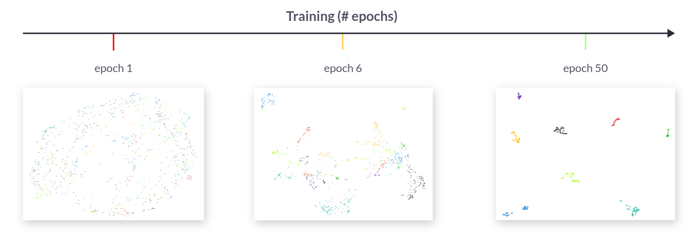
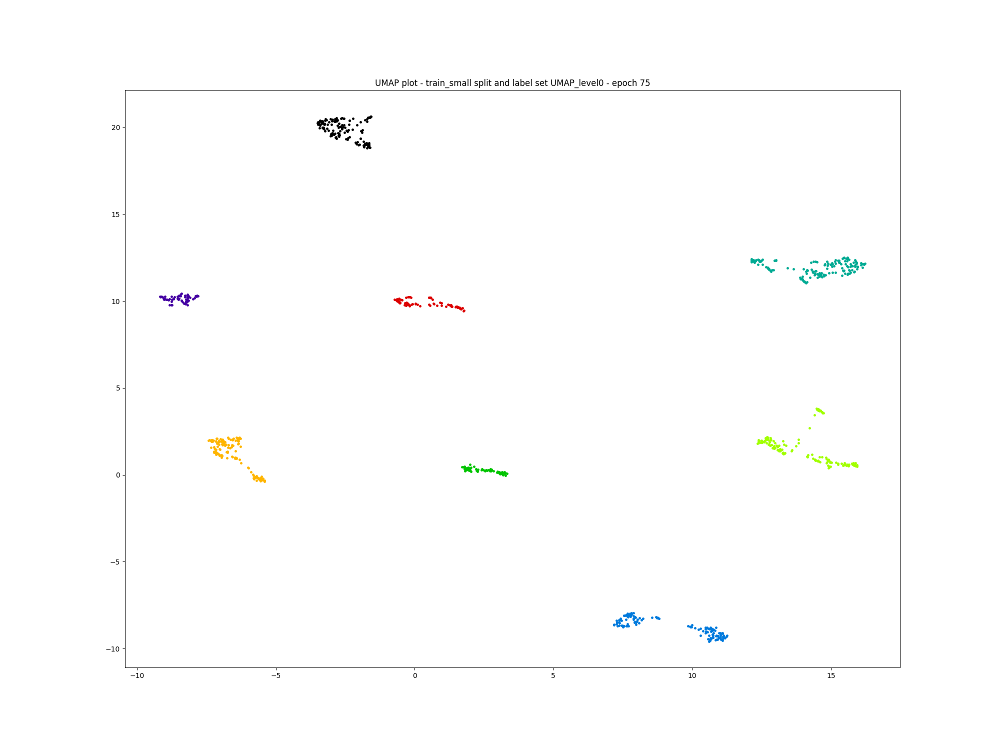

In this blog post we'll delve into the technical
development of a bear face recognition system which is a
critical component of the bear identification
system developed in close collaboration with the [BearID
Project](https://bearresearch.org/) NGO.

> Our research and software tool will provide a replicable technique and
> general approach that can be applied to other species beyond bears, which
> could aid conservation efforts worldwide.
>
> <cite>– BearID Project</cite>

For a comprehensive understanding of this project, please click on the pipeline
overview below:

<a href='' title="Project Details">
  
</a>
 
 

## Project Scope

While many species boast distinctive fur patterns for identification,
brown bears lack consistent and unique markings. Furthermore, their
weight can fluctuate significantly between seasons and throughout their
lifetimes. Consequently, facial recognition emerges as a valuable
alternative for individual identification.

In this article, our attention is directed towards the final phase of
the bear identification system, specifically the recognition of bear
faces.

The initial stage entails acquiring a mapping capable of embedding bear
faces into a high-dimensional space, facilitating the clustering of
individuals.

*Embedding bear faces into a high dimensional space*

Subsequently, we leverage this learned mapping to execute queries and
retrieve the closest matching individuals.

*Retrieving closest individuals from the learned mapping*

Our collaboration with [The BearID Project](https://bearresearch.org)
aims to significantly enhance their current model performance, which
currently stands at accuracy@1 (top-1): 0.649 and accuracy@5 (top-5): 0.707.

## Provided Dataset

The [BearID Project](https://bearresearch.org) has compiled a collection
of bear images, showcasing their facial features,
captured over recent years in forests across British Columbia and Brooks
Falls.

After the development of the bear face segmentation system, as detailed
in [a prior blog post](), we successfully
generated approximately 4700 bear face images,
representing a total of 132 individuals.

*Generated bear faces by the segmentation model*

### Bursts of images

When encountering a bear, photographs or camera traps often capture
multiple images of the same individual in very similar poses. Proper
handling of these bursts of images during data splitting is crucial.
Neglecting this step may lead to train/test data leakage, which can
cause the model to inaccurately overreport its performance.

  

    
    
    
    
  

  <em>Gallery / Provided labels by <a href="https://bearrearch.org">The BearID Project</a> - A burst of images with the same individual</em>

### Individual counts distribution

The curated dataset primarily consists of only a few image faces for
most bears, posing a potential challenge for accurate identification.
Conversely, some bears have hundreds of image faces, largely derived
from bursts of images captured during encounters. Below, we present a
distribution plot of individual counts to provide further insight into
the data.

*Individual counts distribution - How many image faces per individual?*

## re-IDentification

### Definition

Re-identification, often abbreviated as __re-ID__, involves identifying and
tracking individual animals across different camera traps or instances in
wildlife habitats.

### Objective

> The primary goal is to accurately identify and track individual animals over
> time, allowing researchers to study behavior, population dynamics, migration
> patterns, and other ecological factors.

### Challenges

Animal re-identification faces unique challenges compared to person or object
re-identification:

- __Variability in Appearance__: Animals may exhibit variations in
appearance due to factors such as changes in fur color, markings, or
physical condition (e.g., injuries).
- __Environmental Conditions__: Camera traps are often deployed in outdoor
environments where lighting conditions, weather, and vegetation can vary
significantly, affecting image quality and visibility of animals.
- __Species Variability__: Different species may exhibit diverse
morphologies and behaviors, requiring specialized models and approaches for
accurate re-identification.

### Common approach

Similar to other re-identification tasks, animal re-identification often
involves the following steps:

- __Feature Extraction__: Deep learning-based models, such as convolutional
neural networks (CNNs), are used to extract discriminative features from
images captured by camera traps. These features encode unique
characteristics of individual animals, such as fur patterns or facial
markings. For brown bears - which lack unique fur and body markings - facial
markings are key.
- __Matching__: Extracted features are then compared across different camera
traps or instances to identify and track individual animals. Matching
algorithms, such as nearest neighbor search or clustering, are commonly used
to find similar feature representations corresponding to the same animal
across different images.

### Applications

Animal re-identification has numerous applications in wildlife conservation and
ecological research:

- __Population Monitoring__: Researchers can use re-identification data to
estimate population sizes, monitor trends, and assess the impact of
environmental changes or human activities on wildlife populations.
- __Behavioral Studies__: Long-term tracking of individual animals allows
for detailed studies of behavior, movement patterns, habitat use, and social
interactions within animal populations.
- __Conservation Planning__: Re-identification data can inform conservation
strategies by identifying key habitats, migration corridors, and areas of
high wildlife activity for targeted conservation efforts.

Overall, animal re-identification plays a vital role in understanding and
managing wildlife populations, facilitating conservation efforts, and
supporting ecological research initiatives.

### Closed Set, Open Set and Disjoint Set

In the context of __re-ID__, understanding the concepts of open sets, closed
sets, and disjoint sets is critical.

#### Closed Set Identification

In a closed set scenario, the system is trained to recognize a
predefined set of classes or identities.
For example, in a closed set re-identification task, the system is
trained to identify a specific set of animals from a gallery of known
individuals.
The key characteristic of a closed set approach is that the identities
present in the testing or operational phase are limited to those seen
during training. In other words, the system only recognizes identities
that it has been explicitly trained on.

#### Open Set Identification

In contrast to closed set identification, open set identification deals with
scenarios where the testing data might contain identities not seen during
training.
The system needs to be able to recognize known identities (closed set) while
also detecting and handling unknown or novel identities.
This means the system must have the capability to distinguish between familiar
identities (in-distribution data) and unfamiliar ones (out-of-distribution
data).
Open set identification systems often incorporate techniques like anomaly
detection or thresholding to identify instances that don't belong to any known
class.

#### Disjoint Set Identification

Disjoint set identification refers to situations where the identities in the
training and testing datasets are completely separate.
In other words, there is no overlap between the identities seen during training
and those encountered during testing.
This scenario is common in real-world applications where the population of
identities is constantly changing, such as surveillance systems in crowded
areas or public spaces.

#### Summary

In summary, closed set identification deals with recognizing a fixed set
of known identities, open set identification extends this to handle
unknown or novel identities, and disjoint set identification involves
training and testing on completely separate sets of identities. Each
approach has its own challenges and requirements, and the choice depends
on the specific application and the nature of the data.

## Data Modeling

### Data Splits

We opted to create two distinct splits to assess the performance of the
identification system in real-world scenarios:

- __Open-set split__: This split includes a portion of newly introduced
identities in the testing phase, simulating encounters with previously unseen
entities.
- __Disjoint-set split__: In this split, the training and testing datasets
comprise entirely different identities, mimicking scenarios where the system
encounters novel entities during deployment

To avoid data leakage in the open-set split, we implemented a careful splitting
strategy based on both camera reference and date. This ensures that bursts of
images captured by the same camera at the same time are consistently grouped
into the same split (train, validation, or test).

### Metric Learning

#### Overview

Metric learning is a machine learning paradigm focused on learning a distance
metric or similarity function directly from data. Instead of relying on
predefined distance measures, metric learning algorithms aim to discover a
distance metric that optimally represents the underlying structure or
relationships within the data. The goal is to ensure that similar instances are
mapped closer together in the learned metric space, while dissimilar instances
are pushed farther apart. Metric learning has applications in various domains,
including image retrieval, face recognition, clustering, and classification,
where accurately capturing the similarity or dissimilarity between data points
is crucial for task performance.

*Learning a metric space to embed bear faces*

#### Losses

Loss functions play an important role in metric learning as they guide the
optimization process to learn effective distance metrics or embedding spaces.
Let's explore the importance of some common losses in metric learning:

##### Contrastive Loss

The [Contrastive Loss](https://arxiv.org/abs/2004.11362) encourages similar
instances to be closer together and dissimilar instances to be pushed apart in
the embedding space. It achieves this by penalizing pairs of similar instances
that are far apart and pairs of dissimilar instances that are close together.

By using a contrastive loss, the model learns to map instances of the same
class (or similar instances) close to each other while maximizing the distance
between instances of different classes (or dissimilar instances).

##### Triplet Margin Loss

A [Triplet Margin
Loss](https://paperswithcode.com/paper/triplet-loss-in-siamese-network-for-object)
builds upon contrastive loss by considering triplets of anchor, positive, and
negative examples. It ensures that the distance between the anchor and the
positive example is smaller than the distance between the anchor and the
negative example by at least a margin.

The Triplet margin loss explicitly enforces relative distance relationships
between instances, which can lead to more discriminative embeddings. It helps
in dealing with the issue of intra-class variance and inter-class separability.

##### Circle Loss

A [Circle Loss](https://arxiv.org/abs/2002.10857) defines a circular decision
boundary in the embedding space, with each class represented by a circle. The
radius of the circle is dynamically adjusted based on the intra-class
variations, ensuring that samples from the same class are pulled together
within the circle while maintaining a margin from samples of other classes.

A circle Loss offers several advantages over traditional softmax-based losses,
including better handling of intra-class variations, robustness to noisy data,
and improved generalization to unseen classes. It has been shown to achieve
state-of-the-art performance in various metric learning tasks, particularly in
scenarios with large intra-class variations or class imbalances.

##### ArcFace Loss

The [ArcFace loss](https://arxiv.org/abs/1801.07698) is particularly effective
for face recognition tasks. It enhances the discriminative power of the learned
embeddings by introducing a margin-based angular penalty.

The ArcFace loss operates in a hypersphere embedding space, where the angle
between the feature vectors and the corresponding class-specific hypersphere
centers is optimized. This ensures that intra-class variations are minimized
while inter-class variations are maximized, leading to improved classification
accuracy and better generalization.

##### Losses Summary

In summary, losses in metric learning are crucial for guiding the optimization
process towards learning effective embedding spaces. They encourage the model
to embed similar instances close together while pushing dissimilar instances
apart. Each loss function has its advantages and is suitable for different
applications and tasks, ultimately contributing to improved performance in
tasks such as image retrieval, face recognition, and clustering.

### Evaluation Metrics

#### Main metric - Accuracy@k

Accuracy at k is an evaluation metric used to measure the correctness of the
top-k predictions made by a model. It assesses how many of the correct answers
fall within the top-k ranked predictions. This metric is commonly used in
classification tasks, recommendation systems, and information retrieval tasks.

Here's how accuracy at k works:

1. __Top-k Predictions__: After making predictions for a set of inputs (e.g.,
   class labels, recommendations, or search results), the model ranks these
predictions based on their confidence scores or relevance scores.
2. __Correctness Evaluation__: Accuracy at k evaluates the correctness of the
   top-k predictions by considering whether the correct answer is among these
top-k predictions.
3. __Calculation__: The accuracy at k is calculated by dividing the number of
   correct predictions within the top-k ranked results by k.
4. __Interpretation__: Accuracy at k provides insights into how well the model
   performs when considering only the top-ranked predictions. A higher accuracy
at k indicates that a larger fraction of the correct answers are included
within the top-k predictions, suggesting better performance.

__Accuracy@k__ is particularly useful in scenarios where only the top-ranked
predictions are considered, such as recommendation systems where users are only
shown a limited number of recommendations or search engines where users
typically only view the top search results. It helps assess the effectiveness
of the model in providing relevant and accurate predictions within the top-k
ranked results.

We monitor the accuracy at different values of k, including accuracy@1,
accuracy@3, accuracy@5, and accuracy@10, both during the training process and
during evaluation.

### Model Topology

The model architecture we adopted consists of a common pretrained backbone,
complemented by a compact embedder head, as illustrated below:

*Model Topology - Backbone (trunk) and embedder head*

### Training

The training process is executed across two GPUs for over 100 epochs.
Throughout training, evaluation metrics are continuously monitored, and we save
the weights of the best-performing model. Training halts if there's no
improvement in model performance beyond a specified threshold, determined by
the patience parameter.

We adopt different learning rates for training the backbone and the heads. This
decision stems from the fact that the backbone is typically pretrained on large
datasets for feature extraction, whereas the embedder is trained from scratch
for the specific task. Typically, we employ a learning rate ratio of 10 to 100
between the backbone and the embedder to effectively balance the learning rates
and ensure optimal training dynamics.

#### Metric Space Visualization - Embeddings

We visualize the metric spaces using UMAP, a versatile manifold learning and
dimension reduction algorithm, and save the visualizations after every epoch.
This enables us to track and evaluate the improvement of the embedder over
time.

*Embeddings over training time*

#### Hard Negative Mining

Hard negative mining specifically targets the difficult or misclassified
samples that contribute the most to the loss function, ensuring that the model
focuses on learning from these challenging examples.

Here's why hard negative mining is important in metric learning:

- __Enhancing Discriminative Power__: Hard mining helps to identify and
prioritize the training samples that are most informative for improving the
model's ability to discriminate between classes or categories. By focusing on
the "hard" examples, which are often misclassified or have ambiguous class
boundaries, the model can learn more discriminative features.
- __Effective Utilization of Training Data__: In large-scale datasets, not all
samples contribute equally to the learning process. Hard mining allows the
model to efficiently utilize the training data by emphasizing the most
informative samples, leading to faster convergence and better generalization
performance.
- __Addressing Class Imbalance__: In many real-world applications, classes may
be imbalanced, with fewer examples of certain classes compared to others. Hard
mining helps to mitigate the effects of class imbalance by ensuring that the
model learns equally from both easy and challenging examples, thus improving
the overall performance on underrepresented classes.
- __Improving Robustness to Outliers and Noise__: Hard mining encourages the
model to focus on learning from challenging samples, which can help improve its
robustness to outliers, noisy data, and variations in the input space. By
effectively handling difficult examples, the model becomes more resilient to
noise and generalizes better to unseen data.

Overall, hard negative mining is critical in metric learning because it enables the
model to concentrate on the most informative and challenging training samples,
leading to more discriminative embeddings and improved performance animal
re-identification.

#### Baseline

A baseline was quickly established using a pretrained ResNet18 as the backbone
and a Circle Loss for 1 epoch.

| Split         | Backbone | Loss         | Epochs | accuracy@1 | accuracy@3 | accuracy@5 | accuracy@10 |
|:-------------:|:--------:|:------------:|:------:|:----------:|:----------:|:----------:|:-----------:|
| Disjoint Set  | ResNet18 |  Circle Loss | 1      | 43.9       | 56.0       | 62.7       | 70.0        |
| Open Set      | ResNet18 |  Circle Loss | 1      | 54.0       | 66.2       | 71.0       | 79.6        |

*Visualizing the Learned Metric Space: Clusters Yet to Emerge*

The approach shows great promise, and selecting the appropriate hyperparameters
was key in maximizing the model's performance

#### Hyperparameter Search

After configuring experiment tracking, we conducted a random hyperparameter
search across the following parameter space:

- backbones: ResNet18, ResNet50, Convnext_tiny, Convnext_large
- losses: tripletmargin, circle, arcface
- learning rates
- weight decay
- mining strategies: easy, semi hard, hard
- embedder's depth
- optimizers: Adam, SGD, etc
- embedding size; 512, 1024, 2048
- data augmentation steps: rotation, color jitter, etc

We randomly sampled configurations from this parameter space and conducted
training sessions for a few days on two GPUs.

#### Best Model

The winning combination comprises a convnext_large backbone paired with an
arcface loss, employing a hard mining strategy, and trained using the Adam
optimizer.

| Split         | Backbone       | Loss          | Epochs | accuracy@1 | accuracy@3 | accuracy@5 | accuracy@10 |
|:-------------:|:--------------:|:-------------:|:------:|:----------:|:----------:|:----------:|:-----------:|
| Disjoint Set  | Convnext_large |  ArcFace Loss | 200    | 95.5       | 96.5       | 97.3       | 98.5        |
| Open Set      | Convnext_large |  ArcFace Loss | 200    | 95.0       | 95.5       | 95.9       | 96.8        |

*Visualizing the Learned Metric Space: Clusters have emerged*

This robust model excels in identifying bears with exceptional accuracy, even
in disjoint and open set scenarios, representing a significant advancement over
the existing solution developed by BearID. Additionally, we opted to forego the
face alignment stage, deeming it unnecessary due to the superior performance of
our current approach.

## Conclusion

In this guide, we've detailed the development of an open-source,
state-of-the-art model tailored for animal re-identification,
specifically targeting brown bear faces. The comprehensive system,
crafted for deployment by [The BearID Project](https://bearresearch.org) to
monitor bear populations in Canada, represents a significant step forward in
wildlife conservation efforts. With its adaptable design, this technology
stands poised to transcend species boundaries, offering potential applications
across diverse ecosystems. The scalability and versatility of the model
hold promise for advancing conservation endeavors on a global scale.
