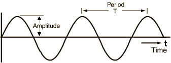

This blog post will detail the development process of an elephant rumble
audio analyzer, created in partnership with [The Elephant Listening
Project](https://www.elephantlisteningproject.org).

> Our vision is to conserve the tropical forests of Africa through acoustic
> monitoring, sound science, and education, focusing on forest elephants
>
> <cite>– The Elephant Listening Project</cite>

For a comprehensive understanding of this project, one can read more on the
detailed project page on [passive acoustic monitoring for forest elephants]().

## What is sound?

Sound is produced by variations in air pressure. These pressure variations can
be measured and plotted over time to create a visual representation of the
sound.

Sound waves often repeat at regular intervals, forming patterns where each wave
has the same shape. The height of these waves, known as amplitude, indicates
the intensity of the sound.

*A soundwave as a variation of air pressure*

The time required for a signal to complete one full wave is called the period.
The number of waves produced by the signal in one second is known as the
frequency. Frequency is the reciprocal of the period and is measured in Hertz
(Hz).

Most sounds we encounter do not follow simple, regular periodic patterns.
However, signals of different frequencies can be combined to form composite
signals with more complex repeating patterns. All the sounds we hear, including
the human voice, are made up of such composite waveforms.

*Elephant rumble recorded in an african forest*

### Encoding sound digitally

To digitize a sound wave, the signal is converted into a series of numbers.
This process involves measuring the amplitude of the sound at regular time
intervals.

*Signal Sampling from [Wikimedia](https://commons.wikimedia.org/wiki/File:Signal_Sampling.png)*

Each measurement is called a sample, and the sampling rate is the number of
samples taken per second. For example, a common sampling rate is 44,100 samples
per second. This means a 10-second music clip would contain 441,000 samples.

### Human hearing range

The human ear can detect sounds within a specific range of frequencies,
typically from about 20 Hz to 20,000 Hz (20 kHz). Sounds below this range are
known as infrasounds, while sounds above this range are referred to as
ultrasounds.

*Audible range for humans*

__Infrasounds__, with frequencies below 20 Hz, are used by animals like elephants.
Elephants communicate using these low-frequency sounds, which can travel long
distances and penetrate through obstacles like dense vegetation.

On the other end of the spectrum, __ultrasounds__ have frequencies above 20 kHz.
Bats are well-known for their use of ultrasound in echolocation. They emit
high-frequency sound waves that bounce off objects and return as echoes,
allowing bats to navigate and hunt in complete darkness.

Human hearing is limited compared to these examples, but our ability to
perceive a wide range of frequencies is crucial for understanding speech,
enjoying music, and detecting environmental sounds.

### Spectrograms

A spectrogram is a visual representation of the frequency content of a
sound signal over time. It provides a detailed picture of how the
different frequencies present in the sound change and evolve.

To understand the relationship between a spectrogram and a raw audio waveform, let's break down the process:

1. **Raw Audio Waveform**: The raw audio waveform is a plot of the
amplitude of the sound signal over time. It shows how the pressure
variations (which we perceive as sound) fluctuate. While the waveform
gives a clear representation of the sound's amplitude at each moment, it
doesn't provide detailed information about the frequency components of
the sound.

2. **Spectrogram**: To create a spectrogram from the raw audio waveform,
the sound signal is divided into small time segments, typically using a
process called the Short-Time Fourier Transform (STFT). Each segment is
analyzed to determine the frequencies present and their respective
amplitudes.

*Fourier Transform Frequency View*

In a spectrogram:

- The horizontal axis represents time.
- The vertical axis represents frequency.
- The intensity or color at each point represents the amplitude of a particular frequency at a given time.

This visualization allows us to see how the frequencies of a sound
change over time. For example, in a speech signal, we can observe the
varying frequencies produced by different phonemes, while in music, we
can see the different notes and their harmonics.

### Machine Learning and audio

State-of-the-art techniques in audio processing with machine learning convert
raw waveforms into images and utilize computer vision methods. Most audio
applications transform raw audio waveforms into spectrograms before inputting
the data into vision models. Examples include the bird classifier
[BirdNet](https://birdnet.cornell.edu/) and [Rainforest
Connection](https://rfcx.org/), which help prevent illegal deforestation and
perform bioacoustic monitoring.

As a result, spectrograms are vital in audio deep learning because they
transform audio signals into a format that is more suitable for analysis by
machine learning models, especially those based on deep learning techniques.

Here are several reasons why spectrograms are so important:

1. __Frequency-Time Representation__: Spectrograms provide a detailed
frequency-time representation of an audio signal, making it easier to analyze
the frequency components and how they change over time. This is crucial for
tasks such as speech recognition, music genre classification, and sound event
detection, where understanding both the frequency content and temporal dynamics
is essential.
2. __Visual Features__: Many deep learning models, particularly convolutional
neural networks (CNNs), are designed to work with visual data. Spectrograms
convert audio data into a visual format, allowing these models to leverage
their powerful feature extraction and pattern recognition capabilities. This
visual representation helps the models learn complex patterns and structures in
the audio signal.
3. __Noise Robustness__: Spectrograms can help in distinguishing useful signal
components from noise. By analyzing the frequency content, models can be
trained to focus on relevant features and ignore irrelevant or noisy parts of
the audio signal, improving the robustness and accuracy of the model.
4. __Task-Specific Adaptation__: Different audio tasks may require focusing on
different aspects of the audio signal. For example, speech recognition models
might benefit from detailed time-frequency resolution, while music analysis
might focus on harmonic content. Spectrograms can be adapted to highlight
specific features relevant to the task, such as using Mel-spectrograms for
speech and music applications.

## Elephant Rumbles

Elephant rumbles are low-frequency vocalizations produced by elephants,
primarily for communication.

*Spectrogram of two elephant rumbles*

- Two elephant rumbles are shown as stacks of parallel lines.
- The white line marks the upper boundary of infrasound, indicating frequencies
below this line are inaudible to humans.
- The bracketed areas represent the speaking frequency ranges for men (70-200
Hz) and women (140-400 Hz).
- The stacks of lines above the white line represent the harmonics of the
fundamental frequency, which in these calls is infrasonic.

Have a listen to the rumbles 🐘

<audio controls src="audio/rumble.mp3"></audio>

These rumbles are a fundamental part of elephant
social interactions and serve various purposes within their groups. Here’s a
detailed explanation:

### Characteristics of Elephant Rumbles

- __Low Frequency__: Elephant rumbles typically fall in the infrasound range,
   below 20 Hz, which is often below the threshold of human hearing. However,
some rumbles can also be heard by humans as a low, throaty sound.
- __Long Distance Communication__: Due to their low frequency, rumbles can
   travel long distances, sometimes several kilometers, allowing elephants to
communicate with each other across vast areas, even when they are out of sight.
It can also travel through dense forests as the wavelength is very large.
- __Vocal Production__: Rumbles are produced by the larynx and can vary in
   frequency, duration, and modulation. Elephants use different types of
rumbles to convey different messages.

### Functions of Elephant Rumbles

- __Coordination and Social Bonding__: Elephants use rumbles to maintain
   contact with members of their herd, coordinate movements, and reinforce
social bonds. For example, a matriarch might use a rumble to lead her group to
a new location.
- __Reproductive Communication__: Male elephants, or bulls, use rumbles to
   communicate their reproductive status and readiness to mate. Females also
use rumbles to signal their estrus status to potential mates.
- __Alarm and Distress Calls__: Rumbles can signal alarm or distress, warning
   other elephants of potential danger. These rumbles can mobilize the herd and
prompt protective behavior.
- __Mother-Calf Communication__: Mothers and calves use rumbles to stay in
   contact, especially when they are separated. Calves may rumble to signal
hunger or distress, prompting a response from their mothers.

## Designing a ML pipeline to process large audio files

About 50 sound recorders are recording forest sounds around the clock in a forest in Congo. Terabytes of data are commonly generated in about a couple of months. Being able to process this amount of audio data fast and with accuracy is key to monitor the forest elephant population.

FIXME: asset showing the pipeline
Raw waveforms -> Spectrograms -> Object Detection Model -> CSV format that can be loaded in RavenPro

The system is required to be able to analyze Terabytes of data in a matter of hours. The main identified bottlenecks of the data pipelines are  the following: 
- The spectrogram generation where one needs to turn raw audio into a relevant spectrogram to see elephant rumbles 
- The model inference step that performs object detection on the spectrograms and reports bounding boxes with probabilities of elephant rumbles

The pipeline will do the following:

1. Generate spectrograms in the frequency range 0-250Hz, where all the elephant rumbles are located
2. Run the rumble object detector on batches of spectrograms
3. Save the predictions as a CSV file

| Spectrogram | Prediction |
|:-----------:|:----------:|
|  |  |
|  |  |
|  |  |

Below is a sample of a generated CSV file:

| probability | freq_start | freq_end | t_start | t_end | audio_filepath | instance_class |
|:-----------:|:----------:|:--------:|:-------:|:-----:|:--------------:|:--------------:|
| 0.7848126888275146 | 185.34618616104126 | 238.925039768219 | 6.117525324225426 | 11.526521265506744 | data/08_artifacts/audio/rumbles/sample_0.wav | rumble |
| 0.7789380550384521 | 187.46885657310486 | 237.14002966880798 | 107.4117157459259 | 112.39507365226746 | data/08_artifacts/audio/rumbles/sample_0.wav | rumble |
| 0.6963282823562622 | 150.82329511642456 | 238.47350478172302 | 89.08285737037659 | 94.3071436882019 | data/08_artifacts/audio/rumbles/sample_0.wav | rumble |
| 0.6579649448394775 | 203.18885147571564 | 231.6151112318039 | 44.13426876068115 | 47.50721764564514 | data/08_artifacts/audio/rumbles/sample_0.wav | rumble |
| ... | ... | ... | ... | ... | ... | ... |

### Fast Spectrogram Generation

Intro and context

#### Librosa

#### TorchAudio

### Fast ML model inference

Following our approach, we are now facing an object detection problem using spectrograms instead of having to deal with raw audio data. There is a small preprocessing cost to transform the audio waveforms into spectrograms but the problem is now turned into a well understood computer vision problem.

*Gallery / Detection of elephant rumbles in spectrograms*

#### YOLO Overview

We opted to utilize a pretrained
[YOLOv8](https://github.com/ultralytics/ultralytics) model and fine-tune it for
our specific object detection task. Renowned for its speed, accuracy, and
user-friendly interface, YOLOv8 stands out as an ideal solution for various
tasks, including object detection, tracking, instance segmentation, image
classification, and pose estimation.

*YOLOv8 Computer Vision Tasks*

### Results

