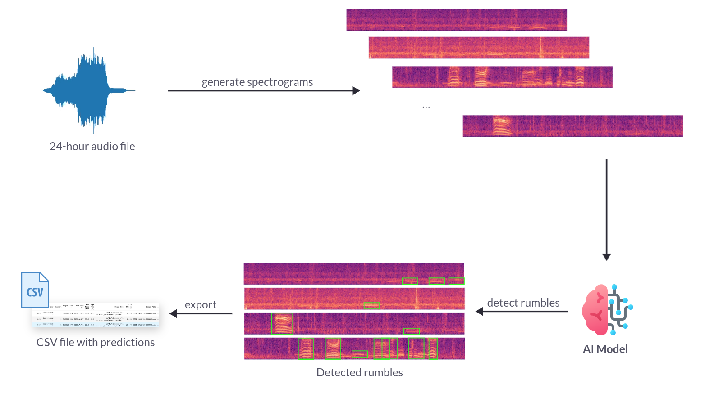
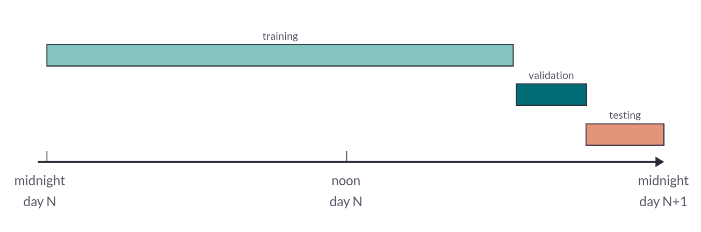

This blog post will detail the development process of an elephant rumble
audio analyzer, created in partnership with [The Elephant Listening
Project](https://www.elephantlisteningproject.org).

> Our vision is to conserve the tropical forests of Africa through acoustic
> monitoring, sound science, and education, focusing on forest elephants
>
> <cite>– The Elephant Listening Project</cite>

For a comprehensive understanding of this project, one can read more on the
detailed project page on [passive acoustic monitoring for forest elephants]().

## What is sound?

 🔉Sound is produced by variations in air pressure. These pressure variations can
be measured and plotted over time to create a visual representation of the
sound.

Sound waves often repeat at regular intervals, forming patterns where each wave
has the same shape. The height of these waves, known as amplitude, indicates
the intensity of the sound.

*A soundwave as a variation of air pressure*

The time required for a signal to complete one full wave is called the period.
The number of waves produced by the signal in one second is known as the
frequency. Frequency is the reciprocal of the period and is measured in Hertz
(Hz).

Most sounds we encounter do not follow simple, regular periodic patterns.
However, signals of different frequencies can be combined to form composite
signals with more complex repeating patterns. All the sounds we hear, including
the human voice, are made up of such composite waveforms.

*Elephant rumble recorded in an african forest*

### Encoding sound digitally

To digitize a sound wave, the signal is converted into a series of numbers.
This process involves measuring the amplitude of the sound at regular time
intervals.

*Signal Sampling from [Wikimedia](https://commons.wikimedia.org/wiki/File:Signal_Sampling.png)*

Each measurement is called a sample, and the sampling rate is the number of
samples taken per second. For example, a common sampling rate is 44,100 samples
per second. This means a 10-second music clip would contain 441,000 samples.

### Human hearing range

 👂The human ear can detect sounds within a specific range of frequencies,
typically from about 20 Hz to 20,000 Hz (20 kHz). Sounds below this range are
known as infrasounds, while sounds above this range are referred to as
ultrasounds.

*Audible range for humans*

__Infrasounds__, with frequencies below 20 Hz, are used by animals like elephants.
Elephants communicate using these low-frequency sounds, which can travel long
distances and penetrate through obstacles like dense vegetation.

On the other end of the spectrum, __ultrasounds__ have frequencies above 20 kHz.

🦇 Bats are well-known for their use of ultrasound in echolocation. They emit
high-frequency sound waves that bounce off objects and return as echoes,
allowing bats to navigate and hunt in complete darkness.

Human hearing is limited compared to these examples, but our ability to
perceive a wide range of frequencies is crucial for understanding speech,
enjoying music, and detecting environmental sounds.

### Spectrograms

A spectrogram is a visual representation of the frequency content of a
sound signal over time. It provides a detailed picture of how the
different frequencies present in the sound change and evolve.

To understand the relationship between a spectrogram and a raw audio waveform, let's break down the process:

1. **Raw Audio Waveform**: The raw audio waveform is a plot of the
amplitude of the sound signal over time. It shows how the pressure
variations (which we perceive as sound) fluctuate. While the waveform
gives a clear representation of the sound's amplitude at each moment, it
doesn't provide detailed information about the frequency components of
the sound.

2. **Spectrogram**: To create a spectrogram from the raw audio waveform,
the sound signal is divided into small time segments, typically using a
process called the Short-Time Fourier Transform (STFT). Each segment is
analyzed to determine the frequencies present and their respective
amplitudes.

*Fourier Transform Frequency View*

In a spectrogram:

- The horizontal axis represents time.
- The vertical axis represents frequency.
- The intensity or color at each point represents the amplitude of a particular frequency at a given time.

This visualization allows us to see how the frequencies of a sound
change over time. For example, in a speech signal, we can observe the
varying frequencies produced by different phonemes, while in music, we
can see the different notes and their harmonics.

### Machine Learning and audio

State-of-the-art techniques in audio processing with machine learning convert
raw waveforms into images and utilize computer vision methods. Most audio
applications transform raw audio waveforms into spectrograms before inputting
the data into vision models. Examples include the bird classifier
[BirdNet](https://birdnet.cornell.edu/) and [Rainforest
Connection](https://rfcx.org/), which help prevent illegal deforestation and
perform bioacoustic monitoring.

As a result, spectrograms are vital in audio deep learning because they
transform audio signals into a format that is more suitable for analysis by
machine learning models, especially those based on deep learning techniques.

Here are several reasons why spectrograms are so important:

1. __Frequency-Time Representation__: Spectrograms provide a detailed
frequency-time representation of an audio signal, making it easier to analyze
the frequency components and how they change over time. This is crucial for
tasks such as speech recognition, music genre classification, and sound event
detection, where understanding both the frequency content and temporal dynamics
is essential.
2. __Visual Features__: Many deep learning models, particularly convolutional
neural networks (CNNs), are designed to work with visual data. Spectrograms
convert audio data into a visual format, allowing these models to leverage
their powerful feature extraction and pattern recognition capabilities. This
visual representation helps the models learn complex patterns and structures in
the audio signal.
3. __Noise Robustness__: Spectrograms can help in distinguishing useful signal
components from noise. By analyzing the frequency content, models can be
trained to focus on relevant features and ignore irrelevant or noisy parts of
the audio signal, improving the robustness and accuracy of the model.
4. __Task-Specific Adaptation__: Different audio tasks may require focusing on
different aspects of the audio signal. For example, speech recognition models
might benefit from detailed time-frequency resolution, while music analysis
might focus on harmonic content. Spectrograms can be adapted to highlight
specific features relevant to the task, such as using Mel-spectrograms for
speech and music applications.

## Elephant Rumbles

Elephant rumbles are low-frequency vocalizations produced by elephants,
primarily for communication.

*Spectrogram of two elephant rumbles*

- Two elephant rumbles are shown as stacks of parallel lines.
- The white line marks the upper boundary of infrasound, indicating frequencies
below this line are inaudible to humans.
- The bracketed areas represent the speaking frequency ranges for men (70-200
Hz) and women (140-400 Hz).
- The stacks of lines above the white line represent the harmonics of the
fundamental frequency, which in these calls is infrasonic.

Have a listen to the rumbles 🐘

<audio controls src="audio/rumble.mp3"></audio>

These rumbles are a fundamental part of elephant
social interactions and serve various purposes within their groups. Here’s a
detailed explanation:

### Characteristics of Elephant Rumbles

- __Low Frequency__: Elephant rumbles typically fall in the infrasound range,
   below 20 Hz, which is often below the threshold of human hearing. However,
some rumbles can also be heard by humans as a low, throaty sound.
- __Long Distance Communication__: Due to their low frequency, rumbles can
   travel long distances, sometimes several kilometers, allowing elephants to
communicate with each other across vast areas, even when they are out of sight.
It can also travel through dense forests as the wavelength is very large.
- __Vocal Production__: Rumbles are produced by the larynx and can vary in
   frequency, duration, and modulation. Elephants use different types of
rumbles to convey different messages.

### Functions of Elephant Rumbles

- __Coordination and Social Bonding__: Elephants use rumbles to maintain
   contact with members of their herd, coordinate movements, and reinforce
social bonds. For example, a matriarch might use a rumble to lead her group to
a new location.
- __Reproductive Communication__: Male elephants, or bulls, use rumbles to
   communicate their reproductive status and readiness to mate. Females also
use rumbles to signal their estrus status to potential mates.
- __Alarm and Distress Calls__: Rumbles can signal alarm or distress, warning
   other elephants of potential danger. These rumbles can mobilize the herd and
prompt protective behavior.
- __Mother-Calf Communication__: Mothers and calves use rumbles to stay in
   contact, especially when they are separated. Calves may rumble to signal
hunger or distress, prompting a response from their mothers.

## Designing an ML pipeline to process large audio files

About 50 sound recorders are recording forest sounds around the clock in a
forest in Congo. Terabytes of data are commonly generated in about a couple of
months. Being able to process this amount of audio data fast and with accuracy
is key to monitor the forest elephant population.

*Overview of the ML pipeline to process audio files*

The system must be capable of analyzing terabytes of data within a few hours.
The primary bottlenecks in the data pipeline are:

- __Spectrogram Generation:__ Converting raw audio into spectrograms that
accurately capture the frequency range relevant for detecting elephant rumbles.
- __Model Inference:__ Performing object detection on these spectrograms to
identify elephant rumbles and report bounding boxes with associated
probabilities.

To address these bottlenecks, the pipeline should:

1. Generate spectrograms in the 0-250 Hz frequency range, which encompasses all
   elephant rumbles.
2. Apply the rumble object detector to batches of these spectrograms.
3. Save the detection results, including bounding boxes and probabilities, into
   a CSV file.

| Spectrogram | Prediction |
|:-----------:|:----------:|
|  |  |
|  |  |
|  |  |

Below is a sample of a generated CSV file:

| freq_start | freq_end  | t_start | t_end    |  probability | audio_filepath                                |
|-----------:|:---------:|:-------:|:--------:|:------------:|:---------------------------------------------:|
|  185.3     | 238.9     | 6.1     | 11.5     | 0.78         |  data/08_artifacts/audio/rumbles/sample_0.wav |
|  187.4     | 237.1     | 107.4   | 112.3    | 0.77         |  data/08_artifacts/audio/rumbles/sample_0.wav |
|  150.8     | 238.4     | 89.0    | 94.3     | 0.69         |  data/08_artifacts/audio/rumbles/sample_0.wav |
|  203.1     | 231.6     | 44.1    | 47.5     | 0.65         |  data/08_artifacts/audio/rumbles/sample_0.wav |
| ...        | ...       | ...     | ...      | ...          |  ...                                          |

### Provided dataset

The [Elephant Listening Project](https://www.elephantlisteningproject.org)
provided hundreds of gigabytes of annotated audio files recorded in the African
forest. These files were annotated using two distinct approaches. The first set
was annotated using their current machine learning (ML) model, while the second
set was meticulously annotated and reviewed by human experts. The annotations
were exported from [RavenPro](https://www.birds.cornell.edu/ccb/raven-pro/), a
comprehensive software tool for visualizing and analyzing audio recordings,
widely used in bioacoustic research.

*Provided dataset as raw audio files and annotations from RavenPro*

The ML model-generated annotations typically identify most sound patterns
within the 0-250 Hz frequency range but exhibit issues with overlapping rumbles
and occasional false positives. Conversely, the human-curated dataset, though
smaller, offers much higher quality annotations, despite some rumbles being
unannotated. This meticulous attention to overlapping rumbles in the human
annotations provides a valuable resource for training accurate ML models.

Given the higher quality of the human-curated dataset, we chose to use it for
training and evaluating our ML models. To prepare the model inputs for
training, the provided dataset needs to be transformed into an image dataset of
spectrograms with bounding boxes that localize the rumbles.

#### Exploratory Data Analysis

Exploratory Data Analysis (EDA) is an approach to analyzing datasets to
summarize their main characteristics, often employing visual methods. The
primary goal of EDA is to uncover patterns, relationships, and anomalies in the
data, which can then inform subsequent analysis or modeling tasks.

EDA typically involves the following steps:

1. __Data Collection__: Gathering the relevant dataset(s) from various sources.
2. __Data Cleaning__: Identifying and handling missing values, outliers, and
   inconsistencies in the data.
3. __Summary Statistics__: Computing descriptive statistics such as mean,
   median, mode, standard deviation, etc., to understand the central tendencies
and variability of the data.
4. __Data Visualization__: Creating visual representations of the data using
   plots, charts, histograms, scatter plots, etc., to explore patterns,
distributions, correlations, and trends within the data.
5. __Exploratory Modeling__: Building simple models or using statistical
   techniques to further understand relationships within the data.
6. __Hypothesis Testing__: Formulating and testing hypotheses about the data to
   validate assumptions or gain insights.
7. __Iterative Analysis__: Iteratively exploring the data, refining analysis
   techniques, and generating new hypotheses as insights emerge.

EDA is a crucial initial step in any data analysis or modeling project as it
helps analysts gain a deeper understanding of the dataset, identify potential
challenges or biases, and inform subsequent analytical decisions. It provides a
foundation for more advanced analyses, such as predictive modeling, hypothesis
testing, or machine learning, by guiding feature selection, model building, and
evaluation strategies.

Some key insights were derived from the exploratory data analysis:

- __Rumble Duration:__ The typical duration of an elephant rumble ranges from 2
to 6 seconds, with some lasting up to 10 seconds. This information is
crucial for determining the length and overlap of generated spectrograms.
- __Frequency Range:__ All elephant rumbles occur within the 0-250 Hz frequency
range. By focusing on this range, we can optimize spectrogram generation by
excluding irrelevant frequencies.
- __Communication Timing:__ Elephants primarily communicate with rumbles during
dawn and dusk, when ambient noise is lower, allowing their low-frequency calls
to travel more effectively. Consequently, the majority of our data points are
concentrated at these times, which will guide our data splitting strategy.

#### Data split

We implemented a standard 80/10/10 data split on the provided dataset to ensure
effective model evaluation. To prevent data leakage between training and
testing phases, we meticulously split the audio files into non-overlapping time
ranges. Each annotated audio file is divided into three distinct time segments:
80% of the rumbles are allocated to the training set, 10% to the validation
set, and 10% to the testing set.

*80/10/10 split of a 24 hour audio file in 3 non overlapping segments*

### Fast Spectrogram Generation

Spectrograms are a fundamental tool in audio analysis, providing a visual
representation of the spectrum of frequencies in a sound signal as it varies
with time. Generating spectrograms quickly and efficiently is crucial in
numerous applications such as speech recognition, music analysis, and
environmental sound classification. Fast spectrogram generation allows for
real-time processing and analysis of audio signals, which is essential in
scenarios where immediate feedback is necessary, such as live sound monitoring
and interactive audio applications.
Two powerful libraries for generating spectrograms in Python are `librosa` and
`torchaudio`.

#### [Librosa](https://librosa.org/)

`librosa` is a widely-used library in the audio analysis
community, known for its user-friendly interface and comprehensive suite of
tools for audio processing. It provides robust functions for loading audio
files, computing spectrograms, and various other audio transformations.

*Librosa Logo*

We began evaluating spectrogram generation using the librosa library. Loading
raw audio files proved to be slow because librosa, by default, operates in a
single-threaded manner, utilizing only one CPU core. Additionally, while
generating spectrograms as images is time-consuming, the resulting visuals are
highly aesthetic, thanks to the ability to apply various color maps.

*Spectrogram generated with Librosa*

To enhance efficiency, we designed and implemented a multiprocessing pipeline
that leverages all available CPU cores for loading audio files and generating
spectrograms. On a 10-core machine, this approach resulted in approximately a
tenfold increase in speed. However, maintaining such a multiprocessing pipeline
can be complex. As an alternative, we considered using the torchaudio library,
which natively supports multiprocessing and GPU acceleration. We aimed to
compare the performance of both libraries to make an informed decision on the
best approach for our needs.

#### [TorchAudio](https://pytorch.org/audio/stable/index.html)

`torchaudio`, on the other hand, is a part of the PyTorch ecosystem, which
allows for seamless integration with deep learning models. It is optimized for
performance and can leverage GPU acceleration to speed up spectrogram
generation and other audio processing tasks.

*Torchaudio logo*

Loading raw audio files with torchaudio is significantly faster because it
leverages multiple cores by default. Spectrogram generation is also much
quicker than with librosa due to its optimized multiprocessing capabilities.
Additionally, torchaudio can utilize GPU acceleration, further speeding up the
process. After benchmarking both libraries, we decided to use torchaudio. This
state-of-the-art audio processing library, which is part of the PyTorch
ecosystem, offers robust performance and is well-maintained, making it the
superior choice for our needs.

Loading a 24-hour raw audio file takes approximately 4 seconds, while
generating 560 spectrograms to cover the entire recording takes around 11
seconds using torchaudio.

*Spectrogram generated with Torchaudio*

### Fast ML model inference

By adopting our approach, we have transitioned from dealing with raw audio data
to addressing an object detection problem using spectrograms. Although there is
a minor preprocessing cost involved in converting audio waveforms into
spectrograms, this shift simplifies the problem to a well-understood computer
vision challenge.

*Visual detection of elephant rumbles in spectrograms*

#### YOLO Overview

We opted to utilize a pretrained
[YOLOv8](https://github.com/ultralytics/ultralytics) model and fine-tune it for
our specific object detection task. Renowned for its speed, accuracy, and
user-friendly interface, YOLOv8 stands out as an ideal solution for various
tasks, including object detection, tracking, instance segmentation, image
classification, and pose estimation.

*YOLOv8 Computer Vision Tasks*

#### Spectrogram Generation and YOLOv8 Model Constraints

Pretrained YOLOv8 models require square images resized to 640 pixels. We face a
trade-off between speed and accuracy when generating spectrograms. A smaller
time range in each spectrogram yields higher resolution for detecting elephant
rumbles, but requires generating more spectrograms to cover the entire time
span.

Given that elephant rumbles typically last between 2 to 6 seconds, with some
extending up to 10 seconds, a larger time range in a 640-pixel wide spectrogram
can make these rumbles difficult to detect. To balance these factors, we
decided to cover a 164-second time range in each 640-pixel wide spectrogram.
Additionally, each spectrogram overlaps the next by 10 seconds, which
corresponds to the maximum rumble duration and helps in deduplicating predicted
rumbles.

*Generation of 560 spectrograms to cover the 24-hour time range*

This approach results in the generation of approximately 560 spectrograms to
cover a full 24-hour period.

### Inference Speed and Performance Optimization

The model is designed to process batches of spectrograms simultaneously,
utilizing multiprocessing when no GPU is available and leveraging GPU
acceleration when present. Through experimentation, we determined an optimal
batch size that balances memory usage with inference speed. With this setup,
the model can process the 560 spectrograms in under 20 seconds on an 8-core
machine and in under 4 seconds when using a GPU.

The table below provides a summary of the overall pipeline speed on a 24-hour
audio file, highlighting the two key bottlenecks: spectrogram generation and
model inference.

| Pipeline Step                  | GPU      | CPU (8 cores) |
|--------------------------------|----------|---------------|
| Load the audio file            | 4s       | 4s            |
| Generate the spectrograms      | 11s      | 11s           |
| Run the model inference        | __4s__   | 19s           |
| Miscellaneous tasks            | 1s       | 1s            |
| Total for a 24-hour audio file | __20s__  | 35s           |
| Total for 1TB of audio data    | __8.3h__ | 14.6h         |

> Analyzing months of audio recordings can now be done in a matter of
> hours, not weeks!

1 terabyte of audio data currently represents one month of recordings collected
from 50 microphones distributed throughout the forest.

## Conclusion 🐘

This article outlines the engineering approach used to develop a
state-of-the-art elephant rumble detector with a strong emphasis on
speed. Designing efficient data pipelines is crucial in conservation
efforts, where vast amounts of data are continuously generated. The
[open-source tools](https://github.com/earthtoolsmaker/forest-elephants-rumble-detection)
developed in this project make a significant contribution to advancing global
conservation initiatives. Moreover, the methods and techniques presented can be
adapted to various conservation applications, including rare species
identification and biodiversity monitoring.
