In this post we explore the development of a benthic coral reef analyzer, built
in partnership with [ReefSupport](https://reef.support) to improve the tools for
monitoring coral reefs and marine environments.

For the full picture, here is the coral analysis pipeline — tap through for the
project:

[]()
*Capture → segment → classify → measure coral cover over time*

> Leveraging computer vision for the segmentation of
coral reefs in benthic imagery holds the potential to
> quantify the long-term growth or decline of coral cover
within
> marine protected areas

## Project Scope

Our collaboration develops an underwater benthic imagery model that identifies
and locates the functional groups in a reef — flexible enough to use across
marine regions worldwide.

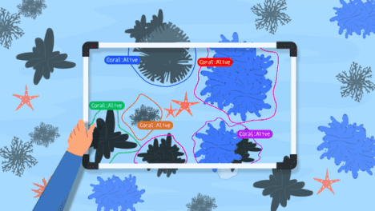
*The benthic imagery analysis system by [Reef Support](https://reef.support)*

We start by distinguishing hard from soft coral, then add finer taxonomic
detail as the system matures — a broad foundation to build comprehensive reef
analysis on.

## Provided Datasets

The data provided by [ReefSupport](https://reef.support) is made available on a
publicly hosted [Google Cloud bucket](https://console.cloud.google.com/storage/browser/rs_storage_open). 
It comes in two forms:

<div class="support__grid support__grid--two">
  <div class="support__card">
    <h3 class="support__card-title">Point (sparse) labels</h3>
    <p class="support__card-description">Random points in an image are classified — typically 50–100 per image. Sources: <a href="https://indonesiabiru.id/">IBF</a>, <a href="https://reefolution.org/">Reefolution</a>, and <a href="https://espace.library.uq.edu.au/view/UQ:734799">Seaview</a>.</p>
  </div>
  <div class="support__card">
    <h3 class="support__card-title">Mask (dense) labels</h3>
    <p class="support__card-description">Full segmentation masks for hard and soft corals. Sources: <a href="https://onlinelibrary.wiley.com/doi/abs/10.1002/rob.21915">CoralSeg</a>, plus ReefSupport's own carefully annotated subsets covering reefs worldwide.</p>
  </div>
</div>


  
  
  
  
  
  


Each image is associated with a dense stitched mask made
of all the individual coral instances.

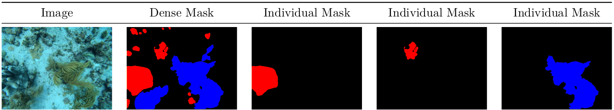
*Associated labels from the ReefSupport dataset - hard and soft coral instances masks*

### Exploratory Data Analysis

Before modelling, we explored the dataset closely — and it surfaced several
data-quality issues worth fixing first.

#### Data quality issues

##### Empty masks

Some stitched masks were entirely black — 532 in SEAVIEW_PAC_USA and 328 in
SEAVIEW_ATL. Removing these empty masks gave a cleaner dataset and improved
performance during training and evaluation.

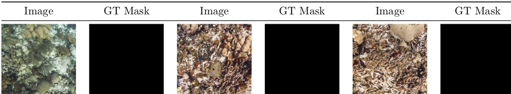
*Empty Masks samples*

##### Low quality labels

The dense labels in SEAVIEW/PAC_USA covered almost all the coral in an image as
one big mask rather than outlining each individual, so we excluded them from the
training set.

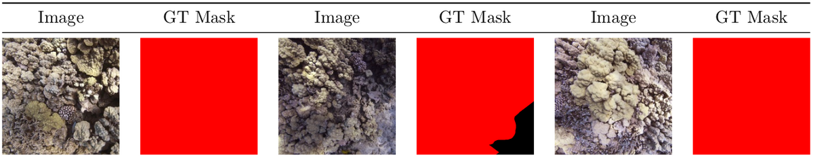
*Low quality Masks samples*

##### Mismatched sparse and dense labels

We compared ReefSupport's dense (mask) labels against the sparse (point) labels
for the same images.

<div class="gallery-box">
  <div class="gallery">
    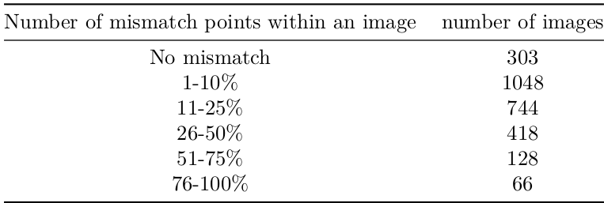
    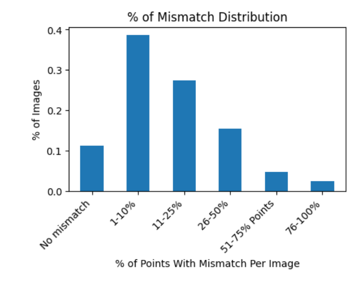
  </div>
  <em>Mismatch summary and distribution</em>
</div>

The presented samples illustrate instances where point labels contradict
dense labels. Each white cross signifies a label mismatch, with the
first sample showing a 17% error mismatch and the last sample
demonstrating a complete 100% error mismatch.

<div class="gallery-box">
  <div class="gallery">
    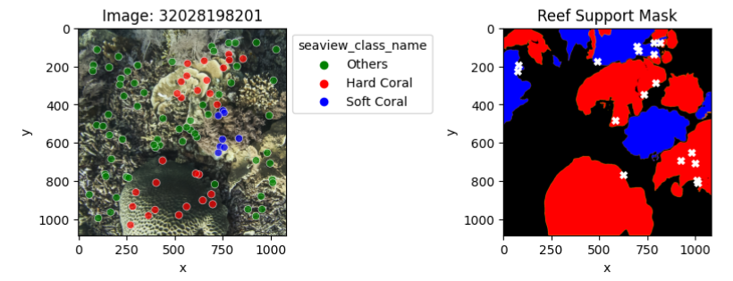
    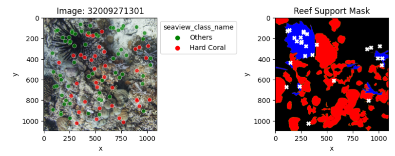
    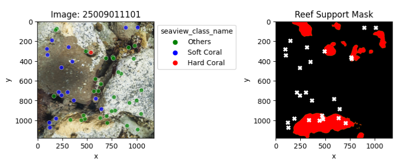
    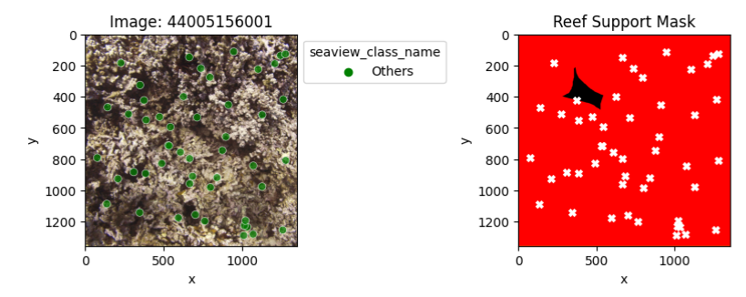
  </div>
  <em>Samples to illustrate sparse and dense label mismatches</em>
</div>

##### Data leakage

In one region, many images overlap with their neighbours within the same
quadrats. If overlapping images land in different splits, the model effectively
sees test content during training — inflating its scores. Ordering by image ID
makes it clear: most images share content with their neighbours.

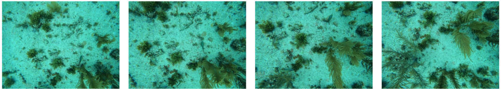
*A sequence of 4 photos that share overlaps with their neighbours*

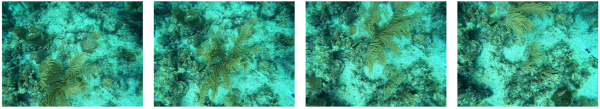
*Another sequence of 4 photos that share overlaps with their neighbours*

Since it is confined to one region, we gauge its impact by evaluating the model
region by region.

##### Class imbalance

The dataset skews heavily towards hard coral — roughly five times more
instances than soft coral. Such imbalance biases a model towards the majority
class and hurts its performance on the minority one.


*Class imbalance distributions*

### Data Preparation

#### YOLOv8 TXT format

To use the YOLOv8 ecosystem, we first convert the raw datasets into [its
expected format](https://roboflow.com/formats/yolov8-pytorch-txt).

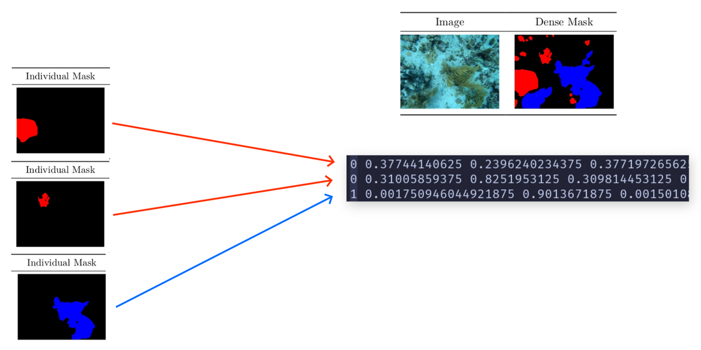
*YOLOv8 TXT format conversion*

Each line represents an instance of a class with a defined contour. It
has the following format:

```txt
class_number x1 y1 x2 y2 x3 y3 ... xk yk
class_number x1 y1 x2 y2 x3 y3 ... xj yj
```

Where the coordinates x and y are normalized to the image width and
height accordingly. Therefore, they always lie in the range [0,1].

___Example:___

```txt
1 0.617 0.359 0.114 0.173 0.322 0.654
0 0.094 0.386 0.156 0.236 0.875 0.134
```

Therefore, each line corresponds to an individual mask instance.

The [OpenCV](https://opencv.org/) library is employed to convert the
dense individual masks into contour coordinates.

## Data Modeling

### Data Split

In this section, we elucidate the methodology employed for the train/val/test
splits across different datasets.

For each region, a dedicated dataset is created with an `80/10/10` split ratio
for train/val/test. Simultaneously, a comprehensive global dataset is
established using the same split ratios. Importantly, any image allocated to
the test set for a region-specific dataset is also included in the test set for
the global dataset (similarly for train and val splits). This design
facilitates the evaluation of models trained on region-specific datasets
against the global dataset.

| Dataset   | Region      | splits ratio | train | val  | test | total |
|-----------|-------------|--------------|-------|------|------|-------|
| ALL       | ALL         | 80/10/10     | 1392  | 173  | 177  | 1742  |
| SEAFLOWER | BOLIVAR     | 80/10/10     | 196   | 24   | 25   | 245   |
| SEAFLOWER | COURTOWN    | 80/10/10     | 192   | 24   | 25   | 241   |
| SEAVIEW   | ATL         | 80/10/10     | 264   | 33   | 33   | 330   |
| SEAVIEW   | IDN_PHL     | 80/10/10     | 189   | 24   | 24   | 237   |
| SEAVIEW   | PAC_AUS     | 80/10/10     | 467   | 58   | 59   | 584   |
| TETES     | PROVIDENCIA | 80/10/10     | 84    | 10   | 11   | 105   |

### Instance Segmentation vs Semantic Segmentation

Semantic segmentation assigns a class label to each pixel in an image,
such as 'person,' 'dog,' or 'flower,' grouping together pixels of the
same class. Conversely, instance segmentation distinguishes between
individual instances of objects within the same class, treating each one
as a separate entity.

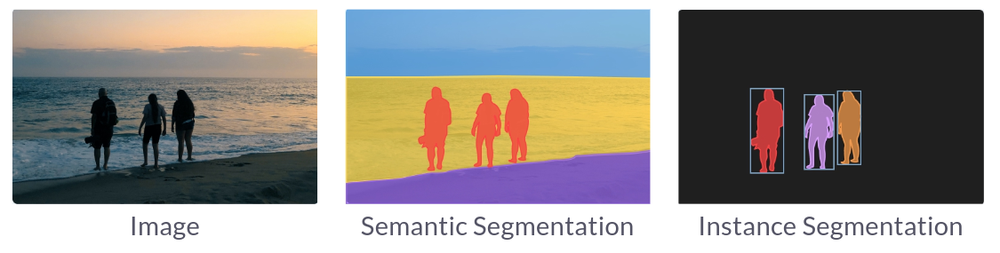
*Semantic segmentation vs Instance segmentation*

For analyzing benthic coral reefs, an instance segmentation approach
proves superior as it enables precise localization and counting of reef
organisms.

### Evaluation Metrics

We evaluate segmentation with **mean IoU (mIoU)** and the **Dice coefficient**,
avoiding mean pixel accuracy since it's misleading on skewed datasets.

**mIoU (Jaccard index)** measures the overlap between the predicted and
ground-truth masks — higher is better:

$$\mathit{IoU} = \dfrac{A \cap B}{A \cup B}$$

**Dice coefficient (F1)** also rewards overlap but weights true positives more
heavily, which makes it well-suited to imbalanced data:

$$\mathit{DiceCoefficient} = \dfrac{2 \times TP}{2 \times TP + FP + FN}$$

### YOLOv8

#### Overview

We took a pretrained
[YOLOv8](https://github.com/ultralytics/ultralytics) model and fine-tuned it for
our instance segmentation task. YOLOv8 is fast, accurate, and easy to work
with, and it handles a range of tasks — object detection, tracking, instance
segmentation, image classification, and pose estimation.


*Segmentation on a benthic image: a photo in, each colony mapped out*

#### Training

##### Baseline

We first established a __baseline__ to gauge the approach: a medium-size
pretrained model fine-tuned for 5 epochs on the train split.

| mIoU | IoU_hard | IoU_soft | IoU_other | mDice | Dice_hard | Dice_soft | Dice_other |
| ---- | ---------| -------- | --------- | ----- | --------- | --------- | ---------- |
| __0.70__ | 0.64     | 0.58     | 0.89      | 0.82  | 0.78      | 0.73      | 0.94       |


*Results / Quantitative - Training metrics (left) and pixel level confusion matrix (right)*

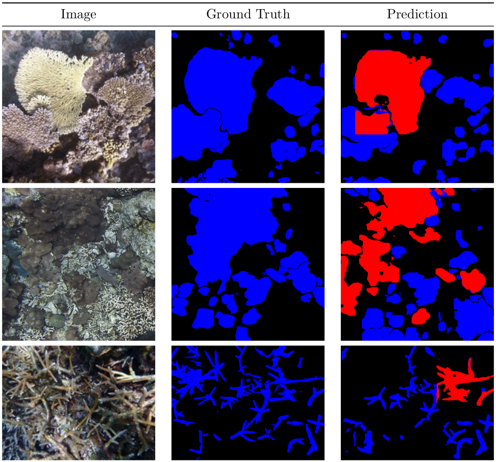
*Results / Qualitative*

The initial results are highly promising, prompting us to further
optimize the performance of the modeling approach through meticulous
selection of hyperparameters.

##### Best Model

After hundreds of GPU-hours of hyperparameter search, we arrived at the
best-performing models.

Given the uncertainty about ReefSupport’s hardware configurations and
the intended use of the models (including the possibility of running on
live video streams from underwater cameras), we aimed to offer a diverse
range of models. These span from models suitable for embedding on edge
devices, enabling real-time video stream segmentation, to high-end GPUs
delivering peak performance. This approach ensures flexibility to
accommodate various deployment scenarios.

The pre-trained YOLOv8 models undergo fine-tuning for 140 epochs with images
resized to 1024x1024 pixels. Additionally, random flipping and rotation of
images up to 45 degrees are applied during training.

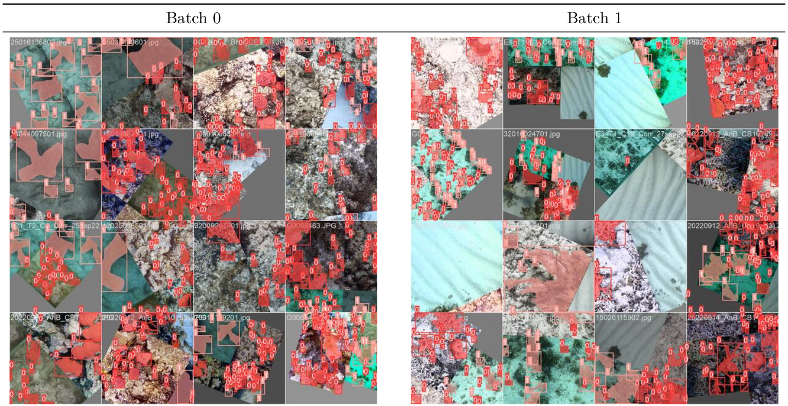
*Data Augmentation / Batch Samples*

| mIoU | IoU_hard | IoU_soft | IoU_other | mDice | Dice_hard | Dice_soft | Dice_other |
| ---- | ---------| -------- | --------- | ----- | --------- | --------- | ---------- |
| __0.85__ | 0.80     | 0.81     | 0.94      | 0.92  | 0.89      | 0.90      | 0.97       |


*Results / Quantitative - Training metrics (left) and pixel level confusion matrix (right)*

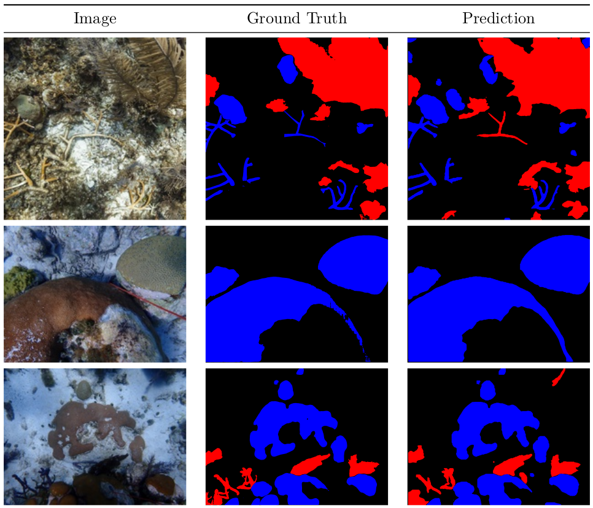
*Results / Qualitative*

#### Evaluation

The subsequent table provides a summary of the performance of the best
model on the test sets for each region:

| data    | mIoU     | IoU_hard | IoU_soft | IoU_other | mDice | Dice_hard | Dice_soft | Dice_other |
| ------- | -------- | ---------| -------- | --------- | ----- | --------- | --------- | ---------- |
| all     | __0.85__ | 0.80     | 0.81     | 0.94      | 0.92  | 0.89      | 0.90      | 0.97       |
| sf_bol  | 0.80     | __0.85__ | 0.63     | 0.93      | 0.89  | 0.92      | 0.77      | 0.97       |
| sf_crt  | 0.72     | 0.70     | 0.54     | 0.94      | 0.83  | 0.82      | 0.70      | 0.97       |
| sv_atl  | 0.78     | 0.63     | 0.78     | 0.92      | 0.87  | 0.78      | 0.87      | 0.96       |
| sv_phl  | __0.62__ | 0.75     | __0.21__ | 0.91      | 0.72  | 0.86      | 0.34      | 0.95       |
| sv_aus  | 0.69     | 0.76     | 0.38     | 0.92      | 0.79  | 0.86      | 0.55      | 0.96       |
| tt_pro  | __0.87__ | 0.77     | __0.88__ | 0.96      | 0.93  | 0.87      | 0.94      | 0.98       |

As the various evaluation metrics are weighted in proportion to the number of
pixels per region, we provide a summary below, illustrating the different
weights assigned to regions based on their respective pixel counts:

| data    | # images (test) | # pixels   | weight (%) | mIoU     | IoU_hard | IoU_soft | IoU_other |
|---------|-----------------|------------|------------|----------|----------|----------|-----------|
| sf_bol  | __25__          | 7056000000 | __39.2__   | 0.80     | __0.85__ | 0.63     | 0.93      |
| sf_crt  | 25              | 1912699566 | 10.6       | 0.72     | 0.70     | 0.54     | 0.94      |
| sv_atl  | 33              | 1136559093 | 6.3        | 0.78     | 0.63     | 0.78     | 0.92      |
| sv_phl  | __24__          | 866520651  | __4.8__    | __0.62__ | 0.75     | __0.21__ | 0.91      |
| sv_aus  | 59              | 1944497328 | 10.8       | 0.69     | 0.76     | 0.38     | 0.92      |
| tt_pro  | __11__          | 5079158784 | __28.2__   | __0.87__ | 0.77     | __0.88__ | 0.96      |

### Model size vs Model accuracy

The table below summarizes the performance of the different YOLOv8 models that
are trained on the same training set, using the same test set for evaluation.

| model size | mIoU | IoU_hard | IoU_soft | IoU_other | mDice | Dice_hard | Dice_soft | Dice_other |
| ---------- | ---- | ---------| -------- | --------- | ----- | --------- | --------- | ---------- |
| x          | __0.85__ | 0.79     | __0.81__     | __0.94__      | __0.92__  | 0.88      | __0.90__      | 0.97       |
| __l__      | __0.85__ | __0.80__     | __0.81__     | __0.94__      | __0.92__  | __0.89__      | __0.90__      | 0.97       |
| m          | __0.85__ | __0.80__     | 0.80     | __0.94__      | __0.92__  | __0.89__      | 0.89      | 0.97       |
| s          | 0.84 | 0.78     | 0.80     | 0.93      | 0.91  | 0.88      | 0.89      | __0.98__       |
| n          | 0.83 | 0.77     | 0.80     | 0.93      | 0.91  | 0.87      | 0.89      | 0.97       |

The top-performing model is the `l` size model, as indicated in the table
above. As the model size decreases, there is a slight degradation in
performance—from a mIoU of 0.85 to 0.83. However, the advantage of smaller
models lies in their faster execution and compatibility with smaller hardware
devices.

## Conclusion

YOLOv8 proved a strong fit for this instance-segmentation task — accurate even
on modest hardware, and fast enough to run on live underwater video streams,
which makes it practical for real deployments.

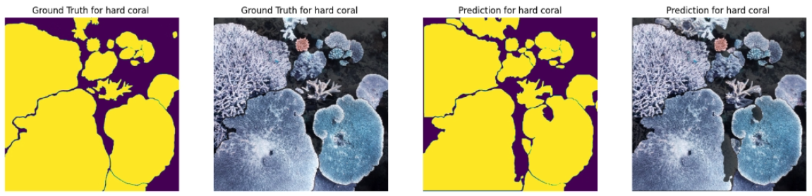
*Benthic Segmentation / Hard Coral*

In conclusion, while YOLOv8 presents a robust solution for the instance
segmentation task, it is crucial to carefully address issues related to
regional model performance, data leakage, and dataset quality. The
insights gained from our findings are invaluable for refining and
optimizing computer vision applications in marine biology and underwater
image segmentation.

You can try the segmenter yourself on real benthic imagery — the interactive
demo runs right in your browser.


