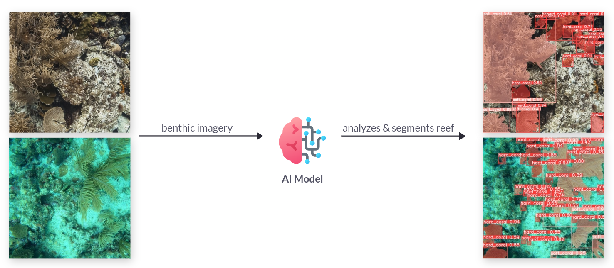

Welcome to our blog post where we'll explore the development process of
a benthic coral reef analyzer, created in partnership with
[ReefSupport](https://reef.support). Our goal is simple: to improve the
tools available for monitoring coral reefs and marine environments.
Let's dive into how we're making this happen!

For a comprehensive understanding of this project, please click on the
image below:

<a href='' title="Project Details">
  
</a>

> Leveraging computer vision for the segmentation of
coral reefs in benthic imagery holds the potential to
> quantify the long-term growth or decline of coral cover
within
> marine protected areas

## Project Scope

Our collaboration aims to lead the way in developing an advanced underwater
benthic imagery model. This model is designed to accurately identify and locate
various functional groups within reef ecosystems. It's flexible and can be used
in different marine regions worldwide.

*Gallery / Benthic Imagery Analysis System by [Reef Support](https://reef.support)*

Initially, our main focus is on distinguishing between hard and soft coral
species. However, our approach is iterative, meaning we can gradually include
more detailed taxonomic classifications as the system evolves and becomes more
sophisticated. By establishing a strong foundation with this broad framework,
we set the stage for comprehensive analysis and management of reef ecosystems.

## Provided Datasets

The data provided by [ReefSupport](https://reef.support) is made available on a
publically hosted [Google Cloud bucket](https://console.cloud.google.com/storage/browser/rs_storage_open). 
Two types of datasets are available:

- __Point Labels__ or __Sparse Labels__: random points in an image are
classified. A typical image would contain
between 50 and 100 point labels. 
  - [IBF](https://indonesiabiru.id/)
  - [Reefolution](https://reefolution.org/)
  - [Seaview](https://espace.library.uq.edu.au/view/UQ:734799)
- __Mask Labels__ or __Dense Labels__: detailed segmentations masks are
provided for hard and soft corals.
  - [CoralSeg](https://onlinelibrary.wiley.com/doi/abs/10.1002/rob.21915) 
  - __ReefSupport__ meticulously annotated subsets of the aforementioned
  datasets, ensuring comprehensive coverage of coral reefs spanning
  various global regions.

  

    
    
    
    
    <!--  -->
    <!--  -->
    
    
  

  <em>Gallery / Random samples from the <b>ReefSupport</b> dataset</em>

Each image is associated with a dense stitched mask made
of all the individual coral instances.

*Associated labels from the ReefSupport dataset - hard and soft coral instances masks*

### Exploratory Data Analysis

Exploratory Data Analysis (EDA) is an approach to analyzing datasets to
summarize their main characteristics, often employing visual methods. The
primary goal of EDA is to uncover patterns, relationships, and anomalies in the
data, which can then inform subsequent analysis or modeling tasks.

EDA typically involves the following steps:

1. __Data Collection__: Gathering the relevant dataset(s) from various sources.
2. __Data Cleaning__: Identifying and handling missing values, outliers, and
   inconsistencies in the data.
3. __Summary Statistics__: Computing descriptive statistics such as mean,
   median, mode, standard deviation, etc., to understand the central tendencies
and variability of the data.
4. __Data Visualization__: Creating visual representations of the data using
   plots, charts, histograms, scatter plots, etc., to explore patterns,
distributions, correlations, and trends within the data.
5. __Exploratory Modeling__: Building simple models or using statistical
   techniques to further understand relationships within the data.
6. __Hypothesis Testing__: Formulating and testing hypotheses about the data to
   validate assumptions or gain insights.
7. __Iterative Analysis__: Iteratively exploring the data, refining analysis
   techniques, and generating new hypotheses as insights emerge.

EDA is a crucial initial step in any data analysis or modeling project as it
helps analysts gain a deeper understanding of the dataset, identify potential
challenges or biases, and inform subsequent analytical decisions. It provides a
foundation for more advanced analyses, such as predictive modeling, hypothesis
testing, or machine learning, by guiding feature selection, model building, and
evaluation strategies.

#### Data quality issues

This section outlines various data quality issues identified during the
Exploratory Data Analysis (EDA) process.

##### Empty masks

Empty stitched masks, characterized by entirely black
pixels, were identified within the datasets. Subsequent
removal of these empty masks resulted in improved overall
performance. Notably, there were 532 empty masks
identified in SEAVIEW_PAC_USA and 328 in SEAVIEW_ATL. The
elimination of such empty masks contributes to a
more refined dataset, enhancing the model’s efficiency
and accuracy during training and evaluation.

*Empty Masks samples*

##### Low quality labels

The presence of dense labels in SEAVIEW/PAC_USA has introduced
challenges in the data modeling process, necessitating their exclusion
from the training set. Regrettably, the labeling process for this
dataset involved creating extensive masks that covered almost all corals
within an image, rather than generating individual masks for each
distinct entity.

*Low quality Masks samples*

##### Mismatched sparse and dense labels

An exploratory analysis was conducted to compare sparse (point) and
dense (mask) labels. In particular, we compared the dense labels
provided by ReefSupport with the point labels associated with the
corresponding images.

  

    
    
  

  <em>Mismatch summary and distribution</em>

The presented samples illustrate instances where point labels contradict
dense labels. Each white cross signifies a label mismatch, with the
first sample showing a 17% error mismatch and the last sample
demonstrating a complete 100% error mismatch.

  

    
    
    
    
  

  <em>Samples to illustrate sparse and dense label mismatches</em>

##### Data leakage

In one of the regions, certain images have been flagged for potential
data leakage due to overlapping content within the same quadrats. This
poses a significant challenge as these images may inadvertently find
their way into multiple datasets, including training, validation, or
testing sets. Such occurrences can lead to an overestimation of
performance metrics during evaluations on both test and validation sets.
A detailed analysis of the sequential order of image IDs highlights a
consistent trend, showing that a majority of images share overlaps with
their neighboring counterparts.

*Sequence of 4 photos that share overlaps with their neigbors*

*Other sequence of 4 photos that share overlaps with their neigbors*

We will assess the magnitude of the data leakage by evaluating the
performance of the fine-tuned model at the regional level as it only
occurs in one identified region.

##### Class imbalance

The dataset exhibited a bias towards hard coral
instances, with their prevalence being approximately five
times higher compared to that of soft coral instances.

Imbalanced datasets pose challenges in machine learning,
particularly when one class is substantially more
dominant than others. This disparity can result in biased
models that inadequately address minority classes,
impacting overall performance.

### Data Preparation

#### YOLOv8 TXT format

## Data Modeling

### Data Split
### Instance Segmentation vs Semantic Segmentation
### Evaluation Metrics

The __mean Intersection Over Union (mIoU)__ and the __Dice Coefficient__ were selected to evaluate the performance of the semantic segmentation results from the models. We stayed away from mean Precision Accuracy (mPA) as it can be very problematic in skewed datasets.

#### mIoU or Jaccard Index

In the context of semantic segmentation, the __Jaccard Index__ is often
referred to as the __Intersection over Union (IoU)__ or the __Jaccard
similarity coefficient__. It is a metric used to assess the accuracy of
segmentation models by measuring the overlap between the predicted
segmentation masks and the ground truth masks.

$$\mathit{IoU} = \dfrac{A \cap B}{A \cup B}$$

The intersection is the number of pixels that are correctly predicted as
part of the object, and the union is the total number of pixels
predicted as part of the object by the model, including both true
positives and false positives.

Higher Jaccard Index values imply better segmentation accuracy,
indicating a greater overlap between the predicted and ground truth
regions.

The Jaccard Index is commonly used as an evaluation metric for semantic
segmentation models. Alongside metrics like pixel accuracy and
class-wise
accuracy, the Jaccard Index helps quantify the spatial agreement between the
predicted and ground truth segmentation masks.

#### Dice Coefficient or F1 score

The __Dice coefficient__, also known as the Dice similarity coefficient or Dice
score, is a metric commonly used in semantic segmentation to quantify the
similarity between the predicted segmentation mask and the ground truth mask.
It is particularly useful for evaluating the performance of segmentation
models, especially when dealing with imbalanced datasets.

The Dice coefficient is calculated using the following formula:

$$\mathit{DiceCoefficient} = \dfrac{2 \times TP}{2 \times TP + FP + FN}$$

Here's how the terms are defined:

- __True Positives (TP)__: The number of pixels that are correctly predicted as
part of the object by both the model and the ground truth. In segmentation, a
true positive occurs when a pixel is correctly identified as belonging to the
object.

- __False Positives (FP)__: The number of pixels that are predicted by the
model as part of the object but are actually part of the background according
to the ground truth.

- __False Negatives (FN)__: The number of pixels that are part of the object in
the ground truth but are incorrectly predicted as background by the model.

The Dice coefficient essentially measures how well the model captures the true
positives relative to the total pixels predicted as part of the object (both
true positives and false positives) and the total pixels that actually belong
to the object (true positives and false negatives). The factor of 2 in the
numerator and denominator is used to ensure that the Dice coefficient ranges
from 0 to 1.

A high Dice coefficient indicates a strong agreement between the predicted
segmentation and the ground truth, while a low Dice coefficient suggests poor
segmentation performance.

In summary, the Dice coefficient provides a way to balance and evaluate the
trade-off between precision (capturing true positives) and recall (capturing
all actual positives) in semantic segmentation tasks. It is a valuable metric,
especially in cases of class imbalance where accuracy alone may not provide a
clear picture of the model's performance.

### YOLOv8
#### Overview
#### Training
#### Evaluation
### Model size vs Model accuracy

## Conclusion

