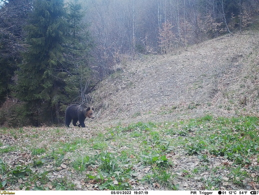
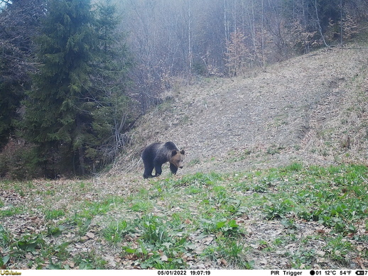
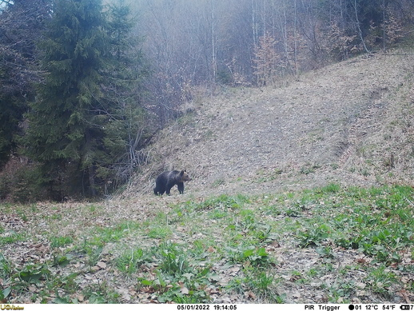
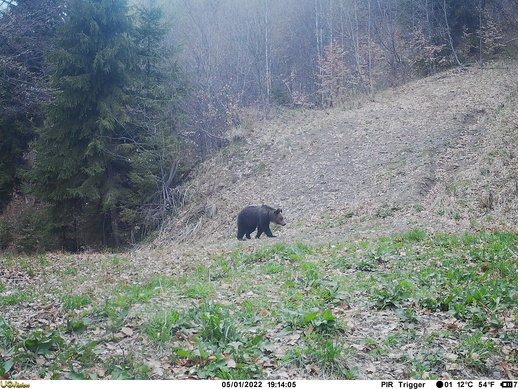
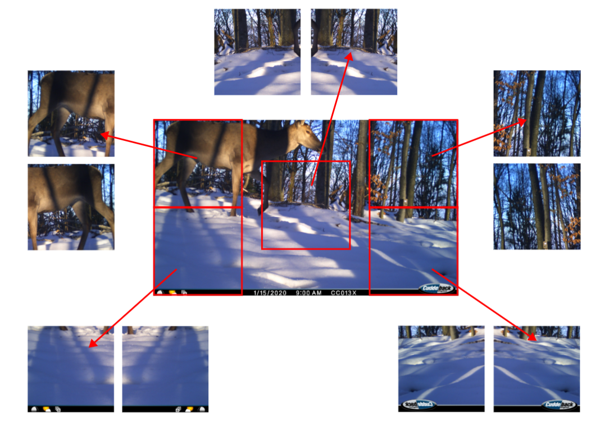
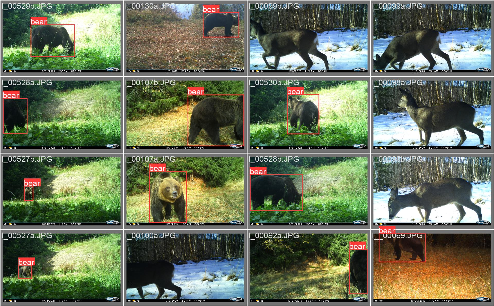
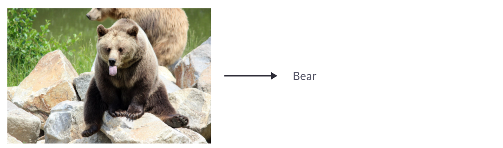
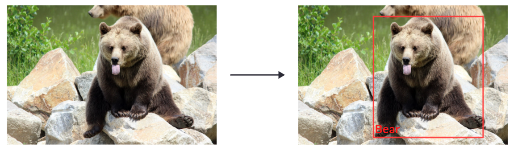
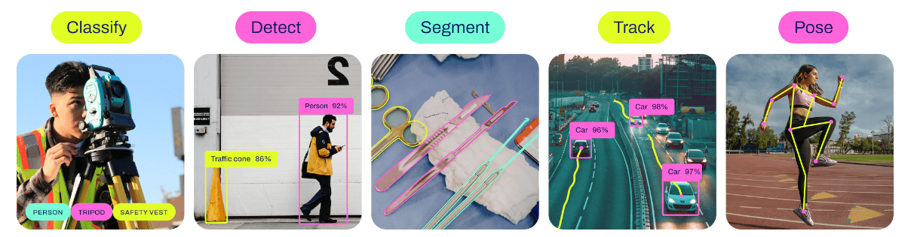
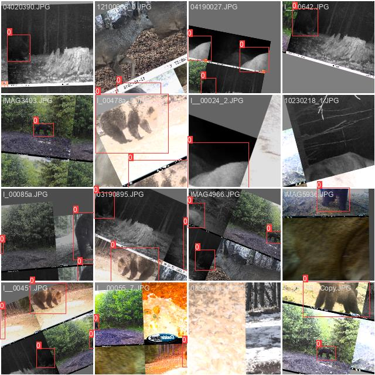

In this post, we'll walk through the development of a real-time bear detection
system, built with the NGO
[HackThePlanet](https://www.hack-the-planet.io) to safeguard Romanian farms by
deterring bears.

> Implementing non-invasive methods to deter bears from approaching farms
> and livestock holds promise in fostering harmonious relations between
> humans and bears.

For the full picture, here is the bear deterrence pipeline — tap through for the
project:

*Watch → detect the bear on-device → trigger → deter it from the farm*

## Project Scope

The detection model runs on a low-power microcontroller (a Raspberry Pi 5), so
it has to be fast and frugal at inference. Catching an approaching bear in time
is critical — a bear on the farm can prey on livestock like pigs — so recall has
to be very high. And since bears are active day and night, the system runs
around the clock.

*A Raspberry Pi is no bigger than a credit card — small and low-power enough to run at the farm's edge*

A low false-positive rate matters just as much, for two reasons: false alarms
erode farmers' trust in a system they rely on daily, and each one needlessly
fires the power-hungry bear-deterrent.

## Provided Dataset

We have amassed a collection of camera trap images captured over the
past years from forests near the farms in Romania.


  
  
  
  

*Camera-trap pictures of bears in Romania, near the farms where the system is deployed*

### Camera Traps

Camera traps have transformed wildlife research: a camera paired with a motion
sensor collects data without anyone present, capturing animals with minimal
disturbance. From the Arctic tundra to tropical rainforests, they've become an
affordable, indispensable tool for studying a huge range of species.


  
  


### Exploratory Data Analysis

Before modelling, we explored the dataset closely — and it surfaced several
data-quality issues worth fixing first.

#### Data quality issues

##### Bursts of Images

When its motion sensor fires, a camera trap records a burst of frames — many
near-identical shots of the same animal. These bursts must be kept together
during the data split; otherwise near-duplicates leak across train and test,
and the model overreports its performance.

  

    
    
    
    
  

  <em>A single bear encounter — the camera fires a burst of near-identical frames</em>

##### Corrupted Images

A sizeable share of the camera-trap pictures were corrupted and wouldn't load.
We couldn't recover them, so they had to be discarded.

#### Class imbalance

The dataset skews heavily towards bears — roughly five times more bear images
than other animals or empty frames — which biases a model towards the majority
class. Three techniques can help rebalance it:

  

    <h3 class="support__card-title">Oversampling</h3>
    
Duplicate or synthesise extra examples of the minority class to even out the counts.

  

  

    <h3 class="support__card-title">Undersampling</h3>
    
Randomly drop examples from the majority class to balance the distribution.

  

  

    <h3 class="support__card-title">Data augmentation</h3>
    
Add small variations to minority-class images — our most effective option here.

  

*Data augmentation / [TenCrop](https://pytorch.org/vision/main/generated/torchvision.transforms.TenCrop.html) — generate 10 images from one to mitigate the class imbalance*

In our experiments, augmenting the empty frames and other-animal images worked
best: it kept plenty of bear images while adding variety to the rest.

### Data Annotation

To annotate our dataset, we evaluated two machine
learning models: __MegaDetector__ and __GroundingDINO__.
In our decision to train an object detector, the
annotation process for each image captured by the camera
traps should include generating bounding boxes that
outline the location of each detected bear: (x, y, width,
height).

Both models found bears in the camera-trap images, but GroundingDINO — prompted
with "bear" — was more accurate, with fewer false positives and negatives, so we
used it to generate the dataset.

___Note:___ MegaDetector and GroundingDINO, while effective for object
detection and image understanding, are not suitable for low-power, real-time
applications due to their large size and high computational requirements.
However, we can leverage these existing models to curate the dataset used for
training our machine learning model.

#### MegaDetector

[__MegaDetector__](https://github.com/microsoft/CameraTraps/blob/main/megadetector.md)
is a camera-trap animal detector from Microsoft AI for Earth, built to localize
animals — including rare species — across large-scale monitoring datasets.

#### GroundingDINO

<b>GroundingDINO</b> is a multimodal model that combines a Vision Transformer
(ViT) with language grounding. By tying a text prompt to visual features, it
detects and localizes objects from a free-text description rather than a fixed
list of classes — so prompting it with "bear" is enough to label the dataset.

 
 

## Data Modeling

### Data split

We split the annotated dataset 80/10/10 into train, validation, and test. To
avoid leakage, we partitioned by camera reference and capture date (from each
picture's EXIF metadata), keeping a camera's bursts together in one split.

### Image Classification vs Object Detection

There are two ways to frame this. As **image classification**, we'd simply
predict whether an image contains a bear. As **object detection**, we'd predict
bounding boxes around any bears in the image.

*Image classification — one label for the whole image*

*Object detection — a bounding box around each bear*

We started with classification, but the model learned to cue off the fixed
camera-trap backgrounds rather than the bears themselves — which would hurt
generalization in the field. Reframing it as object detection fixed that and
performed better.

### YOLOv8

#### Overview

We took a pretrained
[YOLOv8](https://github.com/ultralytics/ultralytics) model and fine-tuned it for
our object detection task. YOLOv8 is fast, accurate, and easy to work with, and
it handles a range of tasks — object detection, tracking, instance
segmentation, image classification, and pose estimation.

*YOLOv8 Computer Vision Tasks*

#### Model size

As we aim to deploy our solution on a low-power microcontroller, we selected
the most compact variant of YOLOv8, known as the `'nano'` version or `'YOLOv8n'`.
The table below illustrates the tradeoff between model size (a proxy for
accuracy) and processing speed.

| Model                                                                                     | size (pixels) | mAPval 50-95 | Speed CPU ONNX (ms) | Speed A100 TensorRT (ms) | params (M) | FLOPs (B) |
| ----------------------------------------------------------------------------------------- | --------------------- | -------------------- | ------------------------------ | ----------------------------------- | ------------------ | ----------------- |
| [YOLOv8n](https://github.com/ultralytics/assets/releases/download/v8.1.0/yolov8n-oiv7.pt) | 640                   | 18.4                 | 142.4                          | 1.21                                | 3.5                | 10.5              |
| [YOLOv8s](https://github.com/ultralytics/assets/releases/download/v8.1.0/yolov8s-oiv7.pt) | 640                   | 27.7                 | 183.1                          | 1.40                                | 11.4               | 29.7              |
| [YOLOv8m](https://github.com/ultralytics/assets/releases/download/v8.1.0/yolov8m-oiv7.pt) | 640                   | 33.6                 | 408.5                          | 2.26                                | 26.2               | 80.6              |
| [YOLOv8l](https://github.com/ultralytics/assets/releases/download/v8.1.0/yolov8l-oiv7.pt) | 640                   | 34.9                 | 596.9                          | 2.43                                | 44.1               | 167.4             |
| [YOLOv8x](https://github.com/ultralytics/assets/releases/download/v8.1.0/yolov8x-oiv7.pt) | 640                   | 36.3                 | 860.6                          | 3.56                                | 68.7               | 260.6             |

#### Training

We trained for 200 epochs, tracking mean IoU, box precision, and box recall on
the validation set throughout. To improve robustness, we applied the usual
augmentations — horizontal flips, random crops, mosaic aggregation, rotation,
colour jitter, and more.

*Data augmentation during training — mosaic, rotation, and more*

#### Evaluation

On the test set we report a confusion matrix, treating the model as a binary
classifier: if its best bear detection clears a probability threshold, the image
counts as containing a bear.

*Confusion Matrix Normalized - imgsz 1024*

### Inference Speed vs Model Accuracy

Running in real time forces a tradeoff between speed and accuracy: a larger
model on the full frame is more accurate but slower. Weighing the two was key to
picking the right model.

*Inference speed and model accuracy tradeoff on the Raspberry Pi 5*

## Conclusion

We've walked through building a real-time bear detector: cleaning up the
dataset, using GroundingDINO to annotate it quickly, and balancing speed against
accuracy to land on a model that runs on a low-power device. The same approach
extends well beyond bears to other human-wildlife conflicts.

  <h3 class="about-cta__title">Explore the project</h3>
  
Try the detector on real camera-trap images, or dive into the full Carpathian bear deterrence project and how it works in the field.

  

    <a class="link-no-decoration" href="/demos/human_wildlife_bear_conflict/">
      <button class="button button--middle">Try the demo</button>
    </a>
    <a class="link-no-decoration" href="/projects/carpathian-bear-deterrence/">
      <button class="button button--middle">View the project</button>
    </a>
  

