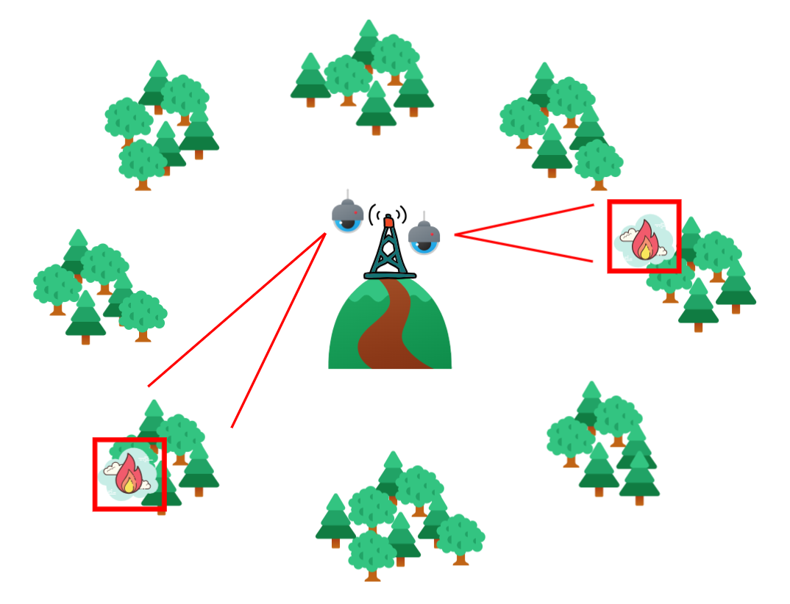

In this blog post we'll explore the development process of a state of the art
early forest fire detector, created in partnership with the NGO
[Pyronear](https://pyronear.org).

> Our detectors communicate fire alerts to a database that is connected
> to a supervision platform for the fire department.
>
> <cite>– Pyronear</cite>

*Overview of the Pyronear system to monitor forests around the clock*

*Overview of the camera system that can cover 360 degrees angle*

*Overview of the embedded ML system*

### Hardware setup

The Pyronear team developped a plug and play system composed of a central processor unit made of a Raspberry Pi connected to 4 cameras that cover 360 degrees angle to process input images around the clock.

#### Setting up the Pyronear system at Fontainebleau

  

    
    
  

  <em>Setting up the system on the antenna tower</em>

  

    
    
  

  <em>Covering 360 degrees with two Reolink RLC-823A 16X cameras</em>

  

    
    
  

  <em>View from the antenan tower</em>

  

    
  

  <em>Pyronear hardware system case - Raspberry Pi, power chords, RJ45, and SIM card</em>

*Range covered by the two cameras by taking pictures at different angles*

#### Covered sites

  

    
    
    
    
  

  <em>360 view of the <b>Brison site</b> - 4 cameras are placed on an antenna tower</em>

<iframe src="https://www.youtube.com/embed/i9Qy-zY16Ew" loading="lazy" frameborder="0" allowfullscreen></iframe>

The computer vision model detects a forest fire in Fontainebleau from a distance of 35 kilometers in real time. Setting a new record for the Pyronear systems.

