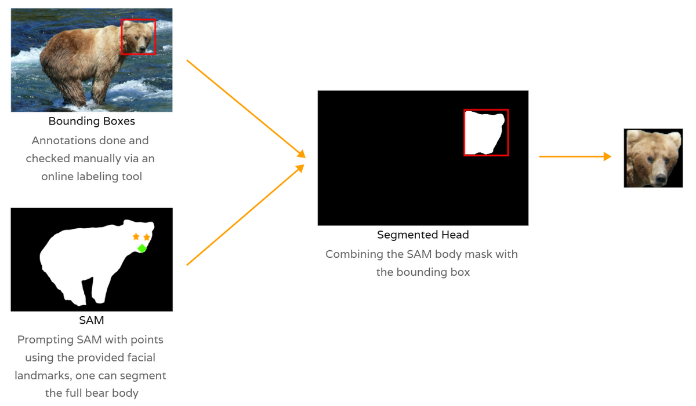

In this blog post, we will dive into the pivotal preprocessing techniques used to normalize animal images to make them ready for identification of individuals. 

It focuses on the first stages of the ML pipelines that were developed during different projects: bear identification and trout identification where similar computer vision techniques and tricks were used to successfuly build robust identification pipelines.

*Gallery / Overview of the ML pipeline to identify __bears__ using their facial markings with Metric Learning*

In the bear identification project, the processing stage spans the bear face detection, head segmentation and head normalization stages.

*Gallery / Overview of the ML pipeline developed to identify __trouts__ using their spot patterns with Local Feature Matching*

In the trout identification project, the processing stage spans the trout detection, pose estimation and image normalization.

Both projects leverage similar preprocessing techniques that are detailed and illustrated in this blog post.

## Segmentation

To successfuly identify individuals, it is critical to precisely isolate the important part of the picture and remove the remaining background pixels. It allows the identification models to only focus on important signal from the picture without having to deal with unimportant or misleading signals coming from the other pixels.

For bears, the literature and our work showed that their facial markings and shapes are unique and can be used to successfuly identify individuals. For trouts, it is possible identify individuals using their stable and unique spot patterns.

### Segmentation

Semantic segmentation assigns a class label to each pixel in an image,
such as 'person,' 'dog,' or 'flower,' grouping together pixels of the
same class. Conversely, instance segmentation distinguishes between
individual instances of objects within the same class, treating each one
as a separate entity.

*Semantic segmentation vs Instance segmentation*

### Manual annotations

TODO:

### GroundingDINO

<b>GroundingDINO</b> is a multimodal framework that combines Vision
Transformers (ViTs) with language grounding for image-text matching tasks. It
leverages the power of transformer-based models for both image and text
modalities, enabling efficient processing of visual and textual information. By
grounding textual descriptions with visual features, GroundingDINO achieves
improved performance in tasks such as image retrieval and cross-modal
understanding.

 
 

TODO:

### Segment Anything Model - SAM

The __Segment Anything Model__ (SAM) produces high quality object masks
from input prompts such as points or boxes, and it can be used to
generate masks for all objects in an image. It has been trained on a
dataset of 11 million images and 1.1 billion masks, and has strong
zero-shot performance on a variety of segmentation tasks.

*SAM Github / SAM output example*

TODO:

## Normalization

Producing normalized images for the identification stage is critical. It makes it easier to compare different individuals in a consistent manner and it boosts the model accuracy.

For bears, it is important to resize and pad the bear heads to make them the same size as the model expects a fixed image size as input. If a segmentation mask is available for the bear faces, it is very simple to cut out the heads and pad the resulting images with black pixels to make them a fixed size.

*Normalized bear faces*

For trouts, we want to realign the fish to face the same direction and then apply the segmentation masks to cut out the background too.

  

    
    
    
    
  

  <em>Normalized trouts</em>

### Rotation

In most cases, one will need to apply a rotation operation to the original images so that all images are aligned using the same angle. That can be needed for identification model that are sensitive to rotation.

TODO: add illustration here.

To find the rotation angle needed to align the pictures in a consistent way, one can leverage a class of ML models know as pose estimation models that learn to predict specific parts of the animal: eye, nose, mouth, tail, etc.

#### Pose Estimation 101

#### Fine tuning a pose estimation model

### Misc

*Generating Bear Face Masks combining bboxes and SAM*

