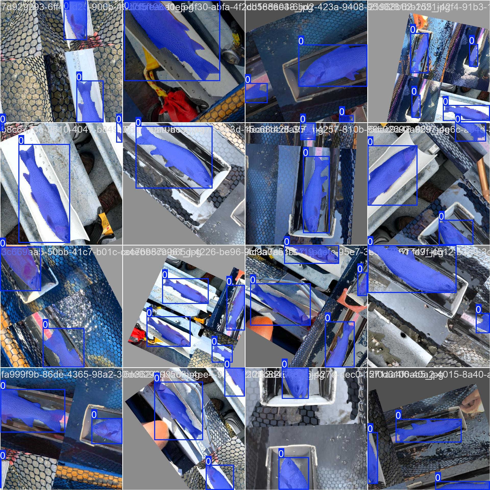
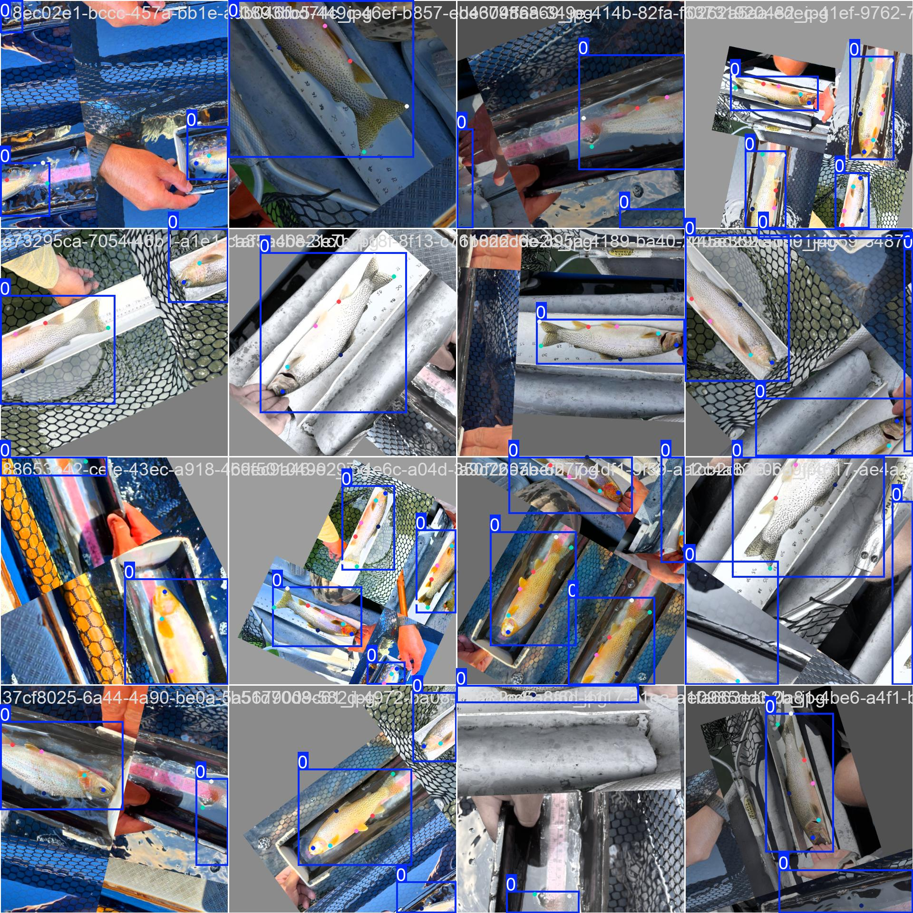
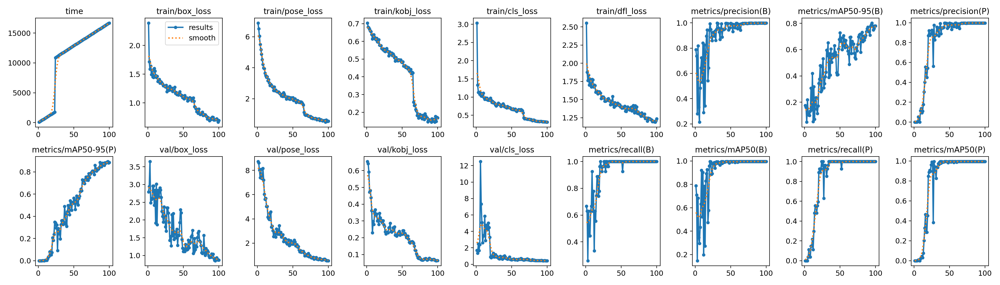
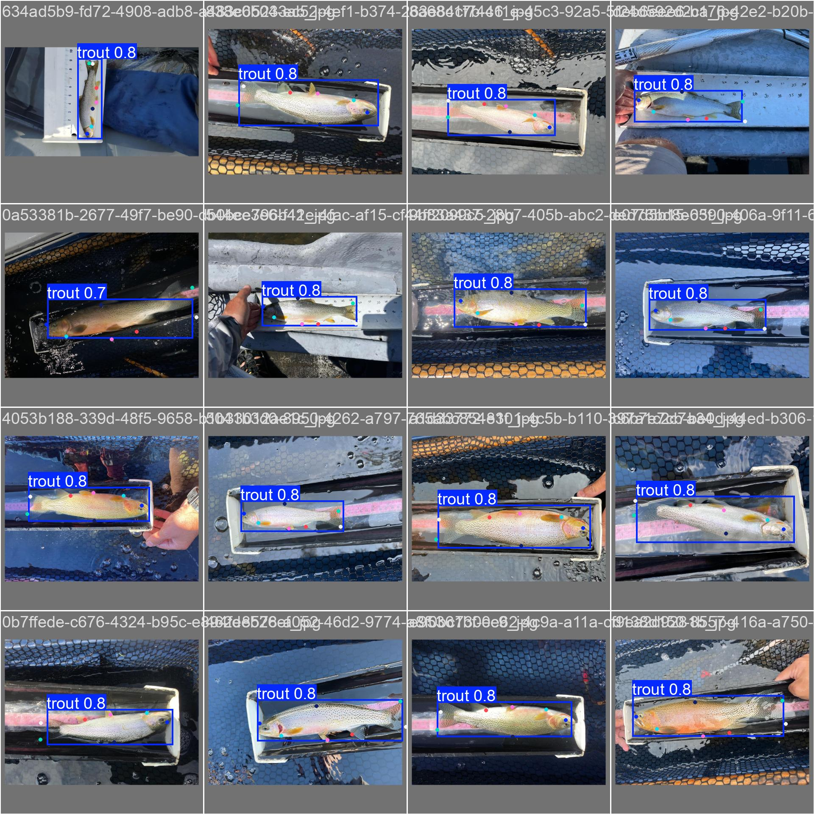

In this blog post, we will explore essential preprocessing techniques for
normalizing animal images, preparing them for individual identification.

We will focus on the initial stages of the machine learning pipelines developed
for various projects, specifically bear and trout identification. In both
cases, similar computer vision techniques and strategies were employed to
successfully create robust identification systems.

*Gallery / Overview of the ML pipeline to identify __bears__ using their facial
markings with Metric Learning*

In the [bear identification project](), the processing stage encompasses bear face detection, head segmentation,
and head normalization.

*Gallery / Overview of the ML pipeline developed to identify __trouts__ using
their spot patterns with Local Feature Matching*

In the [trout identification project](), the processing stage includes trout
detection, pose estimation, and image normalization.

Both projects utilize similar preprocessing techniques, which are thoroughly
detailed and illustrated in this blog post.

## Segmentation

To successfully identify individuals, it is essential to accurately isolate the
key features of the image while removing extraneous background pixels. This
approach enables the identification models to concentrate solely on the
relevant signals from the image, minimizing the influence of unimportant or
misleading information from other pixels.

In the case of bears, both existing literature and our research indicate that
their facial markings and shapes are unique, making them effective for
individual identification. Similarly, for trout, individuals can be identified
by their distinct and stable spot patterns.

### Segmentation 101

Semantic segmentation assigns a class label to each pixel in an image,
such as 'person,' 'dog,' or 'flower,' grouping together pixels of the
same class. Conversely, instance segmentation distinguishes between
individual instances of objects within the same class, treating each one
as a separate entity.

*Semantic segmentation vs Instance segmentation*

Instance segmentation techniques are generally more effective for isolating
individual subjects in images.

### GroundingDINO + SAM = Mask Dataset ❤

Generating a segmentation dataset for a diverse array of animals has become
straightforward by combining an open-set object detector like GroundingDINO,
which localizes and detects animals using text prompts, with a promptable
segmentation model such as the Segment Anything Model (SAM).

*Generating Bear Face Masks combining GroundingDINO and SAM*

*Generating Trout Masks combining GroundingDINO and SAM*

Both of these computer vision models are large and tend to run slowly on a CPU.
Therefore, it is often beneficial to use the generated dataset of masks to
train a smaller, faster instance segmentation model capable of localizing and
segmenting the animal in a single pass.

#### GroundingDINO

<b>GroundingDINO</b> is a multimodal framework that combines Vision
Transformers (ViTs) with language grounding for image-text matching tasks. It
leverages the power of transformer-based models for both image and text
modalities, enabling efficient processing of visual and textual information. By
grounding textual descriptions with visual features, GroundingDINO achieves
improved performance in tasks such as image retrieval and cross-modal
understanding.

 
 

#### Segment Anything Model - SAM

The __Segment Anything Model__ (SAM) produces high quality object masks
from input prompts such as points or boxes, and it can be used to
generate masks for all objects in an image. It has been trained on a
dataset of 11 million images and 1.1 billion masks, and has strong
zero-shot performance on a variety of segmentation tasks.

*SAM Github / SAM output example*

### Finetune an Instance Segmentation model

Once the dataset of masks is generated using GroundingDINO and SAM, the next
step is to train a compact model that can perform both tasks simultaneously and
operate efficiently on a CPU. Enter YOLO!

#### YOLO Overview

[YOLO](https://github.com/ultralytics/ultralytics), known for its remarkable
speed and accuracy, has established itself as a leading choice in the field of
computer vision. YOLO, excels in a variety of tasks, including object
detection, tracking, and image classification. What sets it apart is its
capability for instance segmentation, allowing it to not only identify and
localize objects within an image but also to distinguish between individual
instances of those objects. With its user-friendly interface and efficient
performance, YOLO is an ideal solution for applications requiring precise
segmentation and real-time processing.

*YOLOv8 Computer Vision Tasks*

#### Training

##### Data Augmentation

We can employ various data augmentation techniques to artificially
enhance our training set. These techniques help increase the diversity
of the data and improve the model's robustness. Common augmentation
methods include:

- __Random Scaling__: Varying the size of the images to simulate different
distances from the camera.
- __Random Rotation__: Rotating images by a random angle to account for
variations in orientation.
- __Mosaic Augmentation__: Combining multiple images into a single mosaic to
create a more complex training example.
- __Flipping__: Horizontally or vertically flipping images to introduce mirror variations.
- __Color Jittering__: Randomly adjusting the brightness, contrast, saturation,
and hue of the images to simulate different lighting conditions.
- __Cropping__: Randomly cropping sections of the images to focus on different
parts of the trout, which can help the model learn to identify keypoints in
various contexts.
- __Gaussian Noise__: Adding random noise to the images to make the model more
resilient to variations in input quality.

By applying these augmentation techniques before feeding the images to the
model, we can significantly enhance the training dataset, leading to improved
model performance and generalization.

  

    
    
    
    
  

  <em>Data Augmentation (rotation, scaling, cropping) of the annoted trout dataset - Random batches.</em>

##### Training Results

Typically, training a satisfactory segmentation model requires only a
relatively small number of epochs. This allows for efficient model
development while still achieving effective performance on the task.

*Results of the training of a segmentation model on trouts for 100 epochs*

##### Qualitative Results

A qualitative evaluation of segmentation model was conducted on a random
batch from the validation set. The results demonstrate that the model
performs with high accuracy, effectively localizing and segmenting out
trouts.

| Ground Truth | Prediction |
|:------------:|:----------:|
|  |  |

## Normalization

Producing normalized images for the identification stage is critical. It makes it easier to compare different individuals in a consistent manner and it boosts the model accuracy.

For bears, it is important to resize and pad the bear heads to make them the same size as the model expects a fixed image size as input. If a segmentation mask is available for the bear faces, it is very simple to cut out the heads and pad the resulting images with black pixels to make them a fixed size.

*Normalized bear faces*

For trouts, we want to realign the fish to face the same direction and then apply the segmentation masks to cut out the background too.

  

    
    
    
    
  

  <em>Normalized trouts</em>

### Rotation

In many instances, it is necessary to apply a rotation operation to the
original images to ensure that all images are aligned using a consistent angle.
This alignment is particularly important for identification models that are
sensitive to variations in rotation.

To determine the appropriate rotation angle for consistent alignment, we can
leverage a class of machine learning models known as pose estimation models.
These models are trained to predict specific anatomical features of the animal,
such as the eye, nose, mouth, tail, and other keypoints. By accurately
localizing these features, we can calculate the required rotation angle to
standardize the orientation of the images.

#### Pose Estimation 101

*Gallery / Pose Estimation to localize the key points on a human body*

Pose estimation is a vital domain within computer vision that aims to ascertain
the spatial configuration of individuals or objects within images or videos.
This process involves accurately identifying the positions of key points on
body — such as joints, facial landmarks—or determining the orientation of
various objects. By leveraging these detected keypoints, pose estimation can
facilitate the normalization of images, allowing for realignment and consistent
representation based on the identified poses.

This capability to accurately identify these keypoints with a machine learning
model enables us to realign and normalize images, ensuring that all trout are
oriented in the same direction. Additionally, it allows for the detection of
the side of the trout that is visible in the image, enhancing our ability to
analyze and interpret the data effectively.

*Gallery / Pose estimation to localize the keypoints of a trout: eye, tail, fins*

To realign the trout images, we utilize the predicted keypoints, particularly
the pelvic and anal fins, to determine the appropriate rotation angle needed
for horizontal alignment. By calculating this angle based on the positions of
these keypoints, we can effectively adjust the orientation of the image,
ensuring that the trout is consistently aligned for analysis.

The green line in the images below, drawn between the pelvic and anal fins,
serves as a reference point for rotating the image. This line acts as an
anchor, allowing us to accurately adjust the orientation of the trout for
consistent alignment.

| Original | Keypoints | Rotated | Final |
|:--------:|:---------:|:-------:|:-----:|
|  |  |  |  |
|  |  |  |  |
|  |  |  |  |

#### Finetuning a Pose Estimation model

By utilizing a pretrained model designed for human pose estimation, we can
apply transfer learning techniques to adapt the model for localizing specific
keypoints on trout, such as the eye, pelvic fin, dorsal fin, tail, and others.

We can annotate a small dataset with the identified keypoints that we want the
pose estimation model to learn. For the trout identification project, a few
hundred annotated images proved sufficient to train a highly accurate model.
The annotation process is typically conducted in stages, where an initial model
can bootstrap the expansion of the annotated dataset, allowing for iterative
improvements and enhanced performance over time.

##### Data Augmentation

  

    
    
    
    
  

  <em>Data Augmentation (rotation, scaling, cropping) of the annoted trout dataset - Random batches.</em>

##### Training Results

Typically, only a limited number of epochs are required to train a satisfactory
initial pose estimation model. This foundational model can then be further
enhanced by incorporating additional data points into the annotated dataset,
allowing for continuous improvement in accuracy and performance.

*Results of the training of a pose estimation model for trout keypoints localization for 100 epochs*

##### Qualitative Results

A qualitative evaluation of the pose estimation model was conducted on a
random batch from the validation set. The results demonstrate that the
model performs with high accuracy, effectively identifying and
localizing keypoints on the trout.

| Ground Truth | Prediction |
|:------------:|:----------:|
|  |  |

## Conclusion

In this article, we have explored various standard computer vision
techniques that often complement each other effectively. An open-set
object detector, such as GroundingDINO, combined with a promptable
segmentation model like SAM, can facilitate the curation of a training
mask dataset. If necessary, a smaller segmentation model designed for
real-time performance and capable of running on CPU, such as YOLO, can
be trained on this generated dataset.

Normalizing and standardizing the dataset used for downstream
identification models is crucial. This can be achieved through various
methods, including training a pose estimation model to realign images
based on specific keypoints.

These techniques are versatile and applicable to a wide range of
problems, making them essential tools in the modern computer vision
toolkit.
