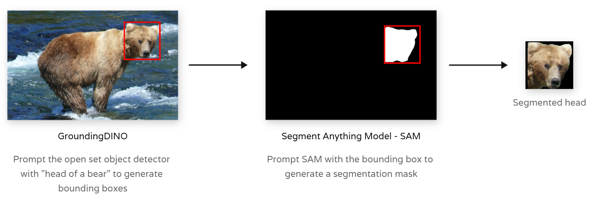

In this blog post, we will explore essential preprocessing techniques for
normalizing animal images, preparing them for individual identification.

We will focus on the initial stages of the machine learning pipelines developed
for various projects, specifically bear and trout identification. In both
cases, similar computer vision techniques and strategies were employed to
successfully create robust identification systems.

*Gallery / Overview of the ML pipeline to identify __bears__ using their facial
markings with Metric Learning*

In the [bear identification project](), the processing stage encompasses bear face detection, head segmentation,
and head normalization.

*Gallery / Overview of the ML pipeline developed to identify __trouts__ using
their spot patterns with Local Feature Matching*

In the [trout identification project](), the processing stage includes trout
detection, pose estimation, and image normalization.

Both projects utilize similar preprocessing techniques, which are thoroughly
detailed and illustrated in this blog post.

## Segmentation

To successfully identify individuals, it is essential to accurately isolate the
key features of the image while removing extraneous background pixels. This
approach enables the identification models to concentrate solely on the
relevant signals from the image, minimizing the influence of unimportant or
misleading information from other pixels.

In the case of bears, both existing literature and our research indicate that
their facial markings and shapes are unique, making them effective for
individual identification. Similarly, for trout, individuals can be identified
by their distinct and stable spot patterns.

### Segmentation 101

Semantic segmentation assigns a class label to each pixel in an image,
such as 'person,' 'dog,' or 'flower,' grouping together pixels of the
same class. Conversely, instance segmentation distinguishes between
individual instances of objects within the same class, treating each one
as a separate entity.

*Semantic segmentation vs Instance segmentation*

Instance segmentation techniques are generally more effective for isolating
individual subjects in images.

### GroundingDINO + SAM = Mask Dataset ❤

Generating a segmentation dataset for a diverse array of animals has become
straightforward by combining an open-set object detector like GroundingDINO,
which localizes and detects animals using text prompts, with a promptable
segmentation model such as the Segment Anything Model (SAM).

*Generating Bear Face Masks combining GroundingDINO and SAM*

*Generating Trout Masks combining GroundingDINO and SAM*

Both of these computer vision models are large and tend to run slowly on a CPU.
Therefore, it is often beneficial to use the generated dataset of masks to
train a smaller, faster instance segmentation model capable of localizing and
segmenting the animal in a single pass.

#### GroundingDINO

<b>GroundingDINO</b> is a multimodal framework that combines Vision
Transformers (ViTs) with language grounding for image-text matching tasks. It
leverages the power of transformer-based models for both image and text
modalities, enabling efficient processing of visual and textual information. By
grounding textual descriptions with visual features, GroundingDINO achieves
improved performance in tasks such as image retrieval and cross-modal
understanding.

 
 

#### Segment Anything Model - SAM

The __Segment Anything Model__ (SAM) produces high quality object masks
from input prompts such as points or boxes, and it can be used to
generate masks for all objects in an image. It has been trained on a
dataset of 11 million images and 1.1 billion masks, and has strong
zero-shot performance on a variety of segmentation tasks.

*SAM Github / SAM output example*

### Finetune an Instance Segmentation model

Once the dataset of masks is generated using GroundingDINO and SAM, the next
step is to train a compact model that can perform both tasks simultaneously and
operate efficiently on a CPU. Enter YOLO!

#### YOLO Overview

[YOLO](https://github.com/ultralytics/ultralytics), known for its remarkable
speed and accuracy, has established itself as a leading choice in the field of
computer vision. YOLO, excels in a variety of tasks, including object
detection, tracking, and image classification. What sets it apart is its
capability for instance segmentation, allowing it to not only identify and
localize objects within an image but also to distinguish between individual
instances of those objects. With its user-friendly interface and efficient
performance, YOLO is an ideal solution for applications requiring precise
segmentation and real-time processing.

*YOLOv8 Computer Vision Tasks*

## Normalization

Producing normalized images for the identification stage is critical. It makes it easier to compare different individuals in a consistent manner and it boosts the model accuracy.

For bears, it is important to resize and pad the bear heads to make them the same size as the model expects a fixed image size as input. If a segmentation mask is available for the bear faces, it is very simple to cut out the heads and pad the resulting images with black pixels to make them a fixed size.

*Normalized bear faces*

For trouts, we want to realign the fish to face the same direction and then apply the segmentation masks to cut out the background too.

  

    
    
    
    
  

  <em>Normalized trouts</em>

### Rotation

In most cases, one will need to apply a rotation operation to the original images so that all images are aligned using the same angle. That can be needed for identification model that are sensitive to rotation.

TODO: add illustration here.

To find the rotation angle needed to align the pictures in a consistent way, one can leverage a class of ML models know as pose estimation models that learn to predict specific parts of the animal: eye, nose, mouth, tail, etc.

#### Pose Estimation 101

#### Fine tuning a pose estimation model

### Misc
