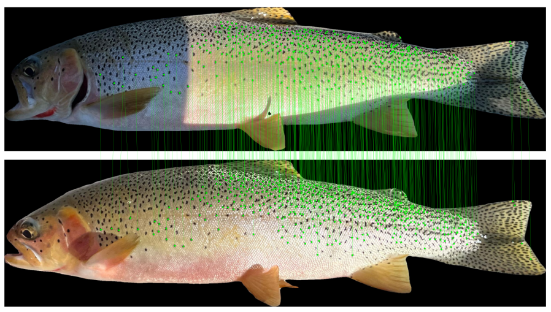
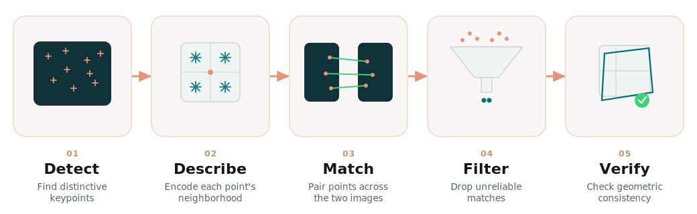
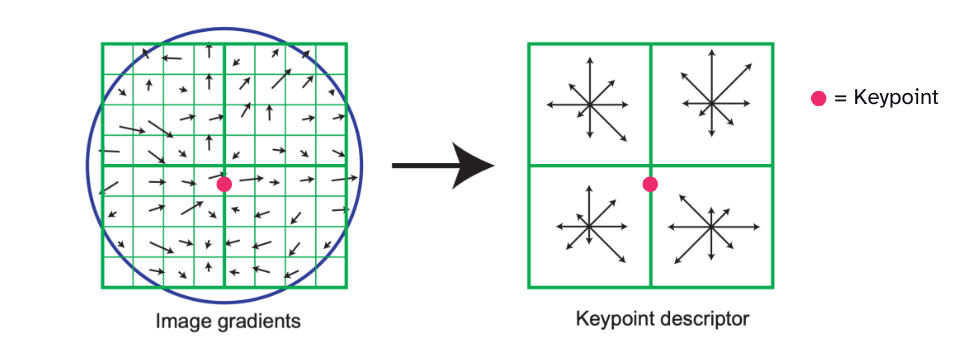
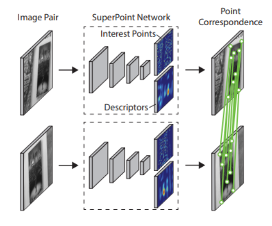
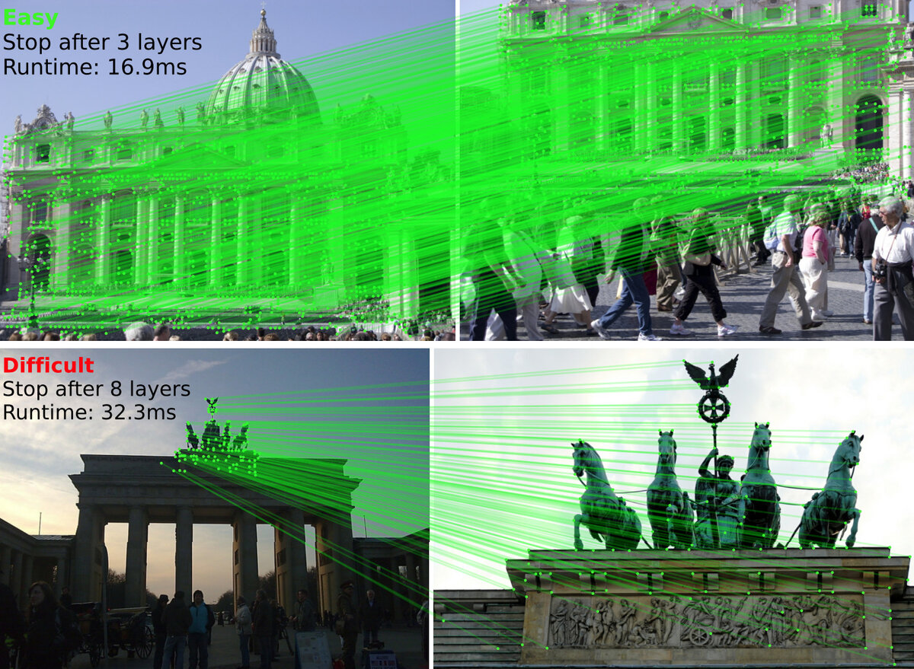
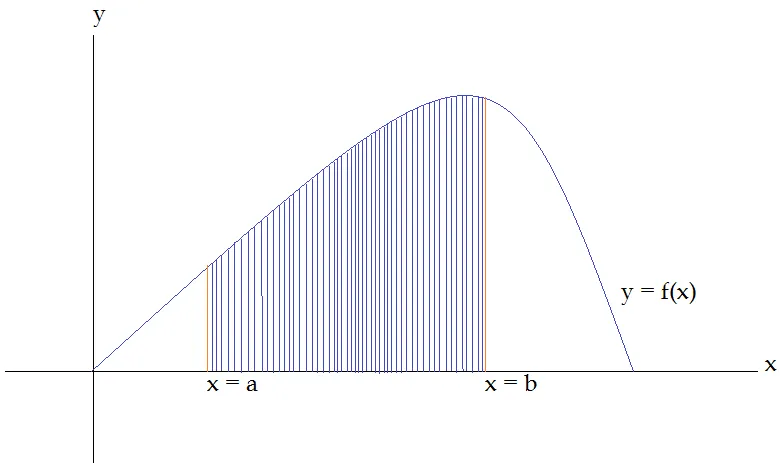
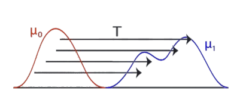

In this post, we will explore a powerful technique widely used for
identifying individuals across various species. This method leverages unique
physical markings that remain relatively stable throughout an organism's
lifetime, making it effective for species with distinct patterns. For instance,
[whale sharks](https://www.sharkguardian.org/whale-shark-research), [trout](),
[turtles](https://app.fruitpunch.ai/article/2024/02/01/tracking-turtles-how-ai-helps-conservationists-to),
and
[seals](https://app.fruitpunch.ai/article/2023/03/23/understanding-seals-with-ai)
all possess unique spot or scale patterns that lend themselves well to this
computer vision approach. 


  
  
  
  


By harnessing these identifiable features,
researchers and conservationists can track and monitor individual animals,
contributing to our understanding of biodiversity and aiding in conservation
efforts. Join us as we delve into the intricacies of this technique and its
applications in wildlife identification.

## Local Feature Matching

Image matching in computer vision is a fundamental task that involves comparing
and identifying similar regions or objects within images. This process is
crucial for various applications, including object recognition, image
stitching, 3D reconstruction, and more. One of the prominent approaches to
image matching is local feature matching, which focuses on identifying and
matching distinctive features in images.

*Local feature matching on trout spot patterns*

End to end, identifying an individual comes down to four steps:

*From a field photo to an identification, at a glance*

Here is that same pipeline on a real cutthroat trout — from a raw field photo
to a confirmed match against another sighting of the same fish:

*1 · Photo — a raw photo straight from the field*

*2 · Normalize — the fish is cut out and straightened so every image is comparable*

*3 · Detect — distinctive keypoints are found all over the spot pattern*

*4 · Match — those keypoints line up with another photo of the same trout, confirming the individual*

### Overview of Local Feature Matching

Local feature matching involves several key steps:

*The local feature matching pipeline, stage by stage*

**1 · Feature Detection** — find keypoints in each image: specific points
likely to be stable and distinctive. Common classical detectors include:

- __Harris Corner Detector__: Identifies corners in the image.
- __SIFT (Scale-Invariant Feature Transform)__: Detects keypoints invariant to
  scale and rotation, focusing on areas of high contrast — the gold standard
  for classical local feature extraction.
- __DISK (Dense Image Keypoint)__: Generates dense keypoints across the image,
  capturing a wide range of features.
- __ALIKED (A Local Image Keypoint Descriptor)__: Emphasizes local image
  characteristics for robust matching.

State-of-the-art methods now lean on deep-learning features, but classical
methods remain strong contenders for feature extraction.

**2 · Feature Description** — describe the patch around each keypoint as a
vector that captures its appearance. Common descriptors include:

- __SIFT Descriptors__: A vector representation of the local image patch.

*SIFT descriptors describe the direction and magnitude of gradients*

- __DISK Descriptors__: Work in conjunction with the DISK keypoints for a rich
  representation of local features.
- __SuperPoint__: A deep-learning approach that produces both keypoints and
  descriptors in a single network, robust to many transformations.

*Superpoint Deep Learning Model Architecture - Computes keypoints and descriptors in a single forward pass*

**3 · Feature Matching** — with keypoints and descriptors from both images,
pair them up. Tap each approach to compare:



**4 · Filtering Matches** — not every match is reliable, so filters weed out
the weak ones:



**5 · Geometric Verification** — finally, check that the surviving matches are
consistent with a single geometric transformation (a homography or affine
warp). This eliminates false matches that look similar but don't fit the
overall geometry, refining the result.

### Applications of Local Feature Matching

Local feature matching is widely used in various applications, including:

  

    <h3 class="support__card-title">Image stitching</h3>
    
Combining multiple overlapping images into a single panoramic view.

  

  

    <h3 class="support__card-title">Object recognition</h3>
    
Identifying and classifying objects within images by their distinctive features.

  

  

    <h3 class="support__card-title">3D reconstruction</h3>
    
Building 3D models from multiple 2D images of the same scene.

  


  
  
  
  


## LightGlue

[LightGlue](https://github.com/cvg/LightGlue) is a modern feature matching
model designed to provide efficient and accurate matching of keypoints in
images. It is an evolution of the
[SuperGlue](https://github.com/magicleap/SuperGluePretrainedNetwork)
model, which leverages deep learning techniques to enhance the quality of
feature matching by considering both local features and global context.
LightGlue is specifically optimized for real-time applications, making it
suitable for scenarios where computational resources are limited or where speed
is critical, such as in mobile devices or embedded systems.

*LightGlue example from their [GitHub repository](https://github.com/cvg/LightGlue)*

The model operates by first extracting keypoints and their descriptors from
input images, similar to traditional feature matching methods. However, it then
employs a lightweight neural network architecture to refine these matches,
ensuring robustness against occlusions, varying viewpoints, and other
challenges commonly encountered in image matching tasks. By balancing accuracy
and efficiency, LightGlue enables high-quality feature matching while
maintaining fast processing times, making it a valuable tool in various
computer vision applications, including augmented reality, robotics, and image
stitching.

### Metrics

Different metrics can be used to analyze the matching scores outputted by the LightGlue matcher. A simple approach is to examine the length of the LightGlue matches, which is an array of match scores that exceed a specific threshold. However, this method does not fully utilize the complete score distribution.

Two more sophisticated metrics are often employed:

1. __Area Under Curve (AUC)__: The AUC provides a comprehensive assessment of
   the matcher's performance by measuring the area under the Receiver Operating
Characteristic (ROC) curve. This metric considers the trade-off between the
true positive rate and the false positive rate across all possible thresholds.

*Area Under Curve (AUC) between ___a___ and ___b___*

2. __Wasserstein Distance__: Also known as the Earth Mover's Distance, the
   Wasserstein Distance quantifies the difference between the distributions of
match scores for true matches and non-matches (null distribution). This metric
captures more nuanced information about the score distributions compared to
simply looking at match lengths.

*Wasserstein Distance: Required energy to turn the red distribution into the blue distribution*

Using these more advanced metrics, one can gain deeper insights into the
overall effectiveness and discriminative power of the LightGlue matcher, beyond
a basic analysis of match lengths.

We found that the AUC (Area Under Curve) and Wasserstein Distance metrics have
very similar discriminative power when applied to the LightGlue matching score
distributions. This suggests that either metric can be used to effectively
evaluate the performance of the LightGlue matcher, without a significant
difference in the insights they provide.

### Comprehensive Benchmark

To identify the optimal combination of parameters and feature extractors for
your dataset, it is advisable to conduct a comprehensive benchmark that
evaluates all potential combinations. This systematic approach will help you
determine the most effective configuration.

In our trout identification project, we performed an extensive comparison of
the performance of various feature extractors, including SIFT, DISK, ALIKED,
and SuperPoint. We tested these extractors on a dataset comprising 250 matching
pairs and 250 non-matching pairs. Additionally, we visualized the distributions
of matching and non-matching pairs to assess their separation. Our objective is
to identify an extractor that yields distributions that are as mutually
exclusive as possible, thereby enhancing the accuracy and reliability of
individual identification. This thorough analysis will guide us in selecting
the best extractor for our specific application.

| Extractor  | Precision | Recall | F1   |
|:----------:|:---------:|:------:|:----:|
| SIFT       | 0.89      | 0.97   | 0.93 |
| DISK       | 0.91      | 0.99   | 0.95 |
| ALIKED     | 0.91      | 0.99   | 0.95 |
| SuperPoint | 0.91      | 0.99   | 0.95 |

Precision, recall, and F1 for each extractor at 512 keypoints (AUC metric), measured on 250 matching and 250 non-matching trout pairs.

SIFT trails the other three extractors, and the gap widens as you reduce the
keypoint budget. The deep-learning extractors (DISK, ALIKED, SuperPoint) hold
up well at just 512 keypoints — no better at 1024 — so the smaller budget is
the better choice: it streamlines extraction and speeds up every pairwise
comparison without costing accuracy.

The next step involves selecting a threshold to identify a new individual. This
threshold represents a critical point in the metric score on the distribution
graphs, where we aim to optimize the separation between the two distributions.
By carefully determining this threshold, we can effectively distinguish between
known individuals and new entries, enhancing the accuracy of our identification
process. This optimization ensures that we minimize false positives and
negatives, leading to more reliable outcomes in our analysis.

### Inference Speed

When identifying an individual using Local Feature Matching, the algorithm must
compare the input image against all images of known individuals. To be
effective, this process needs to be executed rapidly, especially since the
known corpus can be quite large.

This approach contrasts sharply with [Metric
Learning](), which scales more
efficiently with the size of the known corpus but necessitates a significantly
larger dataset of recaptures for model training.

LightGlue, a local feature matching algorithm, is often referred to as "Local
Feature Matching at Light Speed" when executed on a GPU.

To better understand the time required for individual identification, we
conducted benchmarks to evaluate how the size of the known corpus affects
identification speed.

We utilized pre-computed keypoints and descriptors from the trout dataset,
which contains approximately 2,750 entries. The identification process involved
the following steps:

1. Extracting keypoints and descriptors from the input image.
2. Performing pairwise matching of the keypoints and descriptors against the
   entire known corpus (2,750 individuals). The data is batched to optimize the
performance of the LightGlue Matcher model on the GPU.

The table below summarizes the results of our benchmark.

| Hardware       | Extractor | Keypoints | Batch | Identification | ms / pair |
|:--------------:|:---------:|:---------:|:-----:|:--------------:|:---------:|
| __CPU__        | ALIKED    | 1024      | 1     | 1h 5min        | 1418      |
| 1×GPU (T4)     | ALIKED    | 1024      | 1     | 1min 22s       | 29.8      |
| 1×GPU (T4)     | ALIKED    | 1024      | 64    | 1min 3s        | 22.9      |
| __4×GPU__ (T4) | ALIKED    | 1024      | 64    | 20s            | __7.3__   |
| 1×GPU (T4)     | SIFT      | 1024      | 64    | 53s            | 19.3      |
| 1×GPU (T4)     | SIFT      | __128__   | 64    | 28s            | __10.2__  |

The pattern is clear: a GPU is the single biggest win — roughly **50× faster
than a CPU** — and from there, a larger __batch size__, __fewer keypoints__, or
__more GPUs__ each shave off more time. The matchers themselves run at roughly
the same speed; at batch size 64 a single pair takes 20–30 ms, which sets the
budget for identifying against the whole corpus.

| Dataset size | Comparisons time (ms) |
|:------------:|:---------------------:|
| 1            | 20ms                  |
| 10           | 200ms                 |
| 100          | 2s                    |
| 1.000        | 20s                   |
| 10.000       | 3min20s               |
| 100.000      | 33min20s              |

Identification time scales linearly with the corpus size — a straight line on these log-log axes. Each 10× more individuals costs 10× more time, which becomes impractical for large datasets.

Running LightGlue on a CPU is generally impractical, as it requires an
excessive amount of time to process even a single input image. The optimal
setup ultimately depends on the specific use case and the available budget for
time and resources.

For occasional identification of individuals in images, a CPU may suffice.
However, when dealing with a large volume of images, relying on a CPU becomes
unfeasible. In such cases, selecting a GPU configuration from the table above
is essential to ensure the pipeline operates within a reasonable timeframe.

## Conclusion

Local Feature Matching is a powerful technique for image matching and animal
identification, applicable to a wide range of species with unique and stable
body markings. The success of this approach depends on selecting the
appropriate keypoints, descriptors, and matcher. While effective, Local Feature
Matching can be challenging to implement for very large datasets of known
individuals, as it requires pairwise matching against the entire corpus.
However, conservationists can leverage this non-invasive technology to
accurately re-identify individuals, making it a valuable tool for wildlife
monitoring and conservation efforts.

You can try the model yourself on real trout spot patterns — the interactive
demo runs the full local feature matching pipeline right in your browser.


