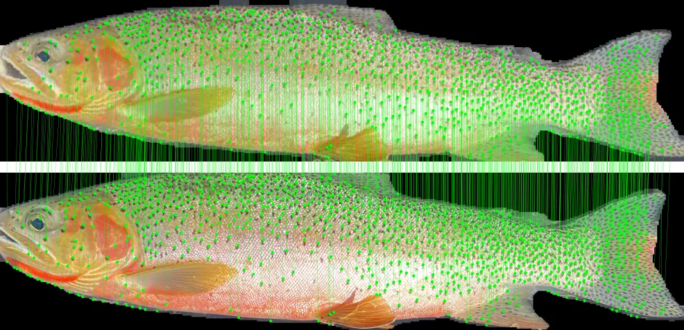
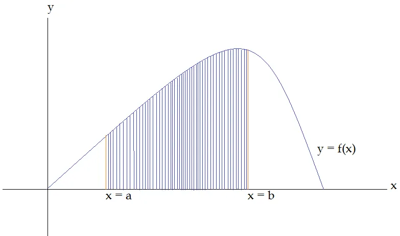
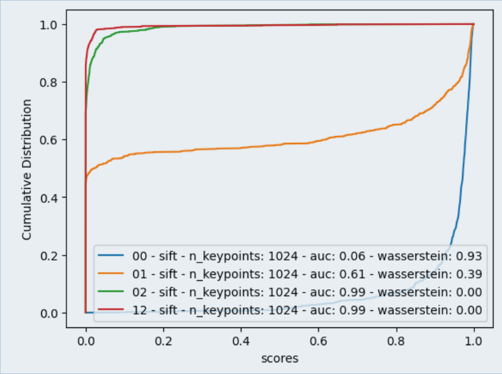

In this blog post, we will explore a powerful technique widely used for
identifying individuals across various species. This method leverages unique
physical markings that remain relatively stable throughout an organism's
lifetime, making it effective for species with distinct patterns. For instance,
[whale sharks](https://www.sharkguardian.org/whale-shark-research), [trout](),
[turtles](https://app.fruitpunch.ai/article/2024/02/01/tracking-turtles-how-ai-helps-conservationists-to),
and
[seals](https://app.fruitpunch.ai/article/2023/03/23/understanding-seals-with-ai)
all possess unique spot or scale patterns that lend themselves well to this
computer vision approach. 

  

    
    
    
    
  

  <em>Gallery / Unique and stable markings for different animal species</em>

By harnessing these identifiable features,
researchers and conservationists can track and monitor individual animals,
contributing to our understanding of biodiversity and aiding in conservation
efforts. Join us as we delve into the intricacies of this technique and its
applications in wildlife identification.

## Local Feature Matching

Image matching in computer vision is a fundamental task that involves comparing
and identifying similar regions or objects within images. This process is
crucial for various applications, including object recognition, image
stitching, 3D reconstruction, and more. One of the prominent approaches to
image matching is local feature matching, which focuses on identifying and
matching distinctive features in images.

*Gallery / Local Feature Matching on trout spot patterns*

### Overview of Local Feature Matching

Local feature matching involves several key steps:

1. __Feature Detection__: The first step is to detect keypoints in the images.
   Keypoints are specific points in the image that are likely to be stable and
distinctive. Common classical algorithms for feature detection include:
   - __Harris Corner Detector__: Identifies corners in the image.
   - __SIFT (Scale-Invariant Feature Transform)__: Detects keypoints that are
   invariant to scale and rotation. It focuses on areas of high contrast. It is
   the Gold Standard for classical locale feature extraction.
   - __DISK (Dense Image Keypoint)__: A method that generates dense keypoints
   across the image, focusing on capturing a wide range of features.
   - __ALIKED (A Local Image Keypoint Descriptor)__: A descriptor that
   emphasizes local image characteristics, providing robust matching
   capabilities.

Current state-of-the-art methods effectively utilize deep learning-based
features; however, classical methods continue to be strong contenders for
feature extraction.

2. __Feature Description__: Once keypoints are detected, the next step is to
   describe the local image patches around these keypoints. This is done using
feature descriptors that capture the appearance of the keypoints. Common
descriptors include:
   - __SIFT Descriptors__: Provide a vector representation of the local image
   patch.

*SIFT descriptors describe the direction and magnitude of gradients*

   - __DISK Descriptors__: Work in conjunction with the DISK keypoints to
   provide a rich representation of local features.
   - __SuperPoint__: A deep learning-based approach that generates both
   keypoints and descriptors in a single network, providing high-quality
   matches and robustness to various transformations.

*Superpoint Deep Learning Model Architecture - Computes keypoints and descriptors in a single forward pass*

3. __Feature Matching__: After extracting keypoints and their descriptors from
   both images, the next step is to match these features. This can be done
using various techniques:
   - __Brute-Force Matching__: Computes the distance between all pairs of
   descriptors and finds the best matches. This is computationally expensive
   but straightforward.
   - __SuperGlue__: A state-of-the-art method that uses a neural network to
   perform feature matching. It takes advantage of both local features and
   global context to produce high-quality matches, making it robust to
   occlusions and varying viewpoints.
   - __LightGlue__: A lightweight alternative to SuperGlue, designed for
   real-time applications. It maintains high matching accuracy while being
   computationally efficient, making it suitable for scenarios where speed is
   critical.

4. __Filtering Matches__: Not all matches are reliable, so filtering techniques
   are applied to improve the quality of matches. Common methods include:
   - __Ratio Test__: Proposed by David Lowe for SIFT, this method compares the
   distance of the closest match to the distance of the second closest match.
   If the ratio is below a certain threshold, the match is considered reliable.
   - __RANSAC (Random Sample Consensus)__: A robust method to estimate the
   transformation between matched features while filtering out outliers.

5. __Geometric Verification__: After obtaining a set of matches, geometric
   verification is often performed to ensure that the matches are consistent
with a particular geometric transformation (e.g., homography, affine
transformation). This step helps to eliminate false matches and refine the
matching results.

### Applications of Local Feature Matching

Local feature matching is widely used in various applications, including:

- __Image Stitching__: Combining multiple images to create a panoramic view.
- __Object Recognition__: Identifying and classifying objects within images.
- __3D Reconstruction__: Creating 3D models from multiple 2D images.

  

    
    
    
    
  

  <em>Local Feature Matching to identify trout individuals</em>

## LightGlue

[LightGlue](https://github.com/cvg/LightGlue) is a modern feature matching
model designed to provide efficient and accurate matching of keypoints in
images. It is an evolution of the
[SuperGlue](https://github.com/magicleap/SuperGluePretrainedNetwork)
model, which leverages deep learning techniques to enhance the quality of
feature matching by considering both local features and global context.
LightGlue is specifically optimized for real-time applications, making it
suitable for scenarios where computational resources are limited or where speed
is critical, such as in mobile devices or embedded systems.

*Gallery / LightGlue example from their [GitHub repository](https://github.com/cvg/LightGlue)*

The model operates by first extracting keypoints and their descriptors from
input images, similar to traditional feature matching methods. However, it then
employs a lightweight neural network architecture to refine these matches,
ensuring robustness against occlusions, varying viewpoints, and other
challenges commonly encountered in image matching tasks. By balancing accuracy
and efficiency, LightGlue enables high-quality feature matching while
maintaining fast processing times, making it a valuable tool in various
computer vision applications, including augmented reality, robotics, and image
stitching.

### Metrics

Different metrics can be used to analyze the matching scores outputted by the LightGlue matcher. A simple approach is to examine the length of the LightGlue matches, which is an array of match scores that exceed a specific threshold. However, this method does not fully utilize the complete score distribution.

Two more sophisticated metrics are often employed:

1. __Area Under Curve (AUC)__: The AUC provides a comprehensive assessment of
   the matcher's performance by measuring the area under the Receiver Operating
Characteristic (ROC) curve. This metric considers the trade-off between the
true positive rate and the false positive rate across all possible thresholds.

*Area Under Curve (AUC) between ___a___ and ___b___*

2. __Wasserstein Distance__: Also known as the Earth Mover's Distance, the
   Wasserstein Distance quantifies the difference between the distributions of
match scores for true matches and non-matches (null distribution). This metric
captures more nuanced information about the score distributions compared to
simply looking at match lengths.

*Wasserstein Distance: Required energy to turn the red distribution into the blue distribution*

Using these more advanced metrics, one can gain deeper insights into the
overall effectiveness and discriminative power of the LightGlue matcher, beyond
a basic analysis of match lengths.

  

    
    
  

  <em>
      Left: AUC scores when comparing different individuals | Right: Wasserstein scores when comparing different individuals. 
      0 and 1 are the same individual different pictures while 2 is a different individual.
   </em>

We found that the AUC (Area Under Curve) and Wasserstein Distance metrics have
very similar discriminative power when applied to the LightGlue matching score
distributions. This suggests that either metric can be used to effectively
evaluate the performance of the LightGlue matcher, without a significant
difference in the insights they provide.

### Comprehensive Benchmark

To identify the optimal combination of parameters and feature extractors for
your dataset, it is advisable to conduct a comprehensive benchmark that
evaluates all potential combinations. This systematic approach will help you
determine the most effective configuration.

In our trout identification project, we performed an extensive comparison of
the performance of various feature extractors, including SIFT, DISK, ALIKED,
and SuperPoint. We tested these extractors on a dataset comprising 250 matching
pairs and 250 non-matching pairs. Additionally, we visualized the distributions
of matching and non-matching pairs to assess their separation. Our objective is
to identify an extractor that yields distributions that are as mutually
exclusive as possible, thereby enhancing the accuracy and reliability of
individual identification. This thorough analysis will guide us in selecting
the best extractor for our specific application.

| Extractor Type | n_keypoints | Metric         | Precision | Recall | F1   | Distributions |
|:--------------:|:-----------:|:--------------:|:---------:|:------:|:----:|:----:|
| SIFT           | 512         | AUC            |  0.89     | 0.97   | 0.93 |  |
| SIFT           | 1024        | AUC            |  0.91     | 0.99   | 0.95 |  |
| SIFT           | 512         | Wasserstein    |  0.88     | 0.95   | 0.91 |  |
| SIFT           | 1024        | Wasserstein    |  0.91     | 0.99   | 0.95 |  |
| DISK           | 512         | AUC            |  0.91     | 0.99   | 0.95 |  |
| DISK           | 1024        | AUC            |  0.91     | 0.98   | 0.94 |  |
| DISK           | 512         | Wasserstein    |  0.91     | 0.99   | 0.95 |  |
| DISK           | 1024        | Wasserstein    |  0.91     | 0.98   | 0.94 |  |
| ALIKED         | 512         | AUC            |  0.91     | 0.99   | 0.95 |  |
| ALIKED         | 1024        | AUC            |  0.91     | 0.99   | 0.95 |  |
| ALIKED         | 512         | Wasserstein    |  0.91     | 0.99   | 0.95 |  |
| ALIKED         | 1024        | Wasserstein    |  0.91     | 0.99   | 0.95 |  |
| SUPERPOINT     | 512         | AUC            |  0.91     | 0.99   | 0.95 |  |
| SUPERPOINT     | 1024        | AUC            |  0.91     | 0.99   | 0.95 |  |
| SUPERPOINT     | 512         | Wasserstein    |  0.91     | 0.99   | 0.95 |  |
| SUPERPOINT     | 1024        | Wasserstein    |  0.91     | 0.99   | 0.95 |  |

As illustrated in the table above, SIFT exhibits lower performance compared to
the other three feature extractor types. Notably, the parameter `n_keypoints`
can be reduced to 512 without compromising accuracy. This adjustment not only
streamlines the feature extraction process but also accelerates the comparison
of image pairs, as the model processes a smaller input size. By optimizing this
parameter, we can enhance efficiency while maintaining the integrity of the
results.

The next step involves selecting a threshold to identify a new individual. This
threshold represents a critical point in the metric score on the distribution
graphs, where we aim to optimize the separation between the two distributions.
By carefully determining this threshold, we can effectively distinguish between
known individuals and new entries, enhancing the accuracy of our identification
process. This optimization ensures that we minimize false positives and
negatives, leading to more reliable outcomes in our analysis.

### Inference Speed

When identifying an individual using Local Feature Matching, the algorithm must
compare the input image against all images of known individuals. To be
effective, this process needs to be executed rapidly, especially since the
known corpus can be quite large.

This approach contrasts sharply with [Metric
Learning](), which scales more
efficiently with the size of the known corpus but necessitates a significantly
larger dataset of recaptures for model training.

LightGlue, a local feature matching algorithm, is often referred to as "Local
Feature Matching at Light Speed" when executed on a GPU.

To better understand the time required for individual identification, we
conducted benchmarks to evaluate how the size of the known corpus affects
identification speed.

We utilized pre-computed keypoints and descriptors from the trout dataset,
which contains approximately 2,750 entries. The identification process involved
the following steps:

1. Extracting keypoints and descriptors from the input image.
2. Performing pairwise matching of the keypoints and descriptors against the
   entire known corpus (2,750 individuals). The data is batched to optimize the
performance of the LightGlue Matcher model on the GPU.

The table below summarizes the results of our benchmark.

| Hardware       | Extractor Type | number keypoints | Batch Size | Extraction (ms) | Identification | Pair processing time (ms) |
|:--------------:|:--------------:|:----------------:|:----------:|:---------------:|:--------------:|:-------------------------:|
| __CPU__        | ALIKED         | 1024             | 1          | 5400            | 1h5min         | 1418                      |
| 1xGPU (T4)     | ALIKED         | 1024             | 1          | 129             | 1min22s        | 29.8                      |
| 1xGPU (T4)     | ALIKED         | 1024             | 8          | 129             | 1min8s         | 24.7                      |
| 1xGPU (T4)     | ALIKED         | 1024             | 16         | 129             | 1min6s         | 24.0                      |
| 1xGPU (T4)     | ALIKED         | 1024             | 32         | 129             | 1min4s         | 23.2                      |
| 1xGPU (T4)     | ALIKED         | 1024             | __64__     | 129             | 1min3s         | 22.9                      |
| 2xGPU (T4)     | ALIKED         | 1024             | 64         | 129             | 35s            | 12.7                      |
| __4xGPU__ (T4) | ALIKED         | 1024             | 64         | 129             | 20s            | __7.3__                   |
| 1xGPU (T4)     | SIFT           | 1024             | 1          | 196             | 1min14s        | 26.9                      |
| 1xGPU (T4)     | SIFT           | 1024             | 64         | 196             | 53s            | 19.3                      |
| 1xGPU (T4)     | SIFT           | 512              | 64         | 196             | 38s            | 13.8                      |
| 1xGPU (T4)     | SIFT           | 256              | 64         | 196             | 32s            | 11.6                      |
| 1xGPU (T4)     | SIFT           | __128__          | 64         | 196             | 28s            | __10.2__                  |
| 1xGPU (T4)     | SUPERPOINT     | 1024             | 1          | 160             | 1min17s        | 28.0                      |
| 1xGPU (T4)     | SUPERPOINT     | 1024             | 64         | 160             | 58s            | 21.1                      |
| 1xGPU (T4)     | DISK           | 1024             | 1          | 202             | 1min23s        | 30.2                      |
| 1xGPU (T4)     | DISK           | 1024             | 64         | 202             | 1min12s        | 26.2                      |

As demonstrated, using a larger __batch size__, reducing the __number of
keypoints__ to match, or utilizing __multiple GPUs__ can significantly enhance
processing speed. Notably, employing a GPU can yield up to a 50x increase in
performance compared to a CPU.

The different matchers run at approximately the same speed. With a batch size
of 64, it takes between 20 and 30 milliseconds to match two sets of keypoints
and descriptors. This provides a good indicator for the total time it takes,
depending on the size of the known corpus.

| Dataset size | Comparisons time (ms) |
|:------------:|:---------------------:|
| 1            | 20ms                  |
| 10           | 200ms                 |
| 100          | 2s                    |
| 1.000        | 20s                   |
| 10.000       | 3min20s               |
| 100.000      | 33min20s              |

  
  <em>This method scales linearly with the size of the dataset. It can become impractical for large datasets.</em>

 

Running LightGlue on a CPU is generally impractical, as it requires an
excessive amount of time to process even a single input image. The optimal
setup ultimately depends on the specific use case and the available budget for
time and resources.

For occasional identification of individuals in images, a CPU may suffice.
However, when dealing with a large volume of images, relying on a CPU becomes
unfeasible. In such cases, selecting a GPU configuration from the table above
is essential to ensure the pipeline operates within a reasonable timeframe.

## Conclusion

Local Feature Matching is a powerful technique for image matching and animal
identification, applicable to a wide range of species with unique and stable
body markings. The success of this approach depends on selecting the
appropriate keypoints, descriptors, and matcher. While effective, Local Feature
Matching can be challenging to implement for very large datasets of known
individuals, as it requires pairwise matching against the entire corpus.
However, conservationists can leverage this non-invasive technology to
accurately re-identify individuals, making it a valuable tool for wildlife
monitoring and conservation efforts.

One can try out the model from the [ML pipeline that performs Local Feature
Matching on trout spot patterns]() or
directly from the snippet below:


