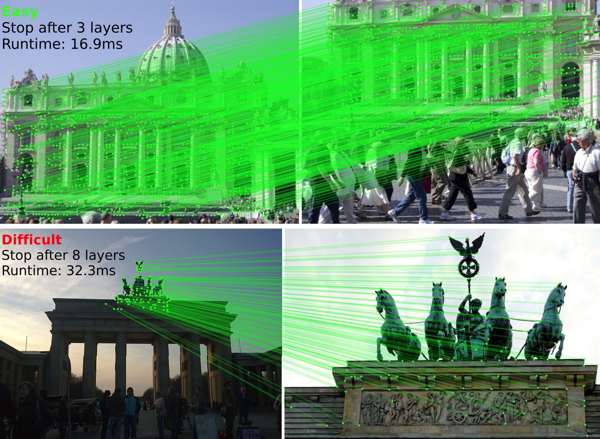
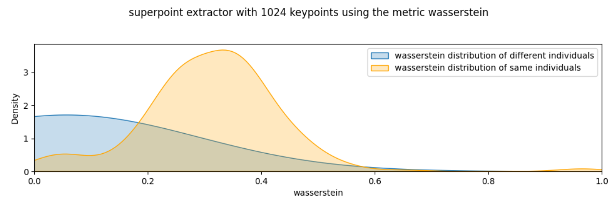

In this blog post, we will explore a powerful technique widely used for
identifying individuals across various species. This method leverages unique
physical markings that remain relatively stable throughout an organism's
lifetime, making it effective for species with distinct patterns. For instance,
Whale Sharks, Trout, Turtles, and Seals all possess unique spot or scale
patterns that lend themselves well to this computer vision approach. By
harnessing these identifiable features, researchers and conservationists can
track and monitor individual animals, contributing to our understanding of
biodiversity and aiding in conservation efforts. Join us as we delve into the
intricacies of this technique and its applications in wildlife identification.

## Local Feature Matching

Image matching in computer vision is a fundamental task that involves comparing
and identifying similar regions or objects within images. This process is
crucial for various applications, including object recognition, image
stitching, 3D reconstruction, and more. One of the prominent approaches to
image matching is local feature matching, which focuses on identifying and
matching distinctive features in images.

### Overview of Local Feature Matching

Local feature matching involves several key steps:

1. __Feature Detection__: The first step is to detect keypoints in the images.
   Keypoints are specific points in the image that are likely to be stable and
distinctive. Common algorithms for feature detection include:
   - __Harris Corner Detector__: Identifies corners in the image.
   - __SIFT (Scale-Invariant Feature Transform)__: Detects keypoints that are
   invariant to scale and rotation.
   - __DISK (Dense Image Keypoint)__: A method that generates dense keypoints
   across the image, focusing on capturing a wide range of features.
   - __ALIKED (A Local Image Keypoint Descriptor)__: A descriptor that
   emphasizes local image characteristics, providing robust matching
   capabilities.

2. __Feature Description__: Once keypoints are detected, the next step is to
   describe the local image patches around these keypoints. This is done using
feature descriptors that capture the appearance of the keypoints. Common
descriptors include:
   - __SIFT Descriptors__: Provide a vector representation of the local image
   patch.
   - __DISK Descriptors__: Work in conjunction with the DISK keypoints to
   provide a rich representation of local features.
   - __SuperPoint__: A deep learning-based approach that generates both
   keypoints and descriptors in a single network, providing high-quality
   matches and robustness to various transformations.

3. __Feature Matching__: After extracting keypoints and their descriptors from
   both images, the next step is to match these features. This can be done
using various techniques:
   - __Brute-Force Matching__: Computes the distance between all pairs of
   descriptors and finds the best matches. This is computationally expensive
   but straightforward.
   - __SuperGlue__: A state-of-the-art method that uses a neural network to
   perform feature matching. It takes advantage of both local features and
   global context to produce high-quality matches, making it robust to
   occlusions and varying viewpoints.
   - __LightGlue__: A lightweight alternative to SuperGlue, designed for
   real-time applications. It maintains high matching accuracy while being
   computationally efficient, making it suitable for scenarios where speed is
   critical.

4. __Filtering Matches__: Not all matches are reliable, so filtering techniques
   are applied to improve the quality of matches. Common methods include:
   - __Ratio Test__: Proposed by David Lowe for SIFT, this method compares the
   distance of the closest match to the distance of the second closest match.
   If the ratio is below a certain threshold, the match is considered reliable.
   - __RANSAC (Random Sample Consensus)__: A robust method to estimate the
   transformation between matched features while filtering out outliers.

5. __Geometric Verification__: After obtaining a set of matches, geometric
   verification is often performed to ensure that the matches are consistent
with a particular geometric transformation (e.g., homography, affine
transformation). This step helps to eliminate false matches and refine the
matching results.

### Applications of Local Feature Matching

Local feature matching is widely used in various applications, including:

- __Image Stitching__: Combining multiple images to create a panoramic view.
- __Object Recognition__: Identifying and classifying objects within images.
- __3D Reconstruction__: Creating 3D models from multiple 2D images.

## LightGlue

LightGlue is a modern feature matching model designed to provide efficient and
accurate matching of keypoints in images. It is an evolution of the SuperGlue
model, which leverages deep learning techniques to enhance the quality of
feature matching by considering both local features and global context.
LightGlue is specifically optimized for real-time applications, making it
suitable for scenarios where computational resources are limited or where speed
is critical, such as in mobile devices or embedded systems.

*Gallery / LightGlue example from their [GitHub repository](https://github.com/cvg/LightGlue)*

The model operates by first extracting keypoints and their descriptors from
input images, similar to traditional feature matching methods. However, it then
employs a lightweight neural network architecture to refine these matches,
ensuring robustness against occlusions, varying viewpoints, and other
challenges commonly encountered in image matching tasks. By balancing accuracy
and efficiency, LightGlue enables high-quality feature matching while
maintaining fast processing times, making it a valuable tool in various
computer vision applications, including augmented reality, robotics, and image
stitching.

## Comprehensive Benchmark

To identify the optimal combination of parameters and feature extractors for
your dataset, it is advisable to conduct a comprehensive benchmark that
evaluates all potential combinations. This systematic approach will help you
determine the most effective configuration.

In our trout identification project, we performed an extensive comparison of
the performance of various feature extractors, including SIFT, DISK, ALIKED,
and SuperPoint. We tested these extractors on a dataset comprising 250 matching
pairs and 250 non-matching pairs. Additionally, we visualized the distributions
of matching and non-matching pairs to assess their separation. Our objective is
to identify an extractor that yields distributions that are as mutually
exclusive as possible, thereby enhancing the accuracy and reliability of
individual identification. This thorough analysis will guide us in selecting
the best extractor for our specific application.

| Extractor Type | n_keypoints | Metric         | Precision | Recall | F1   | Distributions |
|:--------------:|:-----------:|:--------------:|:---------:|:------:|:----:|:----:|
| SIFT           | 512         | AUC            |  0.89     | 0.97   | 0.93 |  |
| SIFT           | 1024        | AUC            |  0.91     | 0.99   | 0.95 |  |
| SIFT           | 512         | Wasserstein    |  0.88     | 0.95   | 0.91 |  |
| SIFT           | 1024        | Wasserstein    |  0.91     | 0.99   | 0.95 |  |
| DISK           | 512         | AUC            |  0.91     | 0.99   | 0.95 |  |
| DISK           | 1024        | AUC            |  0.91     | 0.98   | 0.94 |  |
| DISK           | 512         | Wasserstein    |  0.91     | 0.99   | 0.95 |  |
| DISK           | 1024        | Wasserstein    |  0.91     | 0.98   | 0.94 |  |
| ALIKED         | 512         | AUC            |  0.91     | 0.99   | 0.95 |  |
| ALIKED         | 1024        | AUC            |  0.91     | 0.99   | 0.95 |  |
| ALIKED         | 512         | Wasserstein    |  0.91     | 0.99   | 0.95 |  |
| ALIKED         | 1024        | Wasserstein    |  0.91     | 0.99   | 0.95 |  |
| SUPERPOINT     | 512         | AUC            |  0.91     | 0.99   | 0.95 |  |
| SUPERPOINT     | 1024        | AUC            |  0.91     | 0.99   | 0.95 |  |
| SUPERPOINT     | 512         | Wasserstein    |  0.91     | 0.99   | 0.95 |  |
| SUPERPOINT     | 1024        | Wasserstein    |  0.91     | 0.99   | 0.95 |  |

As illustrated in the table above, SIFT exhibits lower performance compared to
the other three feature extractor types. Notably, the parameter `n_keypoints`
can be reduced to 512 without compromising accuracy. This adjustment not only
streamlines the feature extraction process but also accelerates the comparison
of image pairs, as the model processes a smaller input size. By optimizing this
parameter, we can enhance efficiency while maintaining the integrity of the
results.

The next step involves selecting a threshold to identify a new individual. This
threshold represents a critical point in the metric score on the distribution
graphs, where we aim to optimize the separation between the two distributions.
By carefully determining this threshold, we can effectively distinguish between
known individuals and new entries, enhancing the accuracy of our identification
process. This optimization ensures that we minimize false positives and
negatives, leading to more reliable outcomes in our analysis.
