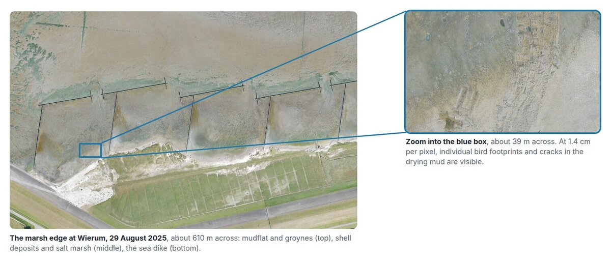
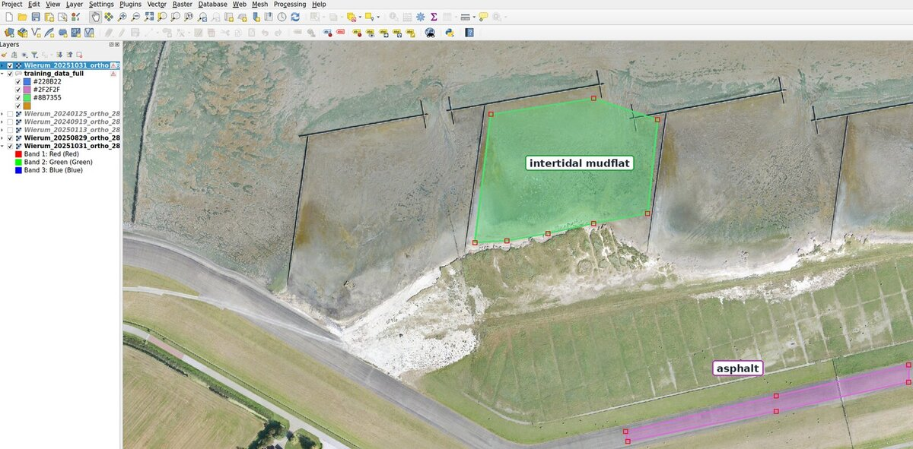
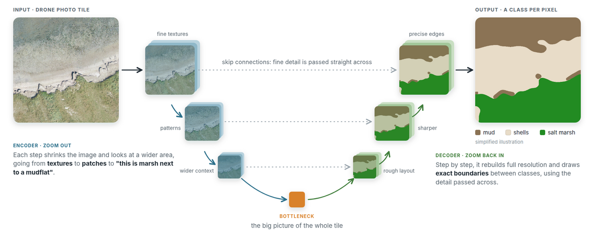
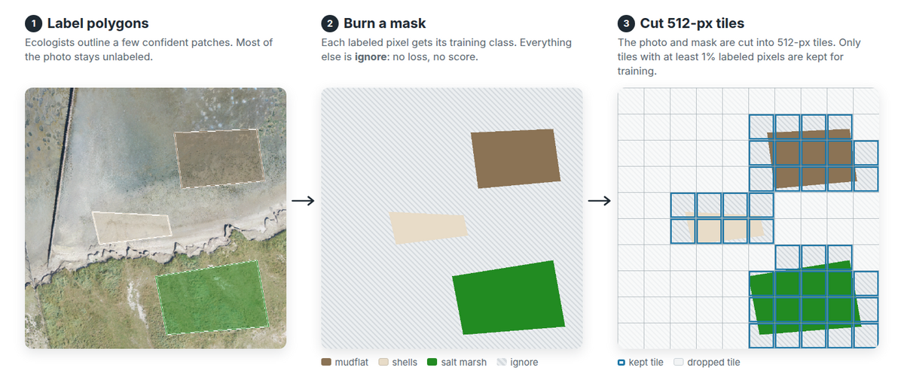
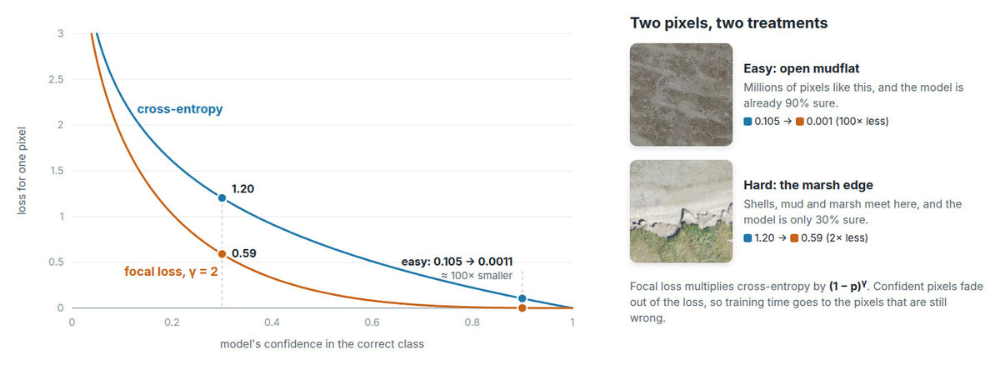
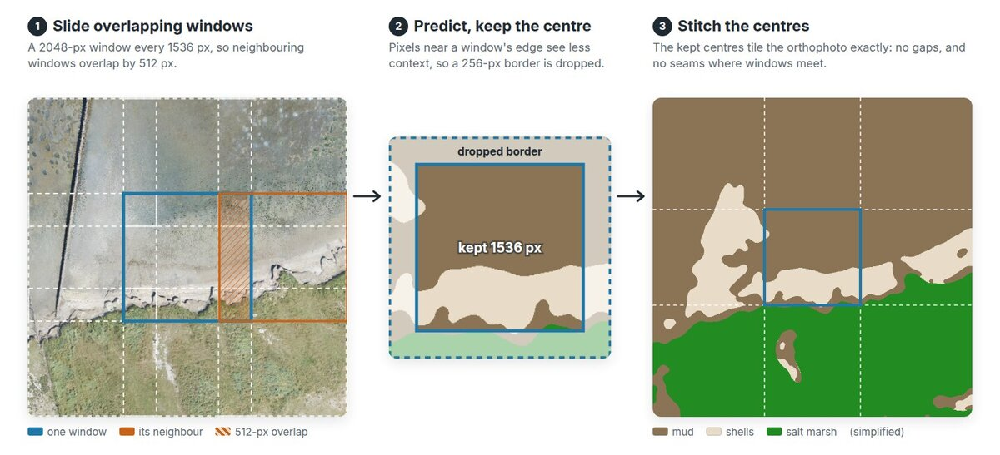
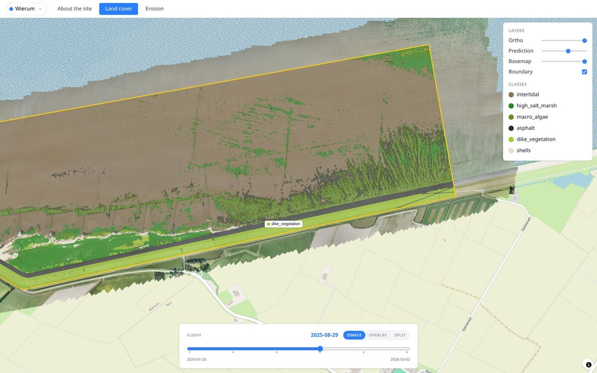

Near the village of Wierum, on the Frisian coast of the Wadden Sea, a drone
flies over the salt marsh every few months. Each flight becomes an
orthophoto at **1.4 cm per pixel**: about 222,000 by 98,000 pixels, more
than 20 billion in total. For
[CODAP](), the Coastal Data
Portal we built with
[Rijkswaterstaat](https://www.rijkswaterstaat.nl/en) and
[Lumax AI](https://lumax.ai/), a segmentation model
labels every one of those pixels as mudflat, salt marsh, macro-algae, shells,
dike grass or asphalt, so that coastal managers can compare surveys in a
browser.

This post is about the model side of that work: how ecologists' labels
become a training target, and how the U-Net at the core of the system turns
a drone photo into a map.

## Ecologists label at whatever level they can see

The training data comes from people. Ecologists open the drone photos in
QGIS and draw polygons around areas they recognise. Each polygon is saved
straight into a shared PostGIS database, which the training pipeline reads
from.

The labels follow a scheme of **44 classes on three levels**, designed with
coastal ecologists:

- **Zone**: intertidal mudflat, salt marsh, or artificial (the dike and
  other structures).
- **Subzone**: for example tidal flat, pioneer zone, high salt marsh, dike.
- **Cover**: what is actually on the surface, from plant species such as sea
  aster or glasswort to shells, mussel beds and asphalt.

A label may use any level, on purpose. In a winter survey many marsh plants
are hard to tell apart from the air, so the labeler uses a broader class
such as "high salt marsh" instead of guessing the species. The database
therefore holds a mix of broad and specific labels, and that mix changes
with the season.



A U-Net, on the other hand, predicts exactly one class per pixel from a flat
list. Something has to sit in between.

## A projection from labels to training classes

We call that something the **projection**: a short, versioned configuration
file that lists the classes the model learns and which database classes feed
each of them. The current model learns six classes: intertidal, high salt
marsh, macro-algae, shells, dike vegetation and asphalt. Labels drawn as
"intertidal" and as "tidal flat" both count as intertidal.

Three rules keep it predictable:

1. **It is curated, not a roll-up to the parent class.** The database groups
   classes by zone, but that grouping is not always the right training
   target. Clay sits under the salt-marsh zone yet is bare substrate. Mussel
   beds sit under the mudflat zone but are shellfish, not mud. The grass on
   the dike sits under "artificial" but is green vegetation. A blind roll-up
   gets all three wrong.
2. **Labels only flow toward an equal or coarser class.** A subzone label
   such as "tidal flat" lands cleanly on the zone-level "intertidal" target.
   The reverse is impossible: a zone-level label cannot be pushed down to a
   species.
3. **Anything not listed becomes `ignore`**, which is excluded from the loss
   and from the metrics. That is what makes it safe to add a class to the
   database at any time: it is simply not learned until someone adds it to
   the projection.

## Why a U-Net

Mapping land cover is a **semantic segmentation** problem. The model does not
answer "is there salt marsh in this tile?" but "which of these pixels are salt
marsh?": its output is an image the same size as its input, with one class
per pixel. At 1.4 cm per pixel, that is what lets the maps show exactly where
the marsh ends and the mud begins.

The [U-Net](https://arxiv.org/abs/1505.04597) was designed for exactly this
kind of output, originally for biomedical images, and it has become the
default starting point for segmentation in general. Its name comes from the
shape of its diagram.

### Zoom out, then zoom back in

A U-Net has two halves:

- **The encoder zooms out.** Each stage halves the resolution and doubles
  the number of feature channels, so every feature describes a wider patch
  of ground. The first stages respond to texture: grass, wet mud, shell
  fragments. The deepest stages respond to layout: a band of green along
  bare mud, the straight edge of a road, the line of a groyne.
- **The decoder zooms back in.** It upsamples those coarse features step by
  step, back to full resolution, and decides at every pixel which class it
  belongs to.
- **Skip connections carry detail across.** At each scale, the encoder's
  features are passed straight to the matching decoder stage. The deep path
  knows *what* is in the tile; the skip connections remember *where* the
  edges are. Without them, boundaries come out blurry and blocky, and thin
  structures such as the marsh cliff, groynes and the edge of the dike road
  would suffer most.

### Why it fits this problem

- **It works with little labeled data.** The U-Net was built for datasets of
  a few dozen annotated images.
- **The encoder starts pre-trained.** We use a ResNet34 encoder pre-trained
  on ImageNet.
  It already knows edges, textures and shapes from everyday photos, so
  training only has to teach it what those look like on a coastline.
- **It is fully convolutional.** The same weights run on any tile size, so we
  can train on small tiles and predict on much larger windows.

## Training and prediction

### Training

Training uses **512-pixel tiles** cut from the labeled areas, with PyTorch
Lightning, batch size 8 and up to 50 epochs with early stopping.

### Focal loss: spend the effort where the model is wrong

A drone photo of a salt marsh is mostly easy. Open mudflat covers huge areas,
looks the same everywhere, and the model learns it within a few epochs. The
hard pixels are few and sit at the boundaries: where shells meet mud, where
marsh grass meets dike grass, along the eroding cliff.

With the standard **cross-entropy** loss, every pixel adds to the loss, even
ones the model already gets right. Millions of easy mudflat pixels, each
contributing a little, can drown out the few hard ones. **Focal loss**
multiplies cross-entropy by a factor (1 − p)γ, where p is the
model's confidence in the correct class. We use γ = 2. A pixel the model is
90% sure about has its loss cut about 100×, while a pixel it is only 30%
sure about keeps half of its loss. The easy pixels fade out, and training
concentrates on the boundaries.

### Prediction

A full orthophoto is far too large for one pass. The predictor slides a
**2048-pixel window with 512 pixels of overlap** across it. Pixels near the
border of a window see less context and are less reliable, so only the
centre of each window is kept, and the centres are stitched into one map.

Connected patches smaller than 256 pixels are then removed, and the result is
converted to vector map tiles that the portal streams to the browser.

## What's next

We built the pipeline so that growing the model is routine. A new flight
arrives as a new survey, a new site brings its labels into the same database,
and a new class is one line in the projection. The pipeline then retrains
the U-Net and re-maps every survey on its own. Training on new sites,
flights and classes needs no new code.

That is what comes next: more labeled surveys across seasons, more sites
along the Wadden Sea, and turning the maps into numbers: area per class,
marsh-edge position, and change between surveys.

Read more about the project on its
[project page]().

  <h3 class="about-cta__title">Explore the live portal</h3>
  
The CODAP portal is public. Browse the land-cover maps of every survey, swipe between dates, and see where the Wierum coast is building up or eroding.

  <a href="https://app.codaportal.org" target="_blank" rel="noopener noreferrer" class="link-no-decoration button button--middle"><i class="fa-solid fa-circle-play"></i>&nbsp;Open the portal</a>

