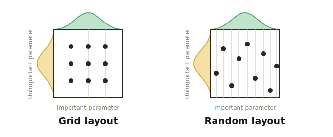
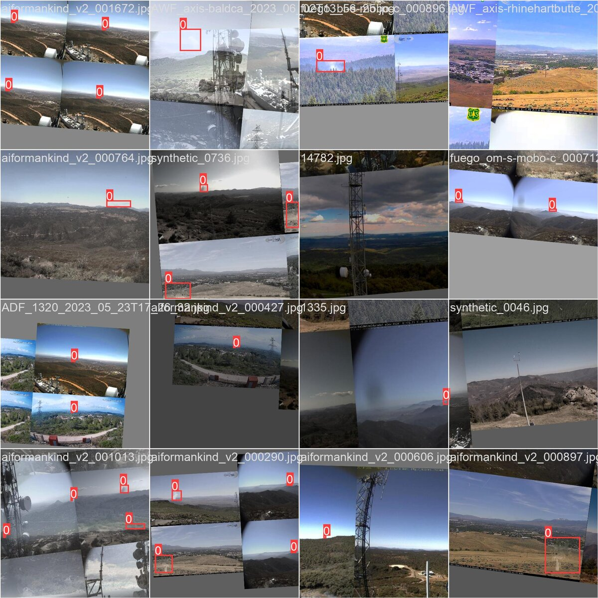
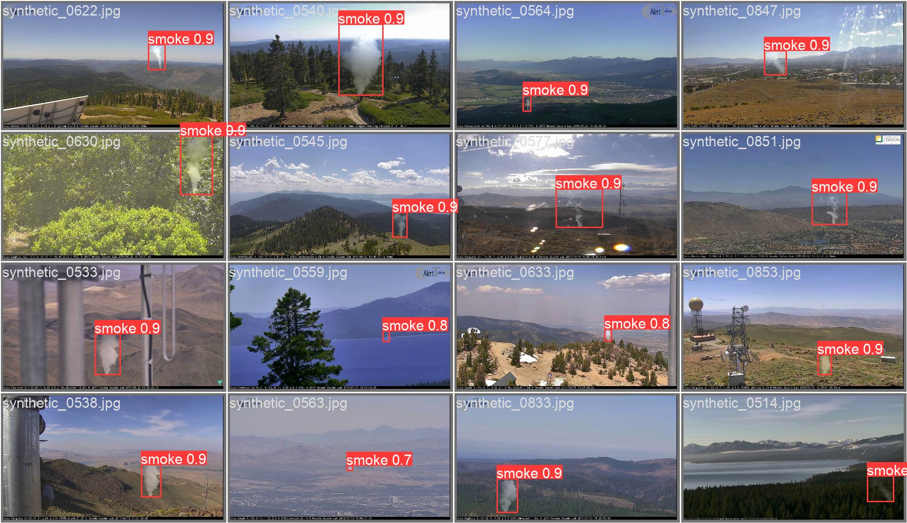

In this post, we’ll walk through the development of an early forest fire
detection system, built in collaboration with the NGO
[Pyronear](https://pyronear.org).

> Our detectors communicate fire alerts to a database that is connected
> to a supervision platform for the fire department.
>
> <cite>– Pyronear</cite>

Pyronear takes a whole-system approach to fire risk. At its core is an early
wildfire detection algorithm that runs on a compact microcomputer, fed by a
network of high-resolution cameras mounted at high vantage points for panoramic
coverage of the forest. Together they form a proactive line of defense against
wildfires.

Installed on antenna towers, the system continuously watches the forest through
these cameras. When it detects smoke in a feed, it raises an alert; the fire
department reviews it and can act immediately.


*Overview of the Pyronear system to monitor forests around the clock*

The video below, filmed in the Forest of Fontainebleau, shows the system end to
end — from the cameras catching the first wisps of smoke to the alert reaching
the fire department.


<p class="media-caption">A walk through the full Pyronear pipeline, filmed in the Forest of Fontainebleau</p>

## Project Scope

Our collaboration focuses on improving the accuracy of their machine learning
system for early forest fire detection. Our goal is to minimize false alarms,
thereby increasing confidence among firefighters and enhancing the model's
precision. Additionally, we are putting sound engineering and MLOps practices in place for
long-term reliability.


*Overview of the embedded ML system*

Our work concentrates on the software component responsible for analyzing input
from the cameras.

### Covered sites


*The camera system covers a full 360-degree view*

The cameras are configured to provide a full 360-degree coverage. Mounted on
tall antennas, the system is capable of detecting fires from distances of 30 to
60 kilometers. Below is the Brison site, where four cameras work in unison to
achieve complete 360-degree coverage.


  
  
  
  

*360 view of the **Brison site** - 4 cameras are placed on an antenna tower*

## Datasets

Pyronear compiled its dataset by developing a custom web scraper, designed to
collect videos of wildfires from a network of surveillance cameras. These
videos were manually enhanced with bounding-box annotations to highlight areas
of interest. The dataset was then filtered using a strategy aimed at improving
both the quality and diversity of the images, resulting in a final set of
10,000 carefully selected frames.

At the heart of the data collection process is an automated scraping script
that interfaces with the AlertWildfire API. This script retrieves images from
each camera at regular intervals, capturing one image per minute as configured
by AlertWildfire.

For a more detailed overview of the data collection process, refer to
Pyronear's published paper
[here](./papers/scrapping_the_web_for_early_wildfire_detection.pdf).

### Primary Sources

<div class="support__grid support__grid--two">
  <div class="support__card">
    <h3 class="support__card-title">HPWREN</h3>
    <p class="support__card-description">A non-commercial, wide-area wireless network of Pan-Tilt-Zoom (PTZ) cameras across Southern California, funded by the NSF — used for network research and wildfire detection.</p>
  </div>
  <div class="support__card">
    <h3 class="support__card-title">ALERTWildfire</h3>
    <p class="support__card-description">A university consortium across the western U.S. providing PTZ fire cameras and public live feeds, supporting firefighters across Washington, Oregon, Idaho, California, and Nevada.</p>
  </div>
</div>

### Derived Datasets

<div class="support__grid">
  <div class="support__card">
    <h3 class="support__card-title">SmokeFrames</h3>
    <p class="support__card-description">~50,000 images from ALERTWildfire cameras (Schaetzen et al., 2020). The SmokeFrames-2.4k subset adds 2,410 images across 677 sequences, with plenty of false positives for robustness.</p>
  </div>
  <div class="support__card">
    <h3 class="support__card-title">Nemo</h3>
    <p class="support__card-description">Frames from raw ALERTWildfire PTZ videos (Yazdi et al., 2022), covering many stages of fire and smoke progression.</p>
  </div>
  <div class="support__card">
    <h3 class="support__card-title">Fuego</h3>
    <p class="support__card-description">HPWREN images annotated from Cal Fire records (Govil et al., 2020) — 8,500 reported, 1,661 publicly available, focused on early fire stages.</p>
  </div>
  <div class="support__card">
    <h3 class="support__card-title">AiForMankind</h3>
    <p class="support__card-description">Two annotated smoke-detection and segmentation datasets, merged from AI For Mankind hackathons (2023).</p>
  </div>
  <div class="support__card">
    <h3 class="support__card-title">FIgLib</h3>
    <p class="support__card-description">The Fire Ignition Image Library (Dewangan et al., 2022): 24,800 images of 315 fires in Southern California from HPWREN — the reference dataset for fire-ignition studies.</p>
  </div>
  <div class="support__card">
    <h3 class="support__card-title">Synthetic</h3>
    <p class="support__card-description">Computer-generated smoke overlaid onto landscape images to create synthetic wildfire scenarios.</p>
  </div>
</div>

## Data Modeling

### Dealing with False positives

The Pyronear system must detect early-stage wildfires with high accuracy
(achieving a high recall) while minimizing false positives. If the system
generates too many false alarms, firefighters may begin to disregard its
alerts. Therefore, finding the right balance between recall and precision is
critical for Pyronear to establish trust among stakeholders and ensure its
reliability in wildfire detection.

### Evaluation Metrics

We judge the detector with three standard metrics, all built from true
positives (TP), false positives (FP), and false negatives (FN).

**Precision** — of everything the model flags as smoke, how much is real smoke?
Fewer false alarms means higher precision.

\[
\text{Precision} = \frac{\text{TP}}{\text{TP} + \text{FP}}
\]

**Recall** — of the real fires in view, how many does the model catch? Missing
fewer fires means higher recall.

\[
\text{Recall} = \frac{\text{TP}}{\text{TP} + \text{FN}}
\]

**F1 score** — the harmonic mean of the two: a single number that only stays
high when precision and recall are both high.

\[
\text{F1} = 2 \times \frac{\text{Precision} \times \text{Recall}}{\text{Precision} + \text{Recall}}
\]

For Pyronear, recall must stay high — a missed fire is the worst outcome — while
precision keeps false alarms rare enough that firefighters keep trusting the
alerts.

### YOLO

#### Overview

We took a pretrained
[YOLO](https://github.com/ultralytics/ultralytics) model and fine-tuned it for
our object detection task. YOLO is fast, accurate, and easy to work with, and it
handles a range of tasks — object detection, tracking, instance segmentation,
image classification, and pose estimation.


*YOLO Computer Vision Tasks*

#### Random Hyperparameter Search

To efficiently identify an optimal combination of hyperparameters, we
opted for random hyperparameter search across 12 hyperparameters for the
YOLO models. This approach allowed us to explore a wide range of potential
configurations without the exhaustive computations required by grid
search.

Below is the Python code that defines the hyperparameter search space:

```python
space = {
    "model_type": np.array(["yolov8n", "yolov8s", "yolov8m"]),
    "epochs": np.linspace(50, 200, 20, dtype=int),
    "patience": np.linspace(10, 50, 10, dtype=int),
    "imgsz": np.array([320, 640, 1024], dtype=int),
    "batch": np.array([16, 32, 64]),
    "optimizer": np.array(
        [
            "SGD",
            "Adam",
            "AdamW",
            "NAdam",
            "RAdam",
            "RMSProp",
            "auto",
        ]
    ),
    # Learning rates
    "lr0": np.logspace(
        np.log10(0.0001),
        np.log10(0.03),
        base=10,
        num=50,
    ),
    "lrf": np.logspace(
        np.log10(0.001),
        np.log10(0.01),
        base=10,
        num=50,
    ),
    # Data Augmentation
    "mixup": np.array([0, 0.2]),
    "close_mosaic": np.linspace(0, 35, 10, dtype=int),
    "degrees": np.linspace(0, 10, 10),
    "translate": np.linspace(0, 0.4, 10),
}
```

Random search samples configurations at random instead of walking a fixed grid.
In high-dimensional spaces where only a few hyperparameters really matter, it
finds good settings faster and scales far better — it spends its budget
exploring each parameter's range broadly rather than testing every combination
exhaustively.


*Grid search samples a fixed lattice; random search covers each parameter's range more densely (after Bergstra & Bengio)*

#### Data Augmentation

To enhance the training set, we perform hyperparameter search on augmentation
techniques such as rotation, translation, mixup, and mosaic. These
augmentations help improve model robustness and performance.


*Data Augmentation: A combination of rotation, translation, mixup and mosaic*

#### Training

A total of 100 training runs were executed in parallel on a GPU cluster. Each
run randomly sampled a parameter configuration from the previously defined
hyperparameter space.

Below is the best-performing YOLOv8 model, evaluated on the holdout test set:


*Training results of the best YOLOv8 model*

Versions 9 and 10 of YOLO were also tested using a similar approach, but
neither demonstrated better performance compared to version 8.

#### Evaluation

On the holdout test set, the Pyronear team evaluated the model using the
metrics outlined above. This model significantly outperformed previous versions
and has been deployed to the Pyronear systems as the new best model.

| Precision | Recall | F1 Score |
|:---------:|:------:|:--------:|
| 0.922     | 0.898  | 0.910    |

Here is a qualitative look at the model on a random sample from the evaluation set.

| Ground Truth | Prediction |
|:------------:|:----------:|
|  |  |

## MLOps

Alongside improving Pyronear's detection accuracy, the project put several
MLOps practices in place. MLOps blends machine learning, software engineering,
and DevOps to manage a model's full lifecycle in production — keeping it
reproducible, reliable, and improvable over time.

### DVC

Managing a data-intensive project starts with a robust way to version and track
the data itself.

<p style="text-align:center; margin: 24px 0;">
  
</p>

[__DVC__](https://dvc.org/) (Data Version Control) is an open-source tool
designed to manage and version control machine learning datasets and models,
much like how Git handles code. It enables users to track changes in data and
experiments, ensuring that data pipelines are reproducible and that every stage
of the pipeline can be reliably recreated. By integrating data versioning with
the code, DVC helps maintain consistency and reproducibility throughout the ML
development lifecycle.

### Library Code and Scripts

All code for data processing, training, and evaluation lives in well-structured
library files and scripts. We avoid Jupyter notebooks at this stage to keep the
workflow reproducible, scalable, and maintainable.

## Future development

The computer vision team at Pyronear is busy exploring ways to reduce false
positives by leveraging temporal data. Often, low clouds can resemble early
fire smoke in a single image frame, but analyzing a sequence of frames can make
it easier to distinguish between them. We've since done exactly that — read
[how we raced the candidate models]()
and [how the temporal model reads smoke over time]().

Additionally, the team is considering the development of models with varying
hardware requirements. Due to limited network bandwidth, streaming all images
or video feeds from the Pyronear system to a central server is not feasible.
Implementing a smaller model with high recall on edge devices, alongside a
larger, more precise model running on a server, could significantly enhance
overall system performance. This approach, however, introduces added complexity
in data synchronization in remote areas and server management.

## Conclusion

This article details the technical implementations developed in collaboration
with Pyronear. It covers the processes of dataset collection and curation,
model training and evaluation, and the integration of MLOps practices, which
established a solid foundation for future development. We are excited to see
our contributions go live, with the system now actively detecting wildfires and
helping to protect forests!


<p class="media-caption">The model detects a forest fire in Fontainebleau from 35 kilometres away, in real time — a new record for the Pyronear systems.</p>

You can try the detector yourself on real camera footage — the interactive demo
runs the model right in your browser.


