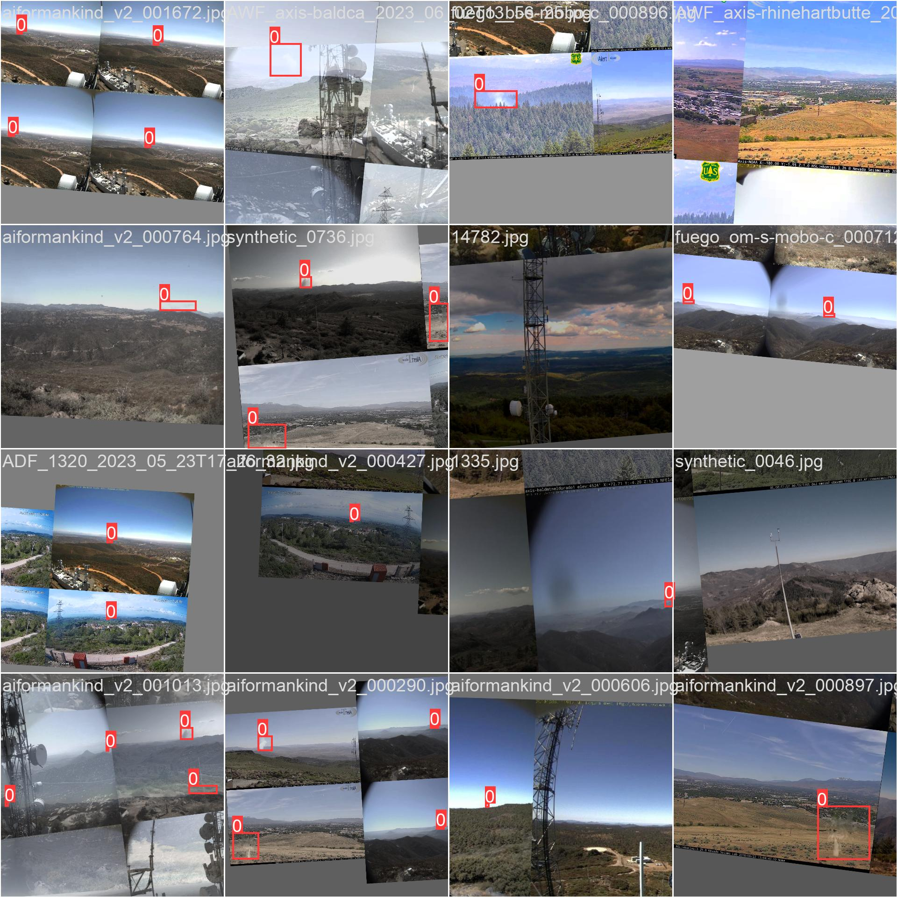

In this blog post, we’ll delve into the development process of a cutting-edge
early forest fire detection system, created in collaboration with the NGO
[Pyronear](https://pyronear.org).

> Our detectors communicate fire alerts to a database that is connected
> to a supervision platform for the fire department.
>
> <cite>– Pyronear</cite>

Pyronear offers a holistic solution for managing fire risks. Central to its
capabilities is an innovative early wildfire detection algorithm, seamlessly
operated on a compact microcomputer. This core system is augmented by a network
of high-resolution cameras strategically positioned at elevated vantage points,
providing panoramic coverage of forested regions. Together, these components
form a resilient and proactive strategy for wildfire prevention and management.

A computer vision system is integrated into the Pyronear setup, which is
installed on antenna towers. These systems continuously monitor forests using
cameras. When the computer vision system detects rising smoke from any camera
feed, it generates an alert. This alert is then reviewed by the fire
department, allowing them to take immediate action to address the fire.


*Overview of the Pyronear system to monitor forests around the clock*

## Project Scope

Our collaboration focuses on improving the accuracy of their machine learning
system for early forest fire detection. Our goal is to minimize false alarms,
thereby increasing confidence among firefighters and enhancing the model's
precision. Additionally, we are implementing best engineering and MLOps
practices to ensure long-term reliability and optimal performance.


*Overview of the embedded ML system*

Our work concentrates on the software component responsible for analyzing input
from the cameras.

### Covered sites


*Overview of the camera system that can cover 360 degrees angle*

The cameras are configured to provide a full 360-degree coverage. Mounted on
tall antennas, the system is capable of detecting fires from distances of 30 to
60 kilometers. Below is the Brison site, where four cameras work in unison to
achieve complete 360-degree coverage.

<div class="gallery-box">
  <div class="gallery">
    
    
    
    
  </div>
  <em>360 view of the <b>Brison site</b> - 4 cameras are placed on an antenna tower</em>
</div>

## Datasets

Pyronear compiled its dataset by developing a custom web scraper, designed to
collect videos of wildfires from a network of surveillance cameras. These
videos were manually enhanced with bounding-box annotations to highlight areas
of interest. The dataset was then filtered using a strategy aimed at improving
both the quality and diversity of the images, resulting in a final set of
10,000 carefully selected frames.

At the heart of the data collection process is an automated scraping script
that interfaces with the AlertWildfire API. This script retrieves images from
each camera at regular intervals, capturing one image per minute as configured
by AlertWildfire.

For a more detailed overview of the data collection process, refer to
Pyronear's published paper
[here](./papers/scrapping_the_web_for_early_wildfire_detection.pdf).

### Primary Sources

- __HPWREN__: The High-Performance Wireless Research and Education Network
(HPWREN), funded by the National Science Foundation, is a non-commercial,
wide-area wireless network featuring Pan-Tilt-Zoom (PTZ) cameras. Serving
Southern California, HPWREN supports network research and demonstrates its
capabilities in wildfire detection.
- __ALERTWildfire__: A consortium of universities across the western U.S.
provides access to advanced PTZ fire cameras and tools, supporting firefighters
and first responders in wildfire management. ALERTWildfire covers vast regions,
including Washington, Oregon, Idaho, California, and Nevada. Its website also
offers public access to live camera feeds.

### Derived Datasets

- __SmokeFrames__: Developed by Schaetzen et al. (2020), this dataset contains
nearly 50,000 images sourced from ALERTWildfire cameras. A subset,
SmokeFrames-2.4k, was tailored to meet specific requirements, consisting of
2,410 images from 677 sequences, with an average of 3.6 images per sequence. It
includes a significant number of false positives, which are vital for building
a robust wildfire detection model.
- __Nemo__: This dataset by Yazdi et al. (2022) comprises frames extracted from
raw wildfire videos captured by ALERTWildfire’s PTZ cameras, covering various
stages of fire and smoke progression.
- __Fuego__: Created as part of the Fuego project (Govil et al., 2020), this
dataset includes images manually selected and annotated from the HPWREN camera
network based on historical fire records from Cal Fire. While the authors
report 8,500 annotated images focusing on early fire stages, only 1,661 images
are publicly available.
- __AiForMankind__: Emerging from hackathons organized by the nonprofit AI For
Mankind (2023), two training datasets were merged to create a large collection
of annotated images for smoke detection and segmentation.
- __FIgLib__: Proposed by Dewangan et al. (2022), the Fire Ignition Image
Library (FIgLib) consists of 24,800 images of 315 different fires in Southern
California, sourced from HPWREN. It serves as the official dataset for fire
ignition studies.
- __Synthetic__: This dataset was generated by overlaying computer-generated
smoke onto various landscape images to create synthetic wildfire scenarios.

## Data Modeling

### Dealing with False positives

The Pyronear system must detect early-stage wildfires with high accuracy
(achieving a high recall) while minimizing false positives. If the system
generates too many false alarms, firefighters may begin to disregard its
alerts. Therefore, finding the right balance between recall and precision is
critical for Pyronear to establish trust among stakeholders and ensure its
reliability in wildfire detection.

### Evaluation Metrics

#### Precision

__Precision__ measures how many of the predicted objects are correct. In object
detection, it's the percentage of detected objects (e.g., bounding boxes) that
are true positives (i.e., correctly identified objects) out of all the objects
the model predicted.

\[
\text{Precision} = \frac{\text{True Positives}}{\text{True Positives} + \text{False Positives}}
\]

- __True Positives (TP)__: The objects correctly identified by the model
(correct object, correct location).
- __False Positives (FP)__: The objects that the model predicted but were not
actually there (incorrect or excess predictions).

A __high precision__ means that most of the detected objects are correct, with
few false positives.

### Recall

__Recall__ measures how many actual objects were detected by the model. It's
the percentage of true objects that the model successfully identified.

\[
\text{Recall} = \frac{\text{True Positives}}{\text{True Positives} + \text{False Negatives}}
\]

- __False Negatives (FN)__: The objects that exist but the model missed (didn’t
detect).

A __high recall__ means that the model is good at detecting most of the
objects, even if some of the detections may be incorrect (i.e., it might have
some false positives).

### F1 Score

The __F1 score__ is the harmonic mean of precision and recall. It provides a
balanced measure that takes both precision and recall into account. It's
particularly useful when you want to find a balance between the two metrics.

\[
\text{F1 Score} = 2 \times \frac{\text{Precision} \times \text{Recall}}{\text{Precision} + \text{Recall}}
\]

- A __high F1 score__ indicates that the model has both high precision and high
recall, meaning it correctly identifies most objects while minimizing false
detections.

### Example in Object Detection

In the context of object detection (e.g., detecting wildfires in camera
footage):
- __Precision__ would measure how many of the detected fires are actual fires
(and not false alarms).
- __Recall__ would measure how many of the actual fires in the footage were
detected by the model.
- The __F1 score__ helps to evaluate the overall performance, balancing between
catching all fires (high recall) and minimizing false alarms (high precision). 

In an ideal scenario, the model would aim for both high precision and high
recall to ensure timely and accurate wildfire detection.

### YOLO

#### Overview

We opted to utilize a pretrained
[YOLO](https://github.com/ultralytics/ultralytics) model and fine-tune it for
our specific object detection task. Renowned for its speed, accuracy, and
user-friendly interface, YOLO stands out as an ideal solution for various
tasks, including object detection, tracking, instance segmentation, image
classification, and pose estimation.


*YOLO Computer Vision Tasks*

#### Random Hyper Parameter Search

To efficiently identify an optimal combination of hyperparameters, we
opted for random hyperparameter search across 12 hyperparameters for the
YOLO models. This approach allowed us to explore a wide range of potential
configurations without the exhaustive computations required by grid
search.

Below is the Python code that defines the hyperparameter search space:

```python
space = {
    "model_type": np.array(["yolov8n", "yolov8s", "yolov8m"]),
    "epochs": np.linspace(50, 200, 20, dtype=int),
    "patience": np.linspace(10, 50, 10, dtype=int),
    "imgsz": np.array([320, 640, 1024], dtype=int),
    "batch": np.array([16, 32, 64]),
    "optimizer": np.array(
        [
            "SGD",
            "Adam",
            "AdamW",
            "NAdam",
            "RAdam",
            "RMSProp",
            "auto",
        ]
    ),
    # Learning rates
    "lr0": np.logspace(
        np.log10(0.0001),
        np.log10(0.03),
        base=10,
        num=50,
    ),
    "lrf": np.logspace(
        np.log10(0.001),
        np.log10(0.01),
        base=10,
        num=50,
    ),
    # Data Augmentation
    "mixup": np.array([0, 0.2]),
    "close_mosaic": np.linspace(0, 35, 10, dtype=int),
    "degrees": np.linspace(0, 10, 10),
    "translate": np.linspace(0, 0.4, 10),
}
```

Random hyperparameter search is particularly useful when trying to find an
effective combination of hyperparameters for a machine learning model because
it offers a more efficient and often more effective alternative to traditional
grid search. Hyperparameters are the settings of the model that must be tuned
manually (e.g., learning rate, batch size, number of layers), and finding the
right combination can have a significant impact on performance.

- **Explores More Space Efficiently**: 
   In random search, values for each hyperparameter are selected at random from
a predefined range. This randomness allows the search to explore a wider
variety of hyperparameter combinations. Since some hyperparameters are more
sensitive than others, random search often finds better combinations faster by
allocating more of the search effort to different regions of the space, rather
than exhaustively testing every possible combination.

- **Avoids Redundancy**:
   In grid search, hyperparameters are chosen from a fixed set of values for
each parameter, creating a structured, exhaustive search. However, many of
these points can be redundant, especially if certain hyperparameters have
little influence on performance. Random search avoids this by covering a more
diverse set of combinations, which can yield better results without testing
every combination.

- **Faster and More Scalable**:
   Random search is faster because it doesn't attempt to search every single
combination of hyperparameters. Instead, it samples hyperparameters randomly,
allowing the search to be terminated early if a good result is found. This is
especially useful when working with high-dimensional hyperparameter spaces,
where grid search becomes exponentially more time-consuming as the number of
hyperparameters increases.

- **Effective in High-Dimensional Spaces**:
   Some hyperparameters may have a stronger influence on model performance than
others. Random search increases the likelihood of stumbling upon good
combinations in these more sensitive regions, especially in high-dimensional
spaces. For example, one or two key hyperparameters may dominate the model's
performance, and random search is more likely to find the right values for
these parameters without needing to explore the entire grid.

##### Comparison to Grid Search

###### **Grid Search**:

- **Method**: Tests all possible combinations of a set of hyperparameter values
defined in a grid.
- **Exploration**: Systematic but potentially redundant. It evaluates every
combination, even if the difference in performance between certain values is
negligible.
- **Efficiency**: Inefficient in large or high-dimensional search spaces
because the number of combinations grows exponentially.
- **Use Case**: Suitable for small search spaces where exhaustive exploration
is feasible.

###### **Random Search**:

- **Method**: Randomly selects combinations of hyperparameters from a defined
range of possible values.
- **Exploration**: More efficient because it covers the hyperparameter space
more broadly without being constrained by the grid. It avoids the exhaustive
search of every combination.
- **Efficiency**: Faster and more scalable, especially for large and
high-dimensional hyperparameter spaces.
- **Use Case**: Particularly useful when only a few hyperparameters are
expected to significantly impact the model's performance. It’s preferred when
computational resources are limited, or the search space is large.

##### Explained visually


Random hyperparameter search is useful because it’s faster, more efficient, and
more scalable in exploring hyperparameter spaces, especially when only a few
parameters are critical to performance. It avoids the exhaustive nature and
redundancy of grid search, making it a preferred choice in many machine
learning workflows.

#### Data Augmentation

To enhance the training set, we perform hyperparameter search on augmentation
techniques such as rotation, translation, mixup, and mosaic. These
augmentations help improve model robustness and performance.


*Data Augmentation: A combination of rotation, translation, mixup and mosaic*

#### Training

A total of 100 training runs were executed in parallel on a GPU cluster. Each
run randomly sampled a parameter configuration from the previously defined
hyperparameter space.

Below is the best-performing YOLOv8 model, evaluated on the holdout test set:


*Training results of the best YOLOv8 model*

Versions 9 and 10 of YOLO were also tested using a similar approach, but
neither demonstrated better performance compared to version 8.

#### Evaluation

On the holdout test set, the Pyronear team evaluated the model using the
metrics outlined above. This model significantly outperformed previous versions
and has been deployed to the Pyronear systems as the new best model.

| Precision | Recall | F1 Score |
|:---------:|:------:|:--------:|
| 0.922     | 0.898  | 0.910    |

Here is a quantitative evaluation based on a random sample from the evaluation set.

| Ground Truth | Prediction |
|:------------:|:----------:|
|  |  |

## MLOps

In addition to enhancing Pyronear's early forest fire detection capabilities,
the project integrated several MLOps practices. MLOps (Machine Learning
Operations) merges machine learning, software engineering, and DevOps
principles to optimize the development, deployment, and monitoring of ML models
in production. It emphasizes automating and managing the entire lifecycle of ML
models, ensuring their scalability, reliability, and continuous improvement in
real-world scenarios.

### DVC

The first crucial aspect of managing a data-intensive project is implementing a
robust system for versioning and managing data.


*DVC Logo*

[__DVC__](https://dvc.org/) (Data Version Control) is an open-source tool
designed to manage and version control machine learning datasets and models,
much like how Git handles code. It enables users to track changes in data and
experiments, ensuring that data pipelines are reproducible and that every stage
of the pipeline can be reliably recreated. By integrating data versioning with
the code, DVC helps maintain consistency and reproducibility throughout the ML
development lifecycle.

### Library Code and Scripts

All code for data processing, training, and evaluation is organized into
well-structured library files and scripts. Jupyter Notebooks are avoided at
this stage to improve reproducibility, scalability, and maintainability,
resulting in a more organized and efficient machine learning workflow.

## Future development

The computer vision team at Pyronear is busy exploring ways to reduce false
positives by leveraging temporal data. Often, low clouds can resemble early
fire smoke in a single image frame, but analyzing a sequence of frames can make
it easier to distinguish between them.

Additionally, the team is considering the development of models with varying
hardware requirements. Due to limited network bandwidth, streaming all images
or video feeds from the Pyronear system to a central server is not feasible.
Implementing a smaller model with high recall on edge devices, alongside a
larger, more precise model running on a server, could significantly enhance
overall system performance. This approach, however, introduces added complexity
in data synchronization in remote areas and server management.

## Conclusion

This article details the technical implementations developed in collaboration
with Pyronear. It covers the processes of dataset collection and curation,
model training and evaluation, and the integration of MLOps practices, which
established a solid foundation for future development. We are excited to see
our contributions go live, with the system now actively detecting wildfires and
helping to protect forests!


<br/>

The computer vision model detects a forest fire in Fontainebleau from a
distance of 35 kilometers in real time. Setting a new record for the Pyronear
systems.

Try out the model here!


