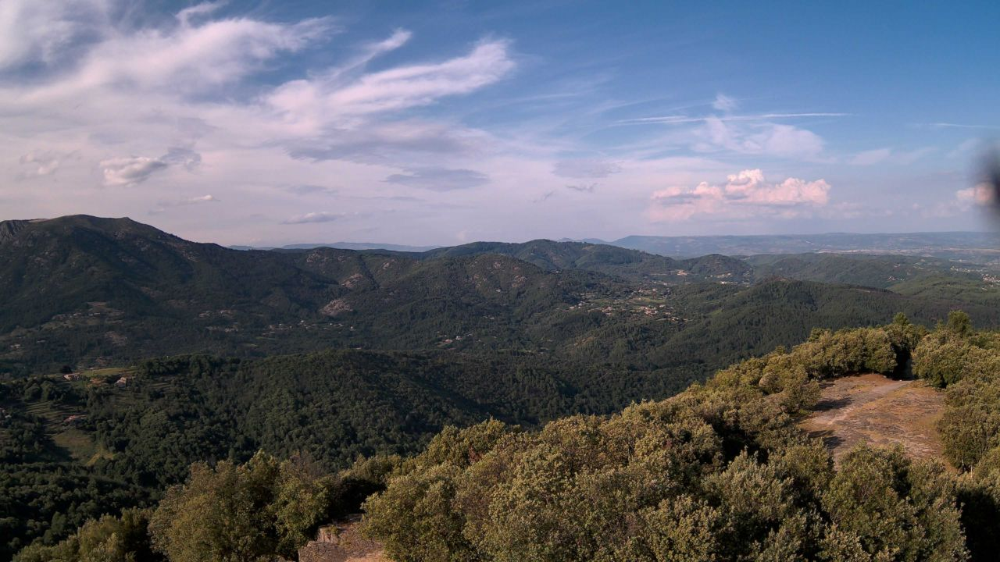

In this blog post we'll explore the development process of a state of the art
early forest fire detector, created in partnership with the NGO
[Pyronear](https://pyronear.org).

> Our detectors communicate fire alerts to a database that is connected
> to a supervision platform for the fire department.
>
> <cite>– Pyronear</cite>

Pyronear offers a holistic solution for managing fire risks. Central to its
capabilities is an innovative early wildfire detection algorithm, seamlessly
operated on a compact microcomputer. This core system is augmented by a network
of high-resolution cameras strategically positioned at elevated vantage points,
providing panoramic coverage of forested regions. Together, these components
form a resilient and proactive strategy for wildfire prevention and management.

A computer vision system is embedded in the Pyronear system which is mounted on top of antenna towers, where cameras monitor forests around the clock.
When the computer vision system detects a rising smoke from one of the camera feeds, it triggers an alert that is checked by the fire department which can immediately take action to take the fire out.

*Overview of the Pyronear system to monitor forests around the clock*

## Project Scope

Our collaboration aims to enhance the accuracy of their machine learning system capable of detecting early forest fires. The goal is to minimze false alarms to bolster confidence among firefighters while increasing the precision of the model. Additionally, we bring best engineering and MLOps practices to the project to ensure optimal reliability over time.

*Overview of the embedded ML system*

Our work focuses on the software part that analyzes inputs from the cameras.

#### Covered sites

The cameras are setup in a way that covers the 360 degrees angle range.
Being mounted on very tall antennas, the system can detect fires from a typical 30-60km distance range.
Below is the Brison site where 4 cameras are working together to cover the 360 degrees range.

*Overview of the camera system that can cover 360 degrees angle*

  

    
    
    
    
  

  <em>360 view of the <b>Brison site</b> - 4 cameras are placed on an antenna tower</em>

## Datasets

### Exploratory Data Analysis

### Dealing with False positives

## Data Modeling

### Evaluation Metrics

### YOLO

#### Overview

#### Random Hyper Parameter Search

#### Training

graphs of training

#### Evaluation

#### Best model selection

## Future development

Temporal model to lower the false positive rate - easier to see a low cloud vs rising smoke in the distance.

## Conclusion

<iframe src="https://www.youtube.com/embed/i9Qy-zY16Ew" loading="lazy" frameborder="0" allowfullscreen></iframe>

The computer vision model detects a forest fire in Fontainebleau from a distance of 35 kilometers in real time. Setting a new record for the Pyronear systems.
