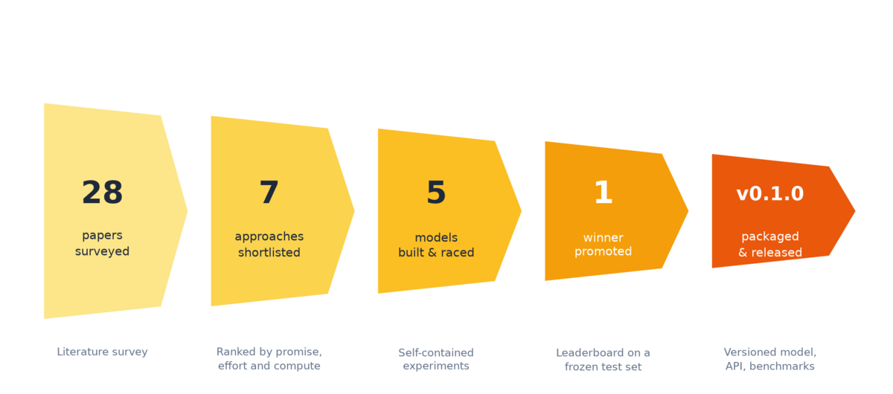
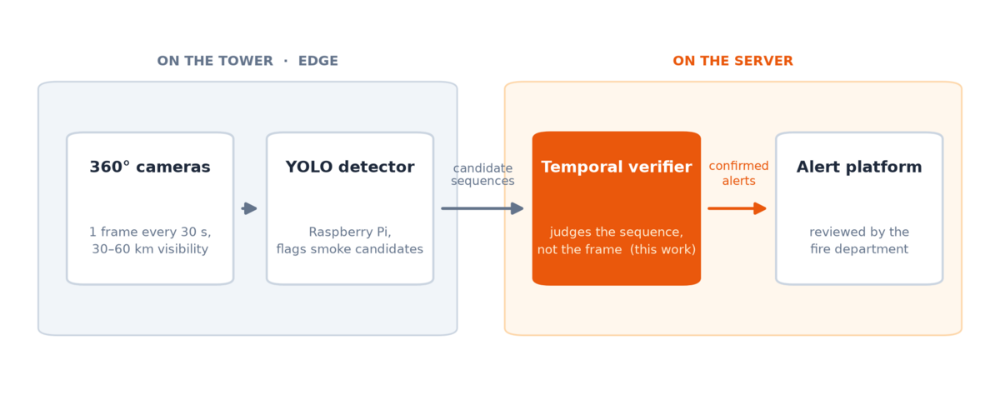
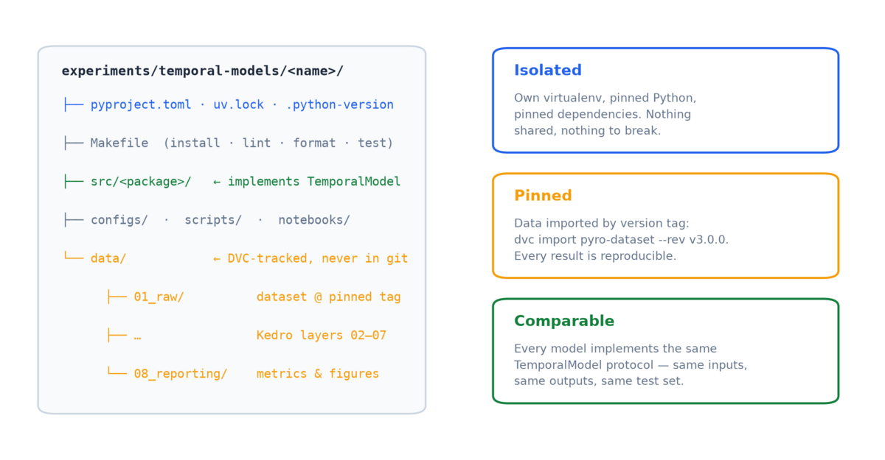
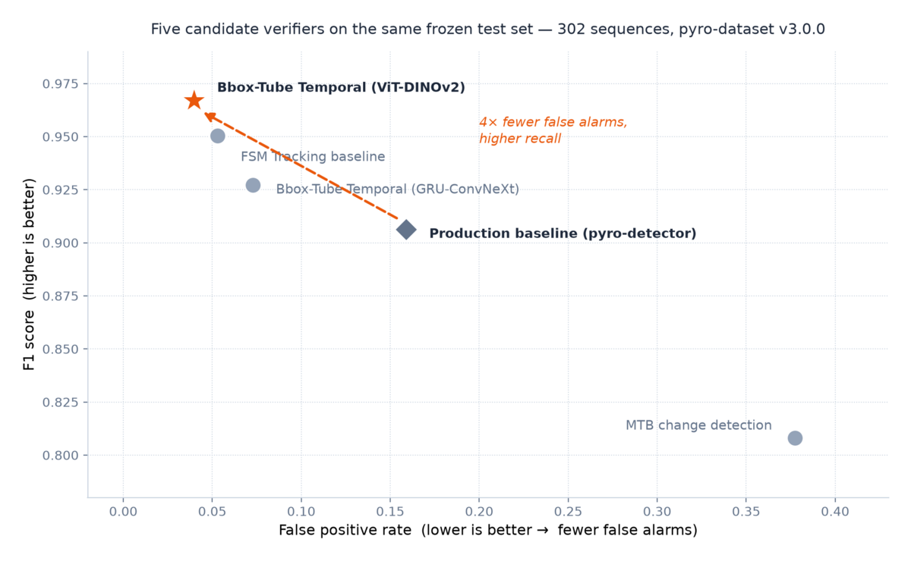
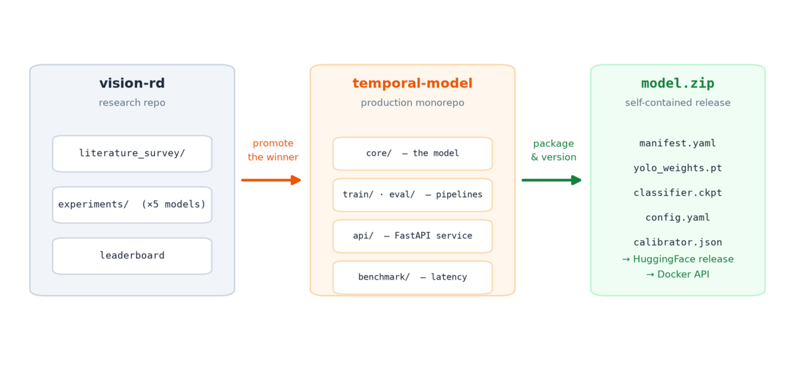

In 2024, we wrote about [building an early forest fire detector]() with the NGO
[Pyronear](https://pyronear.org): cameras on antenna towers, a YOLO object
detector (a fast model that draws boxes around what it finds in a single
image) running on a Raspberry Pi, and real fires detected from 35 kilometers
away. This post is
the next chapter — and it is less about a model than about a **method**.

Over the past months we helped Pyronear answer one question: *can a model that
watches smoke evolve over time cut false alarms without missing fires?* The
answer turned out to be yes — the winning model raises **4× fewer false
alarms** than the production baseline while catching slightly *more* fires.
But the part worth writing about is *how* we got there: a literature survey
distilled into a shortlist, a standardized experiment harness, and a
leaderboard where five candidate models — including the current production
system — raced on the same frozen test set.

*The whole project in one picture: every stage narrows the field, and every
elimination is backed by evidence rather than opinion.*

## The problem: one frame is not enough

A Pyronear installation watches the horizon and captures a frame roughly
every 30 seconds. The edge detector on the Raspberry Pi judges each frame on
its own — and at that resolution, early wildfire smoke is a faint grey wisp a
few pixels wide, easy to confuse with clouds, fog banks, dust, or sun glare.
Single-frame detection hits a false-alarm ceiling: push recall up and the
false positives come with it. Every false alarm sent to a fire department
erodes the trust the whole system depends on.

What distinguishes real smoke from look-alikes is its **behavior over time**:
it appears at a fixed point on the terrain, grows, and drifts. So the plan
was to add a second stage on the server — a *temporal verifier* that judges
the sequence, not the frame.

*The temporal verifier slots in between the edge detector and the alert
platform: the edge stays cheap and sensitive, the server gets the final say.*

## Step 1 — Survey before you build

The temptation with a project like this is to grab the most exciting recent
architecture and start training. We deliberately did the opposite: the first
deliverable was a [literature
survey](https://github.com/pyronear/vision-rd/tree/main/literature_survey) —
28 papers on temporal smoke detection, online action detection, and video
understanding, each summarized with notes and distilled into a **ranked
shortlist of seven approaches**, scored by why it fits Pyronear's constraints
(fixed cameras, one frame every 30 s, modest server hardware), estimated
effort, and compute cost.

A few of the papers that shaped the shortlist:

- [FLAME (Gragnaniello et al., 2024)](https://doi.org/10.1007/s00521-024-10963-z)
  — a detector plus background subtraction and a finite state machine:
  no training needed, +18% precision. The strongest argument for a
  rule-based baseline.
- [SlowFastMTB (Choi et al., 2022)](https://doi.org/10.1093/jcde/qwac027) —
  pixel-wise change detection between frames; evidence that static cameras
  make even simple frame differencing useful.
- [SmokeyNet (Dewangan et al., 2022)](https://arxiv.org/abs/2112.08598) and
  the [lightweight student LSTM (Jeong et al., 2020)](https://doi.org/10.3390/s20195508)
  — CNN features per frame fused by a temporal head, proven on wildfire
  smoke specifically.
- [LSTR (Xu et al., 2021)](https://arxiv.org/abs/2107.03377) and
  [TeSTra (Zhao & Krähenbühl, 2022)](https://arxiv.org/abs/2209.09236) —
  streaming transformers with constant per-frame cost, relevant for an
  always-on service.
- [VideoMAE (Tong et al., 2022)](https://arxiv.org/abs/2203.12602) —
  self-supervised video pre-training, a reminder that unlabeled footage is
  an asset.
- Pyronear's own [PyroNear2025 dataset paper (Lostanlen et al., 2024)](https://arxiv.org/abs/2402.05349)
  — the data foundation everything else stands on.

The survey cost a couple of weeks. It saved months: two whole families of
approaches (dense-video 3D CNNs, billion-parameter video foundation models)
were ruled out on paper because they assume frame rates or compute budgets
Pyronear doesn't have.

## Step 2 — Make experiments cheap, honest, and comparable

With a shortlist in hand, the next investment was *infrastructure for
disagreement*: a way for several candidate approaches to be built by
different people, at different times, and still produce numbers you can put
side by side.

Every experiment in the [vision-rd](https://github.com/pyronear/vision-rd)
research repo is a copy of the same template, and three rules do most of the
work:

- **Isolated.** Each experiment is a self-contained Python project: its own
  pinned dependencies ([uv](https://docs.astral.sh/uv/)), its own pinned
  Python version, its own virtual environment. Nothing is shared, so nothing
  breaks when a neighboring experiment upgrades PyTorch.
- **Pinned.** Data enters an experiment only through a versioned
  [DVC](https://dvc.org/) import of the
  [pyro-dataset](https://github.com/pyronear/pyro-dataset) at an exact tag.
  Six months later, anyone can re-run the experiment and get the same
  numbers. Data flows through Kedro-style layers from `01_raw` to
  `08_reporting`, and raw data is never modified.
- **Comparable.** Every candidate implements the same tiny `TemporalModel`
  protocol: a sequence of frames in, a verdict out. The model behind it can
  be a transformer or three if-statements — the evaluation harness cannot
  tell the difference, which is exactly the point.

None of this is glamorous. All of it is what makes the next step
trustworthy.

## Step 3 — Race the candidates

Five models entered the
[leaderboard](https://github.com/pyronear/vision-rd/tree/main/experiments/temporal-models/temporal-model-leaderboard),
evaluated on the same frozen test set — 302 held-out sequences from
pyro-dataset v3.0.0, half wildfires and half confirmed false positives:

| Rank | Model | Precision | Recall | F1 | FPR | Mean TTD (frames) |
|------|-------|-----------|--------|----|-----|-------------------|
| 1 | Bbox-Tube Temporal (ViT-DINOv2) | 0.961 | 0.974 | 0.967 | 0.040 | 3.4 |
| 2 | FSM Tracking baseline | 0.947 | 0.954 | 0.951 | 0.053 | 4.6 |
| 3 | Bbox-Tube Temporal (GRU-ConvNeXt) | 0.927 | 0.927 | 0.927 | 0.073 | 2.0 |
| 4 | Production baseline (pyro-detector) | 0.858 | 0.960 | 0.906 | 0.159 | 1.3 |
| 5 | MTB Change Detection | 0.712 | 0.934 | 0.808 | 0.378 | 3.0 |

Two of the columns deserve a word. FPR is the *false positive rate* — the
fraction of smoke-free sequences that would have raised a false alarm. TTD
is *time to detection*: how many frames pass before the alarm fires, at
roughly 30 seconds per frame. A perfect verifier would have zero false
positives, perfect recall, and fire on the first frame — the leaderboard
makes the trade-offs between those three explicit.

Two results are worth dwelling on:

**The rule-based baseline finished second.** The finite-state-machine (FSM)
tracker — YOLO boxes, a simple box-overlap tracker, and a "must persist for
several frames" rule, *no ML training at all* — beat a trained neural
model (the GRU-ConvNeXt table entry) and crushed change detection. If we
had skipped baselines and only built the fancy models, we would have had no
idea how much of their performance came from temporal reasoning and how much
from the YOLO detector underneath. Baselines aren't a formality; they are
the measuring stick.

**The winner moved the trade-off, not just the threshold.** The bbox-tube
temporal model — *bbox* for the bounding boxes the detector draws, *tube*
for the way they are linked across frames — scored by a DINOv2 Vision
Transformer (the "ViT" in the table) cut the false positive rate from
0.159 to 0.040 — **4× fewer false alarms** — while *also* improving recall
from 0.960 to 0.974. That is not a threshold slid along the same curve;
it is a better curve. The cost: a mean detection delay of 3.4 frames
(~1.7 minutes), comfortably inside the window where early detection still
matters.

In one image, here is what the winning model sees that a single-frame
detector cannot — a plume that is nearly invisible in the full frame becomes
unmistakable when cropped to the candidate region and laid out over time:

*Top: the hard case — the full frame looks empty. Bottom: the same sequence
as the temporal model sees it. How this works end to end deserves its own
post — coming soon.*

## Step 4 — Promote the winner

Research code dies in research repos. The moment the leaderboard settled,
the winning model was ported out of `vision-rd` into
[temporal-model](https://github.com/pyronear/temporal-model) — a production
monorepo where the model stopped being an experiment and became a product:

- **`core/`** holds the model itself, rewritten as pure, unit-testable
  functions — detection, tube building, cropping, scoring, calibration.
- **`train/` and `eval/`** are DVC pipelines, so retraining and re-evaluating
  a release is one command, not one person's memory.
- **`api/`** wraps the model in a FastAPI service, shipped as a Docker
  image, with per-frame detection caching so a camera streaming overlapping
  sequences only pays for new frames.
- **`benchmark/`** times every stage of the prediction pipeline across
  machines, so hardware decisions are made with numbers too.

The release artifact is a single `model.zip`, [published on
HuggingFace](https://huggingface.co/pyronear/temporal-model), that carries
everything inference needs: the YOLO weights, the classifier checkpoint, the
calibrator, the full configuration, and a manifest stamping the training
git SHA and the detector's hash. Loading a package restores the exact
training-time configuration — there are no hidden defaults shared between
training and serving, which is one of the quieter ways models break in
production.

## What we'd keep doing

If we had to compress the method into five lines:

1. **Survey before you build.** Two weeks of reading eliminated months of
   dead-end engineering.
2. **Always race a dumb baseline.** A no-training tracker finished second —
   and told us exactly how high the bar really was.
3. **One protocol, one frozen test set.** Models compete on evidence; the
   leaderboard settles arguments that opinions can't.
4. **Pin everything.** Versioned data, versioned dependencies, versioned
   models — reproducibility is what lets you trust a number from last month.
5. **Promotion is a port, not a deploy.** The winner was rewritten for
   production, packaged with its config, and versioned — not zipped up from
   a notebook.

None of these steps require a big team — this was a small-team effort with
volunteer collaborators. They require discipline more than headcount, and
the payoff for Pyronear is a verifier that fire departments can trust:
fewer false alarms, no missed-fire regression, and a release process that
can keep improving the model without breaking the system around it.

In the next post, we'll open up the winning model itself — how YOLO boxes
become *tubes*, why stabilized cropping is the trick that makes the temporal
signal legible, and how a DINOv2 backbone and a tiny transformer head learn
that smoke is a behavior, not an appearance.



*Interested in this kind of applied ML R&D for your conservation
organization? [Get in touch]().*
