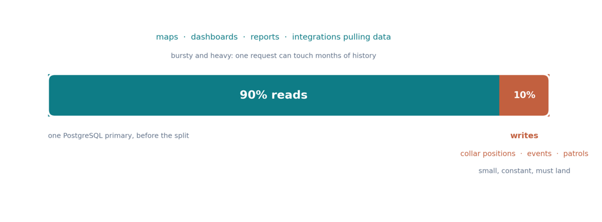
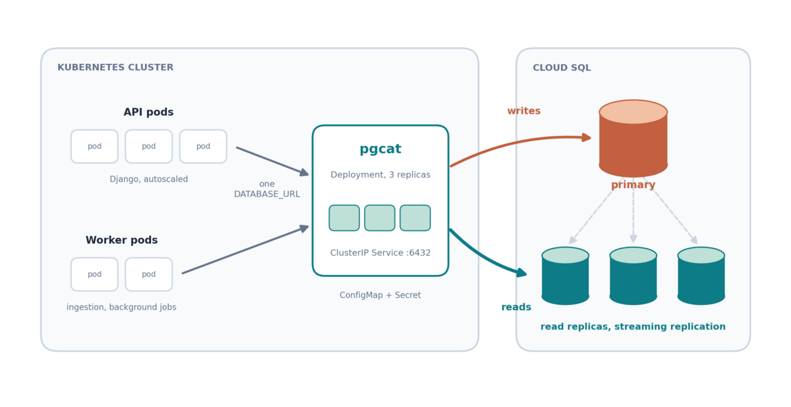
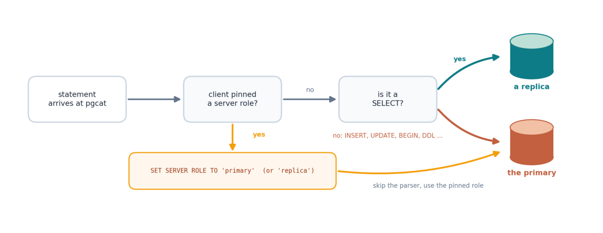
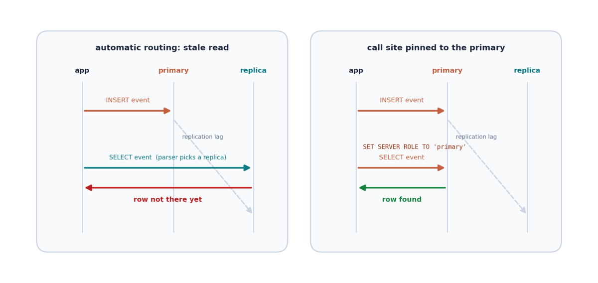
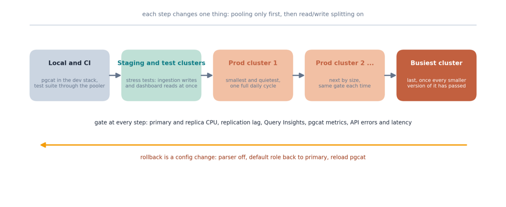

[EarthRanger](https://www.earthranger.com/) is the operations platform behind
real-time conservation at more than 900 protected areas: one live map of
tracked wildlife, ranger patrols, vehicles and sensors, built and maintained by
the team at [Ai2](https://allenai.org/). In 2024 we joined its engineering team
for a [scaling mission]()
on the backend. This post is about the first front of that mission: separating
reads from writes, so the database that every map refresh and every collar ping
lands on stops being the ceiling on the platform's growth.

The number that framed the whole project is a simple one. Roughly **90% of
EarthRanger's database load is reads** and **10% is writes**. Until this work,
all of it queued on one PostgreSQL primary.


*Nine out of ten queries only read. They were competing with the one in ten
that must land, on a single database.*

## The problem: reads and writes fight over one database

The two workloads could not be more different.

**Writes are small, constant and non-negotiable.** A GPS collar reports where
an elephant is right now. A ranger files an incident from the field. A sensor
integration pushes a batch of observations. Each of these is a few rows, but
they arrive around the clock, from every time zone at once, and every one of
them must be stored.

**Reads are bursty and heavy.** A manager opens the map and the platform
assembles the last positions of every tracked animal in the area. A report
pulls months of patrol history. A dashboard aggregates events across a whole
landscape. Each of these is one request, and each can touch orders of magnitude
more data than a write.

On a single database these two workloads share CPU, memory, disk and locks. A
heavy report holds resources that the ingestion path needs; a burst of dashboard
refreshes at the start of the working day slows down the collar pings arriving
at the same moment. The classic answer is to buy a bigger primary. That works
until it does not: a single instance has a ceiling, every step up costs more
than the last, and it does nothing to change the fact that 90% of the traffic
does not need to be there at all.

PostgreSQL has a much better answer for read-heavy workloads: **read replicas**.
A replica is a copy of the primary that receives every change through
streaming replication and can serve any query that only reads. Google Cloud
SQL, where EarthRanger's PostgreSQL runs, can attach several of them to a
primary. The hard part is not creating replicas. The hard part is getting a
large, live Django application, with hundreds of query sites written over many
years, to send the right query to the right database without rewriting it.

## The idea: one address, two paths

The application should not have to know. That was the design constraint we set
ourselves: the API, the background workers and the integrations keep a single
database address, and something between them and PostgreSQL decides where each
query goes.

That something is [pgcat](https://github.com/postgresml/pgcat), a PostgreSQL
connection pooler written in Rust. A connection pooler sits in front of the
database, accepts connections from the application, and multiplexes them onto a
smaller number of real server connections, which is worth having on its own. What
makes pgcat different from older poolers is that it can also **parse the
queries passing through it** and route a read to a replica and a write to the
primary.


*The application keeps one connection string. pgcat routes each statement,
writes to the primary and reads across the replicas, while Cloud SQL keeps the
replicas in sync.*

The layout that came out of it:

- **Cloud SQL** holds the primary and its read replicas, with replication
  managed by Google.
- **pgcat** runs inside the Kubernetes cluster, next to the application, and
  knows about all of the instances.
- **The application** talks to pgcat and nothing else. Its database URL points
  at a Kubernetes Service; as far as Django is concerned there is still one
  database.

## pgcat: a pooler that reads the query

The pgcat configuration that matters fits on a screen. One pool, one shard
(pgcat can also shard, which we did not need), a primary and its replicas, and
the two switches that turn the pooler into a router:

```toml
[pools.earthranger]
pool_mode = "transaction"
default_role = "auto"
query_parser_enabled = true
query_parser_read_write_splitting = true
primary_reads_enabled = false
load_balancing_mode = "random"

[pools.earthranger.shards.0]
database = "earthranger"
servers = [
  ["10.0.0.10", 5432, "primary"],
  ["10.0.0.11", 5432, "replica"],
  ["10.0.0.12", 5432, "replica"],
]
```

With `query_parser_enabled` and `query_parser_read_write_splitting` on, pgcat
looks at each statement as it arrives. A plain `SELECT` goes to one of the
replicas, picked by the load balancer. Anything else, from `INSERT` and
`UPDATE` to `BEGIN` and schema changes, goes to the primary.
`primary_reads_enabled = false` keeps reads off the primary entirely, which is
the whole point: the primary should be doing the 10%, not a random share of the
90%. And `default_role = "auto"` is what lets the parser decide, while leaving
the application a way to overrule it, which we will come to.


*The decision pgcat makes for every statement. The application can pin the
role explicitly and skip the parser.*

One setting deserves a note because it decides how much of the application
has to change: the **pool mode**. In *session* mode a client keeps the same
server connection for as long as it is connected, which is safe but pools
poorly. In *transaction* mode a server connection is borrowed for one
transaction and returned, which pools well but breaks anything that assumes
state survives between transactions: prepared statements, session-level
settings, advisory locks. We audited EarthRanger's data access for those
patterns before deciding, and transaction mode turned out to be safe without
application changes. That was luck of a kind, but luck you only get by
checking.

## Running it in Kubernetes

EarthRanger's API and workers already run in Kubernetes, so pgcat went in as a
regular workload next to them: a **Deployment** with several pgcat replicas
behind a **ClusterIP Service**, the configuration in a **ConfigMap**, and the
database credentials in a **Secret**.

```yaml
apiVersion: apps/v1
kind: Deployment
metadata:
  name: pgcat
spec:
  replicas: 3
  selector:
    matchLabels: { app: pgcat }
  template:
    metadata:
      labels: { app: pgcat }
    spec:
      containers:
        - name: pgcat
          image: ghcr.io/postgresml/pgcat:latest
          ports:
            - { containerPort: 6432, name: postgres }
            - { containerPort: 9930, name: metrics }
          volumeMounts:
            - { name: config, mountPath: /etc/pgcat }
      volumes:
        - name: config
          configMap: { name: pgcat-config }
---
apiVersion: v1
kind: Service
metadata:
  name: pgcat
spec:
  selector: { app: pgcat }
  ports:
    - { port: 6432, targetPort: postgres }
```

The application's change is then a single line: its `DATABASE_URL` points at
`pgcat.<namespace>.svc.cluster.local:6432` instead of the Cloud SQL primary.

We chose a standalone Deployment over a sidecar in every application pod for
three reasons. There is **one place to change** the routing: a new replica is
added to the ConfigMap, not to every pod spec. The pooler's **lifecycle is
independent** of the application's, so rolling out a new API version does not
churn database connections, and rolling out a pgcat config does not restart the
API. And the number of **real connections to Cloud SQL is bounded** by a
handful of pgcat pods with known pool sizes, rather than by however many
application pods the autoscaler decides to run today.

## When the pooler must not decide

The automatic split worked on the first try for the vast majority of the
platform. Then someone saved an event and refreshed the page, and the event
was not there.

This is the classic **read-your-writes** problem, and every read replica setup
meets it. Replication is fast, usually a few milliseconds, but it is not
instant. A request that writes a row to the primary and then immediately reads
it back can be routed, by a perfectly correct parser, to a replica that has
not received the row yet. The user sees their own change disappear for a
moment. Most of the time the next refresh fixes it. That is not good enough for
an operations platform.


*Left: the write goes to the primary, the read goes to a replica that is a few
milliseconds behind, and the row is missing. Right: the application pins the
read to the primary.*

pgcat offers exactly the escape hatch this needs. A client can send

```sql
SET SERVER ROLE TO 'primary';
```

on its connection, and from then on pgcat routes that client's statements to
the primary regardless of what the parser thinks, until the client sends
`SET SERVER ROLE TO 'auto'` or disconnects. This is not a PostgreSQL `SET`;
pgcat intercepts it and never forwards it to the server. It is the reason
`default_role` was set to `auto` rather than hard-coded: *auto* means "the
parser decides unless the client says otherwise".

In the Django application this became a small context manager that developers
wrap around the code paths known to read straight after writing:

```python
@contextmanager
def use_primary():
    with connection.cursor() as cursor:
        cursor.execute("SET SERVER ROLE TO 'primary'")
    try:
        yield
    finally:
        with connection.cursor() as cursor:
            cursor.execute("SET SERVER ROLE TO 'auto'")
```

The important design choice here is that the override is **per call site, and
opt-in**. We considered the alternatives: pinning every non-GET request to the
primary, or making a user "sticky" to the primary for a few seconds after any
write. Both are blunter, both silently move read traffic back onto the primary
in ways that are hard to see, and both hide the actual dependency. A context
manager at the call site documents, in the code, that *this* read depends on
*that* write. It is more work up front and far easier to reason about later.

The same mechanism solved a second, less obvious case: **migrations**. Schema
changes are DDL, and DDL must run on the primary; a replica would reject it.
Django's `migrate` command mostly issues statements the parser would route
correctly anyway, but "mostly" is not a word you want anywhere near a schema
change on a live database. So the migration entry point pins its connection to
the primary before it does anything else, and the parser never gets a vote.

## Rolling it out on a live system

Everything above is the easy part. The hard part is that EarthRanger is never
off. Collars keep reporting, rangers keep patrolling, and the platform has to
keep working through the change. And the change is unusually broad: it does not
touch one endpoint or one table, it changes the path of **every query in the
system**. A wrong route is not a crash you can catch in a test suite. It is a
stale read that a user notices on a map, or a write that a replica refuses.

So we planned the rollout as carefully as the architecture.


*Every step was gated on the metrics from the previous one, and every step
could be reversed with a configuration change.*

**Stage the change so each step changes one thing.** pgcat first went in with
the query parser off and `default_role = "primary"`, so the only thing that
changed was the connection pooling. Once that was stable, read/write splitting
was switched on. Each step had its own failure modes and we wanted to see them
separately.

**Stress test before touching production.** EarthRanger has staging and test
clusters that mirror production, and we ran realistic load through them with
the full pgcat setup: ingestion writes and dashboard reads at the same time,
at and above production rates. This is where the read-your-writes cases
surfaced, and where the migration path was exercised end to end, before a
single production query was rerouted.

**Roll production out one cluster at a time.** EarthRanger runs several
production clusters. We migrated them progressively, smallest and quietest
first, the busiest last, so that every step was rehearsed on a smaller version
of itself. Each cluster ran on the new path for long enough to see a full daily
cycle, including the morning peak when everyone opens the map at once, before
the next one moved.

**Watch the right signals.** At every step we watched a small dashboard of
things that would tell us if the routing was wrong before users did:

- **Cloud SQL instance metrics**: CPU and active connections on the primary
  (which should fall) and on each replica (which should rise and stay even),
  and **replication lag**, which is the number that decides whether
  read-your-writes will bite.
- **Cloud SQL Query Insights**: the slowest queries and where they ran, to
  catch a heavy read that was still landing on the primary or a query pattern
  that behaved differently on a replica.
- **pgcat's own metrics**, exported for Prometheus: connections per pool, wait
  times, and errors. A replica that fails a health check gets banned by pgcat
  for a while and traffic silently falls back to the others, which is exactly
  what you want in an incident and exactly what you want to know about.
- **Application error rates and latency** on the busiest API endpoints, the
  measure users actually feel.

**Keep the rollback boring.** At every stage the way back was a configuration
change: turn the parser off, set the default role back to `primary`, reload
pgcat. No code deploy, no data migration, nothing that needed a runbook longer
than a paragraph. We never needed it in production, which is the outcome you
plan for by assuming you will.

## What it bought us

The primary now does the 10% of the work that only it can do, and the 90% that
is reads is spread across replicas. Dashboards and maps stay responsive during
ingestion peaks because they are no longer competing with ingestion at all.

The deeper change is in how the platform grows. Before, every new partner meant
more reads on the same primary, and eventually another expensive step up in
instance size. Now reads **scale horizontally**: onboarding a wave of new
protected areas means adding a replica to Cloud SQL and one line to a
ConfigMap. The primary's size is set by the write load, which grows much more
slowly, and its headroom is no longer the thing that decides whether the next
park can come on board.

Three things we would do again on any similar system:

- **Put the routing in the infrastructure, not the application.** A pooler
  that parses queries let a large, mature codebase move to replicas without a
  rewrite, and left one place to reason about where queries go.
- **Make the override explicit and local.** Read-your-writes is inevitable;
  the fix that documents itself at the call site beats the one that hides in a
  middleware.
- **Treat the rollout as part of the design.** Staging one variable at a
  time, stress testing before production, migrating clusters from smallest to
  busiest, and keeping the rollback to a config change is what made a change to
  every query in a live platform an uneventful one.
