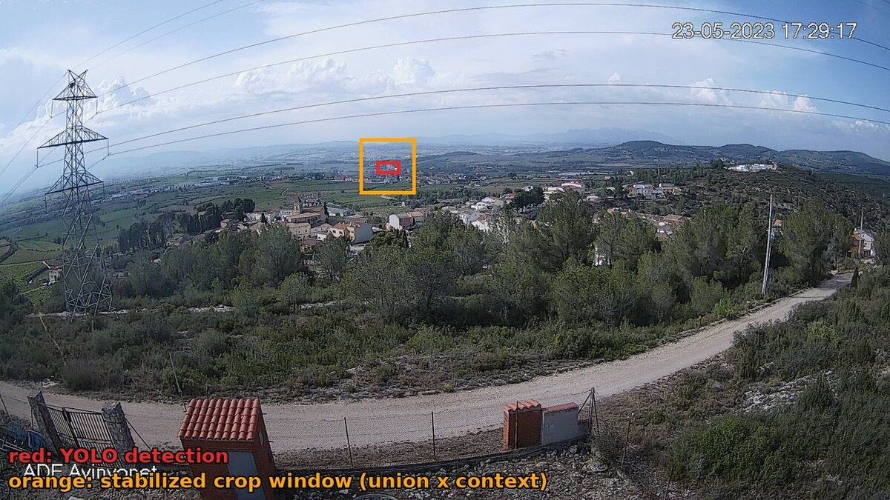
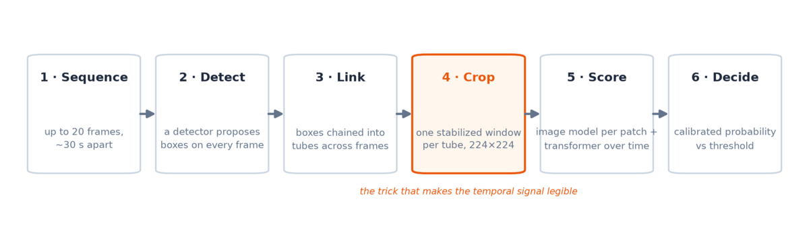
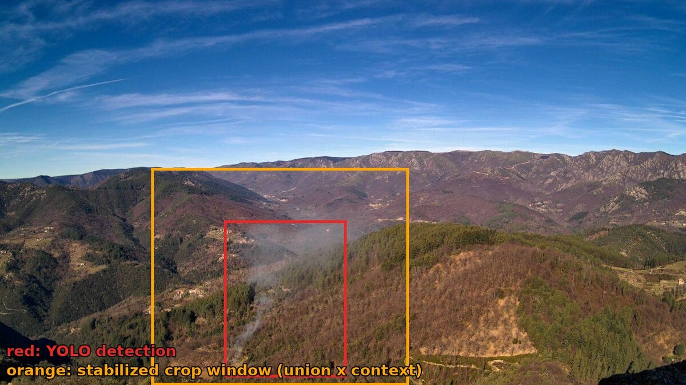
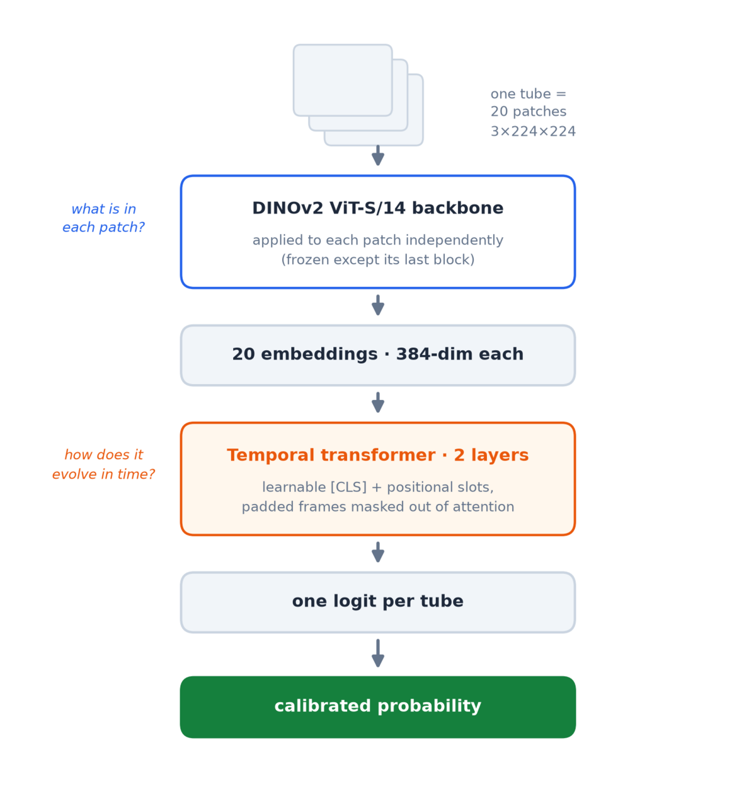

In [the previous post]() we
told the story of *how* the new smoke verifier for
[Pyronear](https://pyronear.org) was selected: a literature survey, five
candidate models, one leaderboard, one winner with 4× fewer false alarms.
This post opens up the winner itself — the **bbox-tube temporal model**
(*bbox* for the bounding boxes a detector draws around candidate smoke,
*tube* for the way those boxes are linked across frames) now
[released as a versioned package](https://huggingface.co/pyronear/temporal-model)
— and walks through how it judges a sequence of camera frames, stage by
stage, with figures computed from real wildfire sequences.

## The hard case

Pyronear cameras watch the horizon and capture a frame roughly every 30
seconds. This is what an early wildfire usually looks like from 30 kilometers
away (red box = detection, orange box = the crop window we'll come back to):

The full frame looks empty. A faint grey wisp a few pixels wide is everything
there is to see — and clouds, fog banks, dust, and sun glare produce wisps
just like it. Judged one frame at a time, this problem is genuinely hard, and
pushing a single-frame detector to catch plumes this small means accepting a
flood of false alarms.

But crop to the candidate region and lay the same sequence out over time:

Now it's unmistakable. The puff appears, thickens, and drifts — anchored to
one spot on the terrain. Clouds scud, fog banks roll, dust settles; smoke
*grows from a fixed point*. That is the one signal a look-alike can't fake,
and it only exists across frames. **Smoke is a behavior, not an appearance.**

The temporal model is built to read exactly that behavior. Here is the whole
pipeline, then each stage in turn:

## Detect: propose first, judge later

A YOLO detector — "You Only Look Once", a family of fast object detectors
that draw bounding boxes around what they find in a single image — is
bundled inside the released model package, its weights hash-stamped in the
manifest. It runs over every frame of the sequence with
deliberately *permissive* settings: a low confidence threshold and a high
inference resolution, because distant plumes need both sensitivity and
pixels.

False positives are expected and tolerated here. A cloud edge or a dust patch
may well get a box — the detector's job is only to nominate *candidates*.
Recall is cheap at this stage; precision is the next stages' job. This
division of labor is what frees the system from the single-frame trade-off:
the detector no longer has to be right, only thorough.

## Link: detections become tubes

The classifier needs a temporally ordered view of *one* candidate plume. So
detections are chained across frames into **tubes** — one tube ≈ one spatial
region tracked over time. The tracking itself is simple greedy matching: a
detection that overlaps an active tube's last box (by intersection-over-union)
extends that tube; an unmatched detection starts a new one; a tube that goes
unmatched for too many frames is terminated.

Raw tubes are messy, so three cleanup passes follow:

1. **Filter** — tubes that span too few frames, or contain too few real
   detections, are dropped. One-frame flickers die here.
2. **Merge** — the detector sometimes fragments one plume into several
   tubes: the box splits, drifts, or drops out and re-appears. Tubes that
   are close in time and co-located in space are fused into one.
3. **Interpolate** — frames where the detector lost the object get a
   synthetic box, linearly interpolated between the nearest real
   detections, and flagged as such.

Here are all three passes acting on a real sequence — each row is a candidate
tube, each dot a detection:

The tracker initially sees one plume as three fragments — the detector
dropped it twice. The merge pass recognizes them as the same plume and fuses
them into a single tube spanning the whole sequence, while the single-frame
flickers (gray) never make it past the filter. And here is why interpolation
matters — the crops along the merged tube, green borders for real
detections, orange for interpolated boxes:

The smoke never actually disappears — YOLO simply lost it for a few frames.
The interpolated boxes keep cropping the same spot, so the classifier's view
of the plume stays continuous until the detector re-acquires it. Without
merging and interpolation, this would have been three short, weak tubes
instead of one long, confident one.

## Crop: hold the camera still

For each tube, every frame is cropped to a square patch around the candidate
region. The obvious way to do this is to crop each frame to its own
detection box. It looks like this:

The detection box grows and shifts with the plume, so the framing re-zooms
and pans on every frame. The camera is bolted to a mast — yet the
*background* appears to move. Almost all of the frame-to-frame change in
these patches is cropping artifact, not smoke. That is noise injected
directly into the one signal a temporal model is supposed to read: motion.

The fix is the quiet centerpiece of the whole pipeline: **one fixed crop
window for the entire tube** — the union of all its boxes, expanded for
context (smoke is judged relative to its surroundings: horizon, terrain,
nearby clouds), squared off, and used to crop *every* frame identically.

Same tube, same frames, stabilized — this is the actual classifier input:

The hillside now holds still, and the only thing left moving is the smoke.
Whatever the classifier learns about change over time, it will be learning
about the plume — not about the cropping.

## Score: what is it, and how does it evolve?

The classifier splits the question in two — *what is in each patch?* and
*how does it change over time?* — and assigns each half to the architecture
best suited for it:

Each patch independently goes through a
[DINOv2](https://arxiv.org/abs/2304.07193) Vision Transformer (the "ViT" in
the diagram) — a backbone pre-trained by self-supervision on 142 million
images, frozen during
training except its last block, just enough to adapt its general visual
features to smoke textures without overfitting a small dataset. Each patch
becomes a single 384-dimensional embedding. The whole tube — megabytes of
pixels — is now twenty vectors.

Here is that matrix for the tube above, frames down the side, embedding
dimensions across:

The vertical striping is the stabilization paying off, made visible:
dimensions encoding the static scene stay nearly constant down each column,
so whatever *varies* along the time axis is the plume. A small two-layer
transformer attends over exactly that variation (padded slots for short
sequences are masked out of attention) and reduces the tube to **one
logit** — a single raw, unbounded score, positive for smoke. For this tube
it answers +10.4 — unambiguously smoke.

## Decide: a logit is not a verdict

A raw score ignores context that obviously matters: the same logit on a
two-frame tube is much weaker evidence than on a fifteen-frame tube. So the
final stage is a deliberately tiny logistic regression that converts each
tube's logit into a calibrated probability using three extra features:
the tube's **length** (longer tubes are trusted more), its **mean detection
confidence** (consistent detections are trusted more — and since
interpolated gap boxes carry confidence zero, a tube the detector kept
losing is automatically discounted), and the **number of tubes** in the
sequence (busy scenes are trusted less).

The left panel shows the same raw logit converting to very different
probabilities depending on the tube behind it: a long, consistently-detected,
lone tube (green) crosses the decision threshold at a far lower logit than a
two-frame flicker in a busy scene (red). The right panel shows the resulting
decision boundary — the longer the tube, the less the classifier's score has
to carry on its own. The threshold itself is picked on the validation set at
packaging time to hit a target recall: missing a real fire costs more than a
false alarm, and the calibration encodes that asymmetry explicitly.

**The sequence raises an alert if at least one tube crosses the threshold.**

## How fast would it have fired?

For evaluation, the model can replay each positive tube prefix by prefix and
report the earliest frame at which the decision would have crossed the
threshold. That number — frames × 30 seconds — is the **time-to-detection**,
and it is the honest cost of waiting for temporal evidence: on the
leaderboard's test set, the model needs a median of two frames, roughly *one
minute of watching*, before it has seen enough growth to be sure. For the
4× reduction in false alarms it buys, that is a trade fire departments take
gladly.

## Everything ships in one zip

The released package is self-contained: the YOLO weights, the classifier
checkpoint, the calibrator coefficients, and the full configuration —
every threshold and parameter named in this post — travel together in a
single versioned `model.zip`, stamped with the training git SHA. Loading it
restores the exact training-time configuration; there are no hidden defaults
shared between training and serving. The
[FastAPI service](https://github.com/pyronear/temporal-model) that serves it
caches per-frame detections across calls, so a camera streaming overlapping
sequences only pays detection cost for frames it hasn't seen.

All the figures in this post were generated from real sequences with the
released model — the [illustrated technical
documentation](https://github.com/pyronear/temporal-model/tree/main/docs)
goes one level deeper, down to the functions and config keys, and every
figure is regenerable from the scripts checked in next to it.



*This work is part of our ongoing collaboration with
[Pyronear](https://pyronear.org) — read [how the model was selected](), or [get in touch]() if your conservation organization needs applied ML R&D.*
