In this blog post, we will dive into the successful development of a wild
salmon monitoring system, currently deployed to 8 different sites in British
Columbia.

> We must take every step in our control now as climate-change related trends
> will make things more difficult for salmon populations in the years ahead.
> This demands urgency for Pacific salmon and for the 130+ species, including
> grizzlies, orcas and eagles, that depend on Pacific salmon.
>
> <cite>– Pacific Salmon Foundation</cite>

The [__SalmonVision__](https://salmonvision.org) project is a
collaborative effort involving the [Pacific Salmon
Foundation](https://psf.ca/), the [Wild Salmon
Center](https://wildsalmoncenter.org/),
[Aeria](https://aeria.ai/), and [Simon Fraser
University](https://www.sfu.ca/). Together, we are developing an
advanced monitoring system that serves as a centralized hub for
generating and collecting crucial data. This data is essential
for effective management of salmon populations and actively
engages stakeholders in conservation efforts.

## Project Scope

Our collaboration aims to develop a comprehensive, deployable system for
monitoring salmon migration at river sites. This system will record video clips
of salmon as they return to their natal streams, automatically classify the
species, and generate aggregate counts for the entire migration season.

The system is designed to be modular, allowing for easy expansion to additional
river sites, thereby covering more migration routes. All recorded video clips
will be accessible via a website, where users can also view model predictions.
To ensure accuracy, agents will review a percentage of the video clips,
validating the machine learning models and continuously expanding the dataset.
This growing dataset will feed back into the AI training process, improving the
system's accuracy over time.

  <iframe src="https://www.youtube.com/embed/V-rZSeM5YtY" loading="lazy" frameborder="0" allowfullscreen>
  </iframe>

<em style="font-size:14px;line-height:1.4em;display:block;">Underwater camera activated at Bear Creek River: Monitoring system now live
</em>
 

## Overview of the SalmonVision Application

The SalmonVision application is designed to monitor salmon migration using an
advanced system of underwater cameras and machine learning models. At each
river site, multiple underwater cameras are strategically placed in fish
corridors—passageways that allow salmon to swim back to their natal streams.
These corridors are typically located at dams or fisheries and are essential
for enabling fish migration.

The system is triggered by motion detectors, which activate the cameras to
record short video clips whenever movement is detected. These videos are stored
on large local hard drives. To ensure timely access to the data, a satellite
connection is used to sync the recorded videos to the cloud multiple times per
hour.

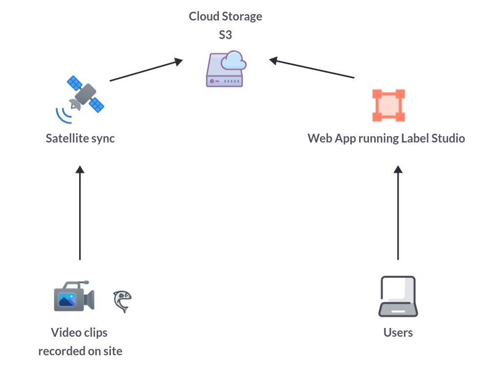
*Gallery / System overview of the [__SalmonVision__](https://salmonvision.org/) application*

The system’s machine learning models, running on edge devices like Raspberry
Pis, analyze the video footage in real time. An object detection model
generates bounding boxes around each detected fish, and a bytetracking
algorithm tracks individual fish as they move through the frame. This allows
the system to count the fish as they travel from left to right or right to left
within the video stream.

All collected data, including the video clips and ML model predictions, is
synced to the cloud via satellite connections. Users can access this data
through a web application, where they can review the video clips and verify the
accuracy of the model’s predictions.

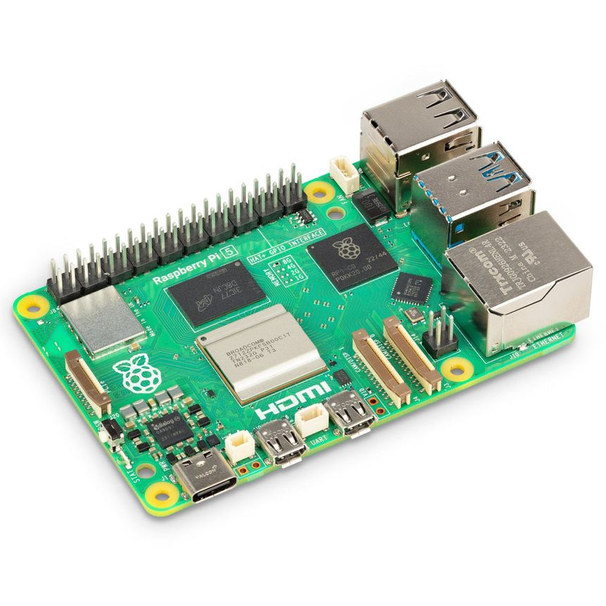
*Gallery / Raspberry Pi 5 micro-controller*

## Deployment at sites

Some hardware is deployed to operate at each site location. A Raspberry Pi
coordinates the system by making use of the motion detectors, the underwater
cameras and the starlink connectors. It is the brain of the setup and it
controls how the different hardware pieces function together.

  

    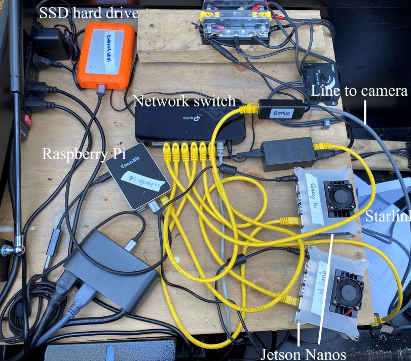
    
  

  <em>Gallery / Setting up sonars and underwater cameras at Haida site</em>

## Web Application

Rather than reinventing the wheel for displaying the predictions made by our
computer vision models, we chose to leverage
[LabelStudio](https://labelstud.io/), an open-source data labeling platform.
Since LabelStudio's feature set closely aligns with our requirements, we opted
to fork the code and customize it by adding the specific features needed for
our project.

### Overview

This diagram provides a high-level overview of the SalmonVision web
application. We have chosen to host the platform on AWS, utilizing S3 buckets
for cloud storage and RDS instances for database management.

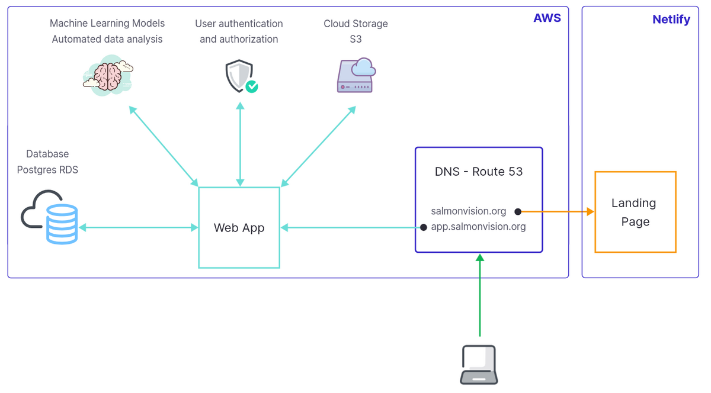
*Gallery / Overview of the web application developed to centralize counts
reports and video clips*

DNS configuration is managed through AWS Route 53, mapping salmonvision.org to
the landing page and app.salmonvision.org to our customized version of
LabelStudio.

The web application is deployed using AWS Elastic Beanstalk with Docker
containers. Each update to our code fork triggers the creation of a new Docker
image, which Elastic Beanstalk then pulls and runs on an EC2 auto-scaling
group.

To manage storage costs, we use AWS S3 inventory reports to track and summarize
the storage usage for each site and camera. Given that a significant portion of
our costs will be associated with storage, this helps us monitor and optimize
our usage. Currently, terabytes of video data are stored in our S3 buckets.

All infrastructure is managed using CloudFormation to ensure scalable,
controlled growth and adaptation over the long term, adhering to industry best
practices.

### Quick Start: Navigating the UI

In this section, we highlight key features of the web application designed to
facilitate the review of predictions made by our computer vision models.

Upon visiting [https://app.salmonvision.org](https://app.salmonvision.org),
users will see the login form. Access is restricted to onboarded organizations
and users who have been granted credentials.

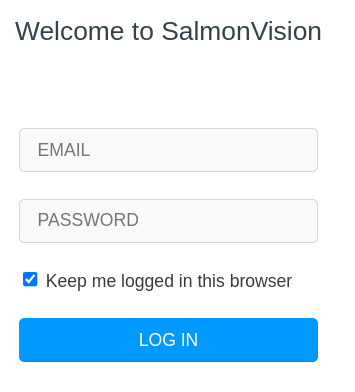
*SalmonVision Login Form*

After logging in, users are redirected to a dashboard displaying a list of
projects, each corresponding to a different river site where the system is
deployed.

Upon selecting a project, users are presented with a table showcasing 10% of
all video clips along with their associated predictions. Users can review both
the video clips and the predictions made by the ML model. The table view
includes filtering options, allowing users to adjust the sample of video clips
displayed.

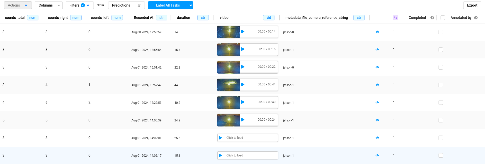
*Table containing all predictions made by the ML model*

Selecting a row from the table displays the video clip with bounding boxes
overlaid, as generated by the computer vision model. Users can play the video
to verify the accuracy of the model's predictions. If discrepancies are found,
users have the option to adjust the bounding boxes and regenerate the fish
counts.

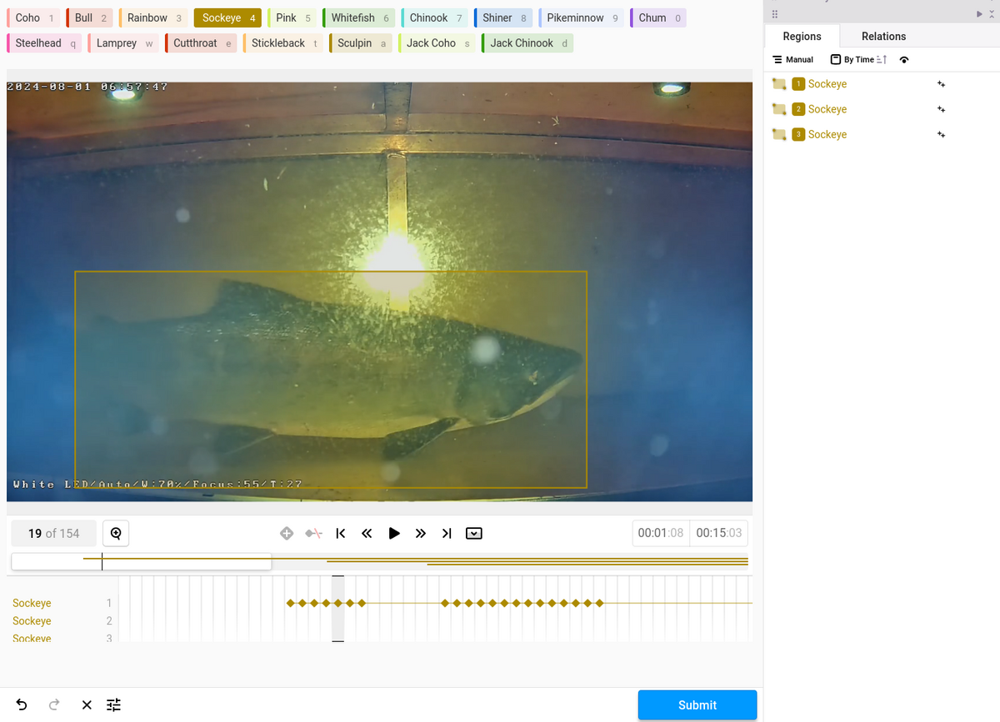
*Video clip overlaid with the ML model predictions*

## Data Modeling

A team of postdoctoral researchers and scientists from Simon
Fraser University undertook the task of collecting a salmon
dataset and training the machine learning models.

For more details on the research and methodology, please refer to
the [following research paper](./papers/fmars-10-1200408.pdf).

### Exploratory Data Analysis

Exploratory Data Analysis (EDA) is an approach to analyzing datasets to
summarize their main characteristics, often employing visual methods. The
primary goal of EDA is to uncover patterns, relationships, and anomalies in the
data, which can then inform subsequent analysis or modeling tasks.

EDA typically involves the following steps:

1. __Data Collection__: Gathering the relevant dataset(s) from various sources.
2. __Data Cleaning__: Identifying and handling missing values, outliers, and
   inconsistencies in the data.
3. __Summary Statistics__: Computing descriptive statistics such as mean,
   median, mode, standard deviation, etc., to understand the central tendencies
and variability of the data.
4. __Data Visualization__: Creating visual representations of the data using
   plots, charts, histograms, scatter plots, etc., to explore patterns,
distributions, correlations, and trends within the data.
5. __Exploratory Modeling__: Building simple models or using statistical
   techniques to further understand relationships within the data.
6. __Hypothesis Testing__: Formulating and testing hypotheses about the data to
   validate assumptions or gain insights.
7. __Iterative Analysis__: Iteratively exploring the data, refining analysis
   techniques, and generating new hypotheses as insights emerge.

EDA is a crucial initial step in any data analysis or modeling project as it
helps analysts gain a deeper understanding of the dataset, identify potential
challenges or biases, and inform subsequent analytical decisions. It provides a
foundation for more advanced analyses, such as predictive modeling, hypothesis
testing, or machine learning, by guiding feature selection, model building, and
evaluation strategies.

#### Class Imbalance

The research team has curated a dataset featuring 16 distinct species of fish
found in the rivers of British Columbia. Below, you'll find graphs illustrating
the distribution of each species within the dataset.

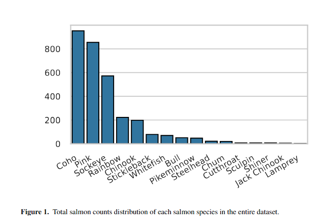

The fish dataset was gathered from four different rivers between 2019 and 2023.
The plots below showcase the species distribution across these river sites.

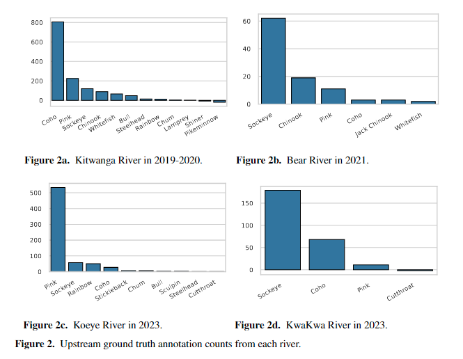

Class imbalance in computer vision can be a significant issue for machine
learning models because it leads to biased learning. When one class dominates
the dataset, the model tends to become biased towards that class, making it
more likely to misclassify or overlook the minority classes. This can result in
poor generalization, where the model performs well on the majority class but
fails to accurately predict or detect instances of the minority classes, which
may be critical in real-world applications. Balancing the classes or using
techniques like oversampling, undersampling, or weighted loss functions is
often necessary to mitigate this issue and improve model performance.

## ML System

### YOLO Overview

We opted to utilize a pretrained
[YOLOv8](https://github.com/ultralytics/ultralytics) model and fine-tune it for
our specific object detection task. Renowned for its speed, accuracy, and
user-friendly interface, YOLOv8 stands out as an ideal solution for various
tasks, including object detection, tracking, instance segmentation, image
classification, and pose estimation.

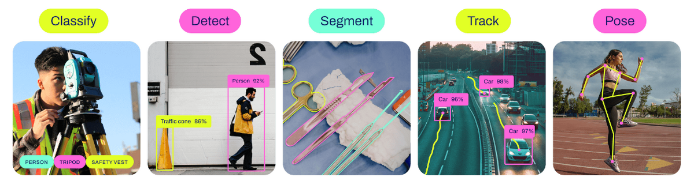
*YOLOv8 Computer Vision Tasks*

#### ByteTrack

Building on our fine-tuned YOLO object detection model, we implement
[ByteTrack](https://github.com/ifzhang/ByteTrack), a powerful multi-object
tracking algorithm.

ByteTrack is designed to handle occlusions and varying object sizes with
greater accuracy. It extends the Simple Online and Realtime Tracking (SORT)
method by tracking both high-confidence and low-confidence detections, ensuring
consistent object tracking even when detections are temporarily lost due to
occlusions or other challenges.

When integrated with YOLO, ByteTrack significantly improves the tracking of
detected objects across video frames, providing more reliable and continuous
monitoring of movement.

#### Fish Counts

By post-processing the output from the ByteTrack algorithm, we can
automatically generate detailed reports on fish counts, enabling effective
monitoring of fish migration across various river sites.

| River Site | Camera Reference | Day        | Coho | Bull | Sockeye | Rainbow | ... | Chinook |
|------------|------------------|------------|------|------|---------|---------|-----|---------|
| Bear Creak | Jetson 0         | 2024-08-29 | 12   | 5    | 108     | 8       | ... | 0       |
| Bear Creak | Jetson 1         | 2024-08-29 | 7    | 9    | 78      | 2       | ... | 1       |
| ...        | ...              | ...        | ...  | ...  | ...     | ...     | ... | ...     |
| Koeye      | Jetson 0         | 2024-08-29 | 54   | 32   | 12      | 0       | ... | 14      |
| Koeye      | Jetson 1         | 2024-08-29 | 24   | 25   | 18      | 1       | ... | 9       |

#### ML Pipeline

The machine learning pipeline developed for this project integrates YOLO object
detection, ByteTrack, and post-processing techniques to accurately count fish
in a given video stream.

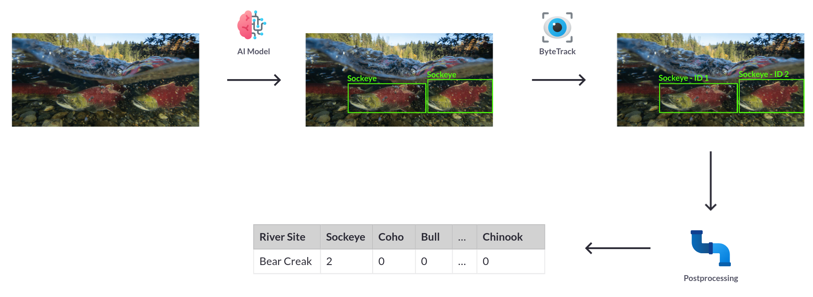
*Gallery / Overview of the ML Pipeline*

1. __Detection with YOLO__: YOLO is employed to detect objects in each video
   frame, producing bounding boxes, class labels, and confidence scores for
each detected fish.
2. __Tracking with ByteTrack__: The YOLO detections (including bounding boxes,
   scores, and labels) are fed into ByteTrack. ByteTrack associates detections
across frames, assigning unique IDs to each fish and maintaining these IDs as
the fish move through the video, even in cases of temporary occlusion.
3. __Post-Processing__: The tracking data from ByteTrack is then used to
   analyze fish trajectories, count the number of fish, and monitor their
behavior over time.

#### Model performance

We evaluate the performance of our object detection model using a holdout test
set. Below is the confusion matrix for the fine-tuned YOLOv8 object detector.

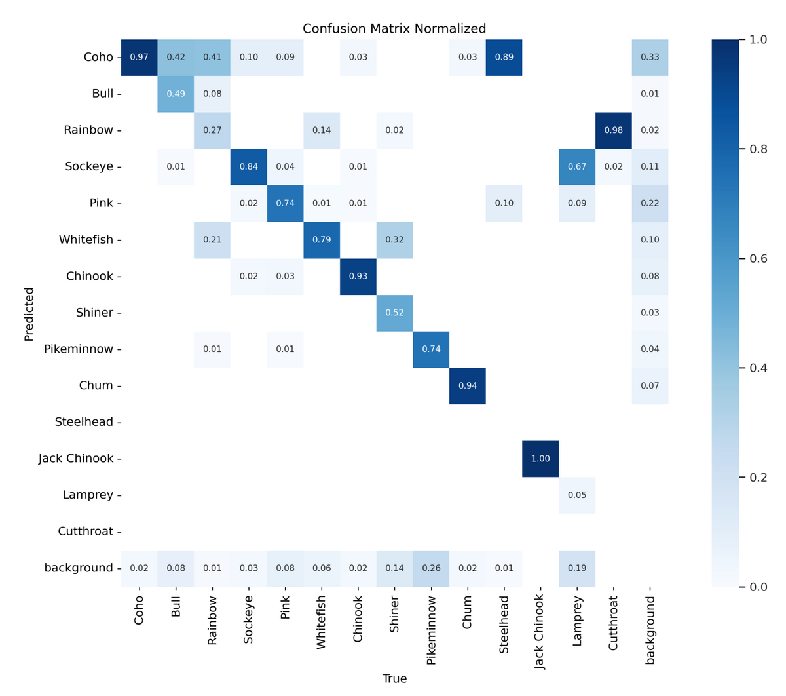

Although the model isn't perfect yet, it is effective for practical use. Our
strategy involves continuously gathering more data as we deploy the systems at
additional river sites and retraining our models with these expanded datasets
to enhance accuracy. This approach creates a positive feedback loop, benefiting
all users of the system.

| Ground Truth                                     | Prediction                                     |
|:------------------------------------------------:|:----------------------------------------------:|
| 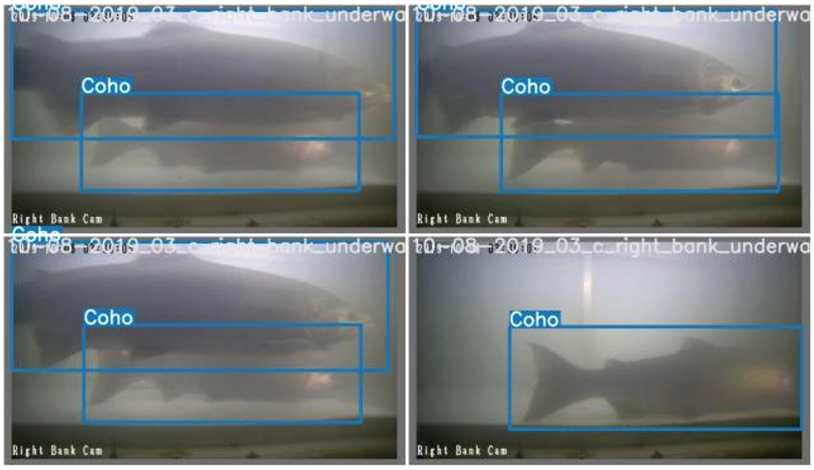 | 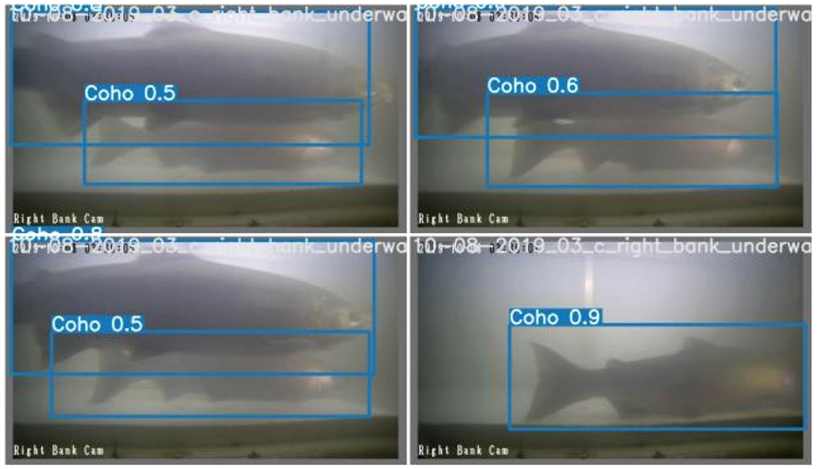 |

The table above displays a random sample of images alongside
the corresponding predictions made by the machine learning
model.

## Future development

At the current stage, our system can reliably collect and analyze video
clips of fish swimming back to their natal streams using underwater
cameras. To expand our coverage to more river sites, we are testing sonar
technology, which will provide additional insights into migrating fish.
Additionally, drone imagery is being explored to monitor other parts of the
river.

As the project progresses and we deploy to more river sites, we aim to
build one of the largest datasets of salmon in Canada. This will enable us
to develop highly accurate machine learning models for automatic monitoring
of these fish.

## Conclusion

This article provided an overview of the __SalmonVision__ project, covering
everything from the hardware and software developed to monitor and count
wild salmon migrating back to their natal streams. This solution is crucial
for effectively managing and mitigating threats to salmon populations and
will play a key role in engaging stakeholders in conservation efforts.

One can try out the model from the [ML Space]() or directly from the snippet below:


