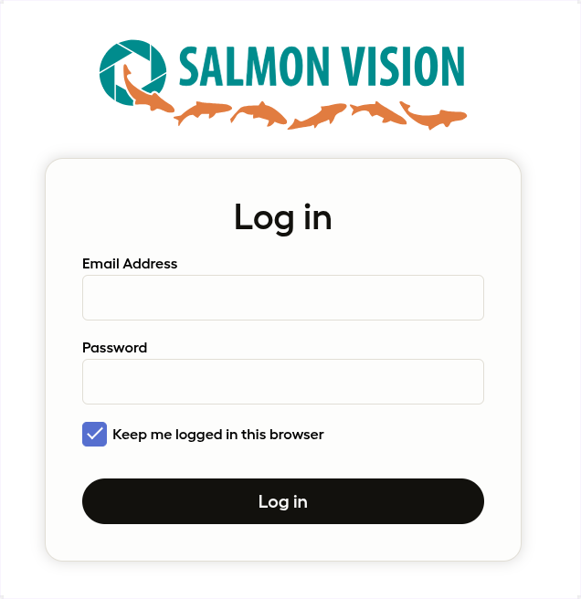

In this blog post, we will dive into the successful development of a wild
salmon monitoring system, currently deployed to 8 different sites in British
Columbia.

> We must take every step in our control now as climate-change related trends
> will make things more difficult for salmon populations in the years ahead.
> This demands urgency for Pacific salmon and for the 130+ species, including
> grizzlies, orcas and eagles, that depend on Pacific salmon.
>
> <cite>– Pacific Salmon Foundation</cite>

The [__SalmonVision__](https://salmonvision.org) project is a
collaborative effort involving the [Pacific Salmon
Foundation](https://psf.ca/), the [Wild Salmon
Center](https://wildsalmoncenter.org/),
[Aeria](https://aeria.ai/), and [Simon Fraser
University](https://www.sfu.ca/). Together, we are developing an
advanced monitoring system that serves as a centralized hub for
generating and collecting crucial data. This data is essential
for effective management of salmon populations and actively
engages stakeholders in conservation efforts.

## Project Scope

Our collaboration aims to develop a comprehensive, deployable system for monitoring salmon migration at river sites. This system will record video clips of salmon as they return to their natal streams, automatically classify the species, and generate aggregate counts for the entire migration season.

The system is designed to be modular, allowing for easy expansion to additional river sites, thereby covering more migration routes. All recorded video clips will be accessible via a website, where users can also view model predictions. To ensure accuracy, agents will review a percentage of the video clips, validating the machine learning models and continuously expanding the dataset. This growing dataset will feed back into the AI training process, improving the system's accuracy over time.

  <iframe src="https://www.youtube.com/embed/V-rZSeM5YtY" loading="lazy" frameborder="0" allowfullscreen>
  </iframe>

<em style="font-size:14px;line-height:1.4em;display:block;">Underwater camera activated at Bear Creek River: Monitoring system now live
</em>
 

## Overview of the SalmonVision Application

The SalmonVision application is designed to monitor salmon migration using an
advanced system of underwater cameras and machine learning models. At each
river site, multiple underwater cameras are strategically placed in fish
corridors—passageways that allow salmon to swim back to their natal streams.
These corridors are typically located at dams or fisheries and are essential
for enabling fish migration.

The system is triggered by motion detectors, which activate the cameras to
record short video clips whenever movement is detected. These videos are stored
on large local hard drives. To ensure timely access to the data, a satellite
connection is used to sync the recorded videos to the cloud multiple times per
hour.

*Gallery / System overview of the [__SalmonVision__](https://salmonvision.org/) application*

The system’s machine learning models, running on edge devices like Raspberry
Pis, analyze the video footage in real time. An object detection model
generates bounding boxes around each detected fish, and a bytetracking
algorithm tracks individual fish as they move through the frame. This allows
the system to count the fish as they travel from left to right or right to left
within the video stream.

All collected data, including the video clips and ML model predictions, is
synced to the cloud via satellite connections. Users can access this data
through a web application, where they can review the video clips and verify the
accuracy of the model’s predictions.

FIXME: add an image of a RPi and an underwater camera

## Deployment at sites

## Web Application

Rather than reinventing the wheel for displaying the predictions made by our
computer vision models, we chose to leverage
[LabelStudio](https://labelstud.io/), an open-source data labeling platform.
Since LabelStudio's feature set closely aligns with our requirements, we opted
to fork the code and customize it by adding the specific features needed for
our project.

### Overview

This diagram provides a high-level overview of the SalmonVision web
application. We have chosen to host the platform on AWS, utilizing S3 buckets
for cloud storage and RDS instances for database management.

*Gallery / Overview of the web application developed to centralize counts
reports and video clips*

DNS configuration is managed through AWS Route 53, mapping salmonvision.org to
the landing page and app.salmonvision.org to our customized version of
LabelStudio.

The web application is deployed using AWS Elastic Beanstalk with Docker
containers. Each update to our code fork triggers the creation of a new Docker
image, which Elastic Beanstalk then pulls and runs on an EC2 auto-scaling
group.

To manage storage costs, we use AWS S3 inventory reports to track and summarize
the storage usage for each site and camera. Given that a significant portion of
our costs will be associated with storage, this helps us monitor and optimize
our usage. Currently, terabytes of video data are stored in our S3 buckets.

All infrastructure is managed using CloudFormation to ensure scalable,
controlled growth and adaptation over the long term, adhering to industry best
practices.

### Quick Start: Navigating the UI

In this section, we highlight key features of the web application designed to
facilitate the review of predictions made by our computer vision models.

Upon visiting [https://app.salmonvision.org](https://app.salmonvision.org),
users will see the login form. Access is restricted to onboarded organizations
and users who have been granted credentials.

*SalmonVision Login Form*

After logging in, users are redirected to a dashboard displaying a list of
projects, each corresponding to a different river site where the system is
deployed.

FIXME: add an image of the projects

Upon selecting a project, users are presented with a table showcasing 10% of
all video clips along with their associated predictions. Users can review both
the video clips and the predictions made by the ML model. The table view
includes filtering options, allowing users to adjust the sample of video clips
displayed.

*Table containing all predictions made by the ML model*

Selecting a row from the table displays the video clip with bounding boxes overlaid, as generated by the computer vision model. Users can play the video to verify the accuracy of the model's predictions. If discrepancies are found, users have the option to adjust the bounding boxes and regenerate the fish counts.

*Video clip overlaid with the ML model predictions*

## Project Scope
## Provided Datasets
### EDA
#### Class imbalance
Distributions of species and sites
## Overview of the system
## Web application System
### Fork of LabelStudio Community Edition
add images that show the UI
explain what was added to the fork: multi tenant system (mutliple orgs)
Possibility to update salmon counts when updating and submitting the annotations

## ML System
### YOLOv8
#### Overview
#### Object Detection
#### Bytetracking
### Classified species and performances
  add confusion matrix from research paper
### Automated counts reports
  table of counts to show how it works
### Positive feedback loop to acquire a large dataset and expediate the labelling process with ML.

## Future development
  sonar
  aerial
  expand to more sites

## Conclusion

