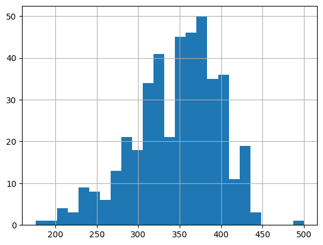

In this blog post, we will dive into the pivotal preprocessing techniques used to normalize raw trout pictures to make them ready for the identification stage. We will focus on the first stage of the ML pipeline that was developed to successfuly identify trouts based on their unique spot patterns.

*Gallery / Overview of the ML pipeline developed to identify trouts*

## Exploratory Data Analysis

Exploratory Data Analysis (EDA) is an approach to analyzing datasets to
summarize their main characteristics, often employing visual methods. The
primary goal of EDA is to uncover patterns, relationships, and anomalies in the
data, which can then inform subsequent analysis or modeling tasks.

  

    
    
    
    
  

  <em>Gallery / Random batch from the dataset</em>

EDA typically involves the following steps:

1. __Data Collection__: Gathering the relevant dataset(s) from various sources.
2. __Data Cleaning__: Identifying and handling missing values, outliers, and
   inconsistencies in the data.
3. __Summary Statistics__: Computing descriptive statistics such as mean,
   median, mode, standard deviation, etc., to understand the central tendencies
and variability of the data.
4. __Data Visualization__: Creating visual representations of the data using
   plots, charts, histograms, scatter plots, etc., to explore patterns,
distributions, correlations, and trends within the data.
5. __Exploratory Modeling__: Building simple models or using statistical
   techniques to further understand relationships within the data.
6. __Hypothesis Testing__: Formulating and testing hypotheses about the data to
   validate assumptions or gain insights.
7. __Iterative Analysis__: Iteratively exploring the data, refining analysis
   techniques, and generating new hypotheses as insights emerge.

EDA is a crucial initial step in any data analysis or modeling project as it
helps analysts gain a deeper understanding of the dataset, identify potential
challenges or biases, and inform subsequent analytical decisions. It provides a
foundation for more advanced analyses, such as predictive modeling, hypothesis
testing, or machine learning, by guiding feature selection, model building, and
evaluation strategies.

  

    
    
  

  <em>EDA / Findings from the preliminary EDA</em>

Following a preliminary exploratory analysis of three
years of historical data, we observed the following key
findings:

- A total of __2,769 images__ are linked to identifiable PIT tags (ID numbers).
- There were __204__ fish that were recaptured once, resulting in a total of 408 associated images.
- The average size of the trout measured __37 cm__.
- Data collection occurred annually over a three-year period, from 2021 to 2023.
