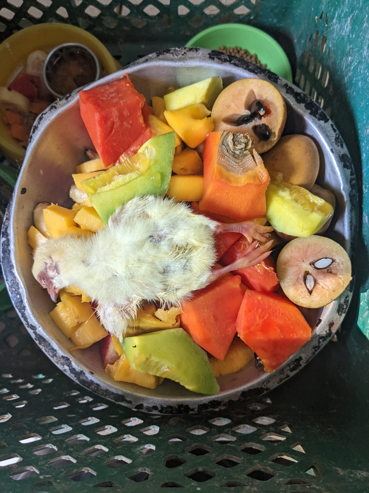
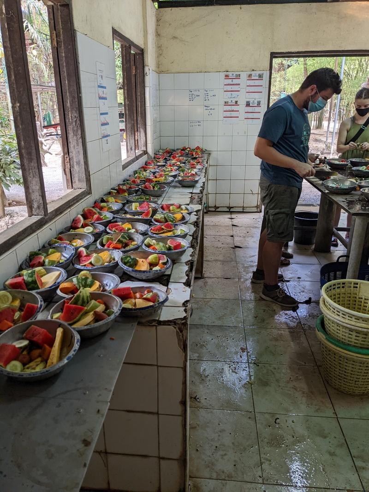

In this blog, we will share our experiences volunteering at various wildlife
rescue centers.

  <a class="link-no-decoration" href="https://www.wfft.org/donate/">
    <button class="button button--cta">
      Make a donation to WFFT 🐘
  </button>
  </a>
  <a class="link-no-decoration" href="https://arcasguatemala.org/donors/" style="padding-left: 10px;">
    <button  class="button button--cta"/>
      Make a donation to ARCAS 🐒
    </button>
  </a>

 
 

## Introduction

A wildlife rescue center primarily focuses on the rehabilitation of injured,
sick, or orphaned animals. The goal is to treat these animals and eventually
release them back into their natural habitats.

Rescue centers typically provide medical care, rehabilitation, and temporary
housing for animals. They often engage in rescue operations and collaborate
closely with local authorities to respond to wildlife emergencies.

These centers usually work in conjunction with wildlife sanctuaries, which
serve as permanent safe havens for animals that cannot be released back into
the wild due to injuries, habituation to humans, or other reasons.

Sanctuaries prioritize the well-being of the animals and often educate the
public about wildlife conservation. They may also participate in breeding
programs for endangered species and offer tours or educational programs to
raise awareness.

## Wildlife Friend Foundation Thailand - WFFT

  

[WFFT](https://www.wfft.org/) is a non-governmental organization (NGO) in
Thailand, founded in 2001. The foundation undertakes various projects,
including animal rescue, rehabilitation, and veterinary assistance for wild
animals in Thailand. It promotes wildlife protection through educational
initiatives aimed at both local Thai communities and tourists. Many of the
rescued animals are either kept as illegal pets or found injured in the wild.

  <iframe src="https://www.youtube.com/embed/akGPiurjjCo" loading="lazy" frameborder="0" allowfullscreen>
  </iframe>

<em style="font-size:14px;line-height:1.4em;display:block;">WFFT Volunteer Introduction Video</em>
 

Spending a couple of weeks volunteering in animal care involves following a
daily routine designed by wildlife experts and veterinarians. This schedule
outlines everything from the type of food the animals should receive to their
feeding times and enclosure cleaning. Working in the humid and hot weather from
early morning can be physically exhausting. During our first week, we focused
our efforts at the Elephant Refuge Sanctuary.

### Elephant Refuge Sanctuary

During the first part of the stay, we volunteered at the Elephant Refuge.
Established in 2003, the ER project currently cares for over 20 Asian
elephants, most of whom were rescued from trekking camps where they were
harshly exploited for tourist entertainment. While these elephants cannot
return to the wild, they benefit from the opportunity to roam in expansive
forested enclosures. WFFT has acquired large tracts of land featuring forests
and lakes, with the largest elephant enclosure spanning 20 hectares. The
sanctuary takes pride in being Asia’s first chain-free facility, ensuring that
no elephant is ever chained, day or night.


  
  
  
  


Elephant are given fresh food every day, two times a day. Volunteers hide the
food inside tires or hang them in trees which forces the animals to forage for
their food. This is more stimulating for them as they never get to find their
food twice in the same spot.

Fruits and branches are prepared daily for them. To stock up for the upcoming
weeks, volunteers often need to go and chop down some banana trees nearby.

  

    
    
  

  <em>Banana trees are collected for elephants</em>

#### 🙅‍♂️  Never back ride an elephant

The training of elephants for riding and performances in Thailand often
involves a process that can be quite harsh and traumatic for the animals.
Initially, many elephants are captured from the wild, which can involve violent
methods. Young elephants are frequently taken from their mothers, leading to
significant distress and trauma. The first phase of training, often referred to
as "breaking," involves isolating the elephant and using physical punishment to
instill obedience. This can include confinement in small spaces, deprivation of
food, and the use of tools like
[bullhooks](https://www.elephantvoices.org/elephants-in-captivity-7/about-the-bull-hook.html) — sharp,
pointed instruments used to inflict pain.

Once the elephant is subdued, trainers employ fear-based techniques to
condition the animals to accept human commands. This conditioning often
involves repeated exposure to stressful situations, loud noises, or physical
punishment for disobedience. After the initial breaking process, trainers use
repetitive commands and rewards, such as food, to reinforce desired behaviors.
However, the initial trauma inflicted during training often leaves lasting
psychological scars on the elephants.

  <iframe src="https://www.youtube.com/embed/GAinaDnPPO0" loading="lazy" frameborder="0" allowfullscreen>
  </iframe>

<em style="font-size:14px;line-height:1.4em;display:block;">Breaking the spirit of elephants is inhumane practice</em>
 

The physiological and psychological trauma experienced by these animals is
profound. The training process can lead to chronic stress and anxiety, with
signs that may include repetitive behaviors, aggression, or withdrawal.
Additionally, the use of bullhooks and other training tools can cause physical
injuries, including wounds, infections, and long-term damage to the skin and
muscles. Elephants are highly social animals, and the training process often
involves isolating them from their herds, which can result in loneliness and
depression, as they thrive on social interactions.

*Left: Elephant with a damaged back due to tourist riding - Right: Regular bumpy back of an elephant*

Moreover, the training and subsequent life as a riding elephant can prevent
them from engaging in natural behaviors, such as foraging, roaming, and
socializing, which are essential for their well-being. The combination of
physical punishment, isolation, and the unnatural environment can lead to
severe psychological trauma. Elephants may develop symptoms similar to
post-traumatic stress disorder (PTSD), including heightened fear responses and
difficulty forming bonds with other elephants.

The exploitation of elephants for tourism, particularly through riding, raises
significant ethical concerns. Many animal welfare organizations advocate for
the cessation of such practices and promote alternatives that allow elephants
to live in more natural and humane conditions. Efforts are being made to
educate tourists about the realities of elephant training and to support
sanctuaries that prioritize the well-being of these magnificent animals.

Learn more about [the ugly truth about elephant back rides](https://www.elephantvoices.org/elephants-in-captivity-7/about-elephant-back-rides.html).

### Wildlife Rescue Center

We also contributed our time to the Wildlife Rescue Center, which
rescues a diverse array of animals. Established in 2001, the WRC currently
cares for over 600 animals, relying on volunteer support for their well-being.
Many of these animals have been rescued from dire conditions or abandoned after
being unwanted pets. In Thailand, thousands of domesticated and wild animals
are kept as pets or exploited in the tourism industry. The WRC provides shelter
to a significant number of wild animals, some for a short duration, while
others will remain there for the rest of their lives.


  
  
  
  
  
  


Depending on the species assigned, specific food portions tailored by
veterinarians must be prepared.

  

    
    
  

  <em>Gallery / Food preparation</em>

After cleaning, sorting, cutting, and slicing the fruits and vegetables,
volunteers are dispatched to various locations to distribute the food portions
to the animals. Enclosure cleaning typically occurs afterward, just before the
next round of feeding. Additionally, there is time allocated for enhancing the
enclosures and tidying up the surrounding forested areas.

Overall, volunteering at WFFT has been a rewarding experience, providing
valuable insights into the challenges of operating a wildlife rescue center.
Animals are treated with care and respect, allowing them to spend part of their
lives in a safe haven before being released back into the wild.

## ARCAS

  

[ARCAS](https://arcasguatemala.org) is a non-profit civil association in
Guatemala, founded in 1989 by a group of concerned citizens who witnessed the
rapid decline of their precious natural heritage, particularly wildlife.

Since its inception, the ARCAS Rescue Center has evolved into one of the
largest and most comprehensive rescue centers in the world, receiving between
300 and 600 animals from over 40 species each year.

### Life at ARCAS Guatemala

Volunteering at the Wildlife Rescue Center is an incredible experience. Scarlet
macaws and howler monkeys begin their day early, often waking volunteers around
6 a.m. as they require feeding.


  
  
  
  
  
  


The volunteer day begins with preparing food for assigned animals and cleaning
their enclosures. It is essential to wear face masks at all times to prevent
the transmission of diseases to the animals, which can be particularly
exhausting in a hot and humid climate.

During our stay, a small team of veterinarians was implementing a release
protocol for a group of spider monkeys that had been rewilded for approximately
eight years to teach them essential survival skills. This marked the first time
they were able to release such a large group, and the team monitored the
well-being of the monkeys using GPS collars for several weeks. These release
protocols are often refined over time through trial and error and could serve
as a foundation for successfully reintroducing spider monkeys into the wild.

Each day, there is an opportunity to engage with veterinarians and gain
insights into their work. We also heard deeply moving stories about some of the
animals that arrived at ARCAS.

## Conclusion

There are numerous ways you can support organizations like
[WFFT](https://www.wfft.org/) and [ARCAS](https://arcasguatemala.org/) or other
wildlife rescue centers. If you have the time, consider volunteering at one of
these facilities. This experience will provide you with valuable insights into
the challenges of rehabilitating wildlife and the complexities of reintroducing
them into their natural habitats. Additionally, you will gain a deeper
understanding of the illegal wildlife trade, which threatens many species with
extinction. If volunteering isn’t an option, you can also make a meaningful
impact by donating to these organizations, helping them continue their vital
work in wildlife conservation.

  <a class="link-no-decoration" href="https://www.wfft.org/donate/">
    <button class="button button--cta">
      Make a donation to WFFT 🐘
  </button>
  </a>
  <a class="link-no-decoration" href="https://arcasguatemala.org/donors/">
    <button  class="button button--cta"/>
      Make a donation to ARCAS 🐒
    </button>
    </a>

