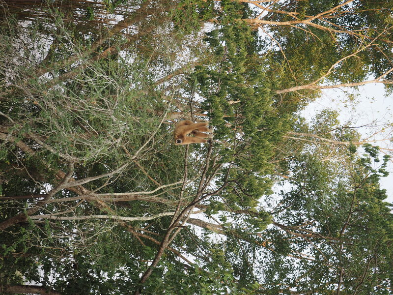

TODO:

- [ ] Add links to NGOs
- [ ] Add links to donation pages
- [ ] Section on elephant exploitation (elephant riding)

In this blog, we will share our experience staying and volunteering at some Wildlife Rescue Centers.

## Introduction

A Wildlife Rescue Center is primarily focused on the rehabiliation of injured, sick or orphaned animals. The goal is to treat these animals and eventually release them back into their natural habitats.

Rescue centers often provide medical care, rehabilitation, and sometimes temporary housing for animals. They may also engage in rescue operations and work closely with local authorities to respond to wildlife emergencies.

They usually work in tandem with Wildlife Sanctuaries whose purpose is to provide a permanent, safe haven for animals that cannot be released back into the wild due to injure, habituation to humans or other reasons.

Sanctuaries often educate the public about wildlife conservation and may engage in breeding programs for endangered species. They prioritize the well-being of the animals and may offer tours or educational programs to raise awareness.

## Wildlife Friend Foundation Thailand - WFFT

WFFT is an NGO in Thailand, founded in 2001. The foundation has several different projects including animal rescue, rehabiliation and veterinary assistance to wild animals in Thailand. It promotes the protection of wildlife through educational initiatives for localt Thai people as well as tourists.
Many of the rescued animals are kepts as pets illegally or are found injured.

  <iframe src="https://www.youtube.com/embed/akGPiurjjCo" loading="lazy" frameborder="0" allowfullscreen>
  </iframe>

<em style="font-size:14px;line-height:1.4em;display:block;">WFFT Volunteer Introduction Video</em>
 

Spending a couple of weeks there as a volunteer focusing on animal care. The daily routine is designed by wildlife experts and vets: From the food they should be given, to their feeding schedule, enclosure cleaning times, etc. Working from very early in the morning under humid and hot weather can be physically exhausting. Our first week, we worked in the Elephant Refuge Sanctuary.

### Elephant Refuge Sanctuary

During the first part of the stay, we volunteered at the Elephant Refuge.
Established in 2003, the ER project currently cares for over 20 Asian
elephants, most of whom were rescued from trekking camps where they were
harshly exploited for tourist entertainment. While these elephants cannot
return to the wild, they benefit from the opportunity to roam in expansive
forested enclosures. WFFT has acquired large tracts of land featuring forests
and lakes, with the largest elephant enclosure spanning 20 hectares. The
sanctuary takes pride in being Asia’s first chain-free facility, ensuring that
no elephant is ever chained, day or night.

  

    
    
    
    
  

  <em>Gallery / Eating, cooling down, and resting</em>

Elephant are given fresh food every day, two times a day. Volunteers hide the food inside tires or hang them in trees which forces the animals to forage for their food. This is more stimulating for them as they never get to find their food twice in the same spot.

Fruits and branches are prepared daily for them. To stock up for the upcoming weeks, volunteers often need to go and chop down some banana trees nearby.

  

    
    
  

  <em>Banana trees are collected for elephants</em>

#### 🙅‍♂️  Never back ride an elephant

The training of elephants for riding and performances in Thailand often
involves a process that can be quite harsh and traumatic for the animals.
Initially, many elephants are captured from the wild, which can involve violent
methods. Young elephants are frequently taken from their mothers, leading to
significant distress and trauma. The first phase of training, often referred to
as "breaking," involves isolating the elephant and using physical punishment to
instill obedience. This can include confinement in small spaces, deprivation of
food, and the use of tools like
[bullhooks—sharp](https://www.elephantvoices.org/elephants-in-captivity-7/about-the-bull-hook.html),
pointed instruments used to inflict pain.

Once the elephant is subdued, trainers employ fear-based techniques to
condition the animals to accept human commands. This conditioning often
involves repeated exposure to stressful situations, loud noises, or physical
punishment for disobedience. After the initial breaking process, trainers use
repetitive commands and rewards, such as food, to reinforce desired behaviors.
However, the initial trauma inflicted during training often leaves lasting
psychological scars on the elephants.

  <iframe src="https://www.youtube.com/embed/GAinaDnPPO0" loading="lazy" frameborder="0" allowfullscreen>
  </iframe>

<em style="font-size:14px;line-height:1.4em;display:block;">Breaking the spirit of elephants is inhumane practice</em>
 

The physiological and psychological trauma experienced by these animals is
profound. The training process can lead to chronic stress and anxiety, with
signs that may include repetitive behaviors, aggression, or withdrawal.
Additionally, the use of bullhooks and other training tools can cause physical
injuries, including wounds, infections, and long-term damage to the skin and
muscles. Elephants are highly social animals, and the training process often
involves isolating them from their herds, which can result in loneliness and
depression, as they thrive on social interactions.

Moreover, the training and subsequent life as a riding elephant can prevent
them from engaging in natural behaviors, such as foraging, roaming, and
socializing, which are essential for their well-being. The combination of
physical punishment, isolation, and the unnatural environment can lead to
severe psychological trauma. Elephants may develop symptoms similar to
post-traumatic stress disorder (PTSD), including heightened fear responses and
difficulty forming bonds with other elephants.

The exploitation of elephants for tourism, particularly through riding, raises
significant ethical concerns. Many animal welfare organizations advocate for
the cessation of such practices and promote alternatives that allow elephants
to live in more natural and humane conditions. Efforts are being made to
educate tourists about the realities of elephant training and to support
sanctuaries that prioritize the well-being of these magnificent animals.

Learn more about [the ugly truth about elephant back rides](https://www.elephantvoices.org/elephants-in-captivity-7/about-elephant-back-rides.html).

### Wildlife Rescue Center

We also contributed our time to the Wildlife Rescue Center, which
rescues a diverse array of animals. Established in 2001, the WRC currently
cares for over 600 animals, relying on volunteer support for their well-being.
Many of these animals have been rescued from dire conditions or abandoned after
being unwanted pets. In Thailand, thousands of domesticated and wild animals
are kept as pets or exploited in the tourism industry. The WRC provides shelter
to a significant number of wild animals, some for a short duration, while
others will remain there for the rest of their lives.

  

    
    
    
    
    
    
  

  <em>Gallery / Gibbon, Iguana, Macaw, Tiger, Otters, Turtle - from top to bottom, left to righ</em>

Depending on the species assigned, specific food portions tailored by
veterinarians must be prepared.

  

    
    
  

  <em>Gallery / Food preparation</em>

After cleaning, sorting, cutting, and slicing the fruits and vegetables,
volunteers are dispatched to various locations to distribute the food portions
to the animals. Enclosure cleaning typically occurs afterward, just before the
next round of feeding. Additionally, there is time allocated for enhancing the
enclosures and tidying up the surrounding forested areas.

Overall, volunteering at WFFT has been a rewarding experience, providing
valuable insights into the challenges of operating a wildlife rescue center.
Animals are treated with care and respect, allowing them to spend part of their
lives in a safe haven before being released back into the wild.

## ARCAS

ARCAS is a non-profit Guatemalan Civil Association formed in 1989 by a group of Guatemalan citizens who became concerned as they saw their precious natural heritage - especially their wildlife - rapidly disappearing before their eyes.

Since its establishment, the ARCAS Rescue Center has grown into one of the largest and most complex rescue centers in the world, receiving between 300 and 600 animals of more than 40 species per year.

Volunteering at the Wildlife Rescue Center is a very great experience. Scarlet Macaws and Howler Monkeys start early and will wake you up around 6am as they need to be fed. 

## Conclusion

There are numerous ways you can support organizations like [WFFT](https://www.wfft.org/) and [ARCAS](https://arcasguatemala.org/) or other wildlife rescue centers. If you have the time, consider volunteering at one of these facilities. This experience will provide you with valuable insights into the challenges of rehabilitating wildlife and the complexities of reintroducing them into their natural habitats. Additionally, you will gain a deeper understanding of the illegal wildlife trade, which threatens many species with extinction. If volunteering isn’t an option, you can also make a meaningful impact by donating to these organizations, helping them continue their vital work in wildlife conservation.

  

    <a class="link-no-decoration" href="https://www.wfft.org/donate/">
      <button class="button button--cta">
        Make a donation to WFFT 🐘
    </button>
    </a>
    <a class="link-no-decoration" href="https://arcasguatemala.org/donors/" style="padding-left: 10px;">
      <button  class="button button--cta"/>
        Make a donation to ARCAS 🐒
      </button>
    </a>
  

