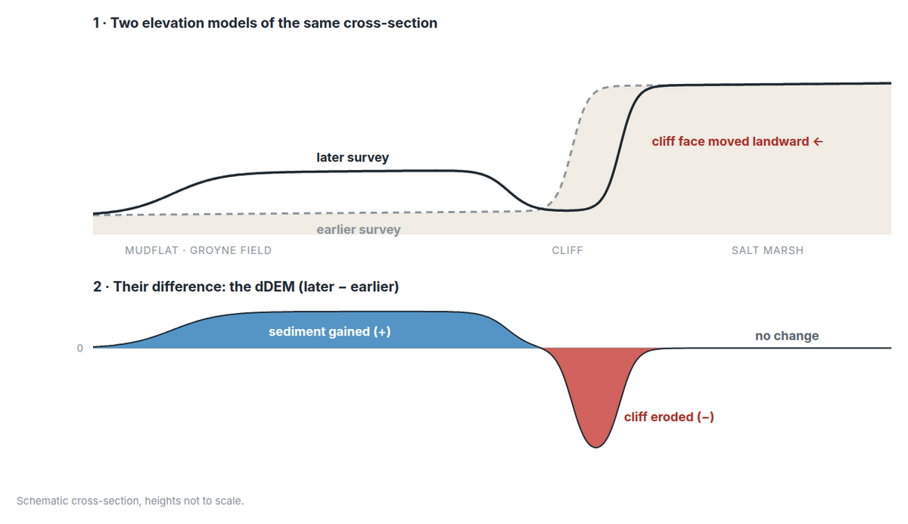

A salt marsh protects the dike behind it only as long as it keeps up with
the sea. Whether it does comes down to a sediment budget measured in
centimetres: mud settling on the flats in front of the marsh, and the marsh
edge crumbling where waves attack it.

At Wierum, on the Frisian coast of the Wadden Sea, we measured those changes
across the whole site for [CODAP](), the Coastal Data Portal we built
with [Rijkswaterstaat](https://www.rijkswaterstaat.nl/en) and [Lumax
AI](https://lumax.ai/). Between January 2024 and March 2026, half of the site
rose by 11 cm or more, and the fields between the brushwood groynes by up to
about half a metre. Along the marsh edge, a narrow band dropped by up to about
50 cm.

This post is about how those numbers are made: from drone photos to elevation
models, from two elevation models to a map of change, and from a map of change
to a reading of the coast.

## From drone photos to an elevation model

Each drone survey produces many overlapping photos. Photogrammetry
matches the same points across photos taken from different positions and
reconstructs the surface in 3D. The same processing that gives the
orthophoto, the distortion-free aerial photo used for land-cover mapping,
also gives a **digital elevation model** (DEM): a raster that stores the
height of every point on the site.

For change detection, the DEM is what matters. One DEM is a snapshot. Two
DEMs of the same place, on different dates, are a measurement.

## The DEM of difference

Subtracting the earlier DEM from the later one, pixel by pixel, gives a
**DEM of difference**, or dDEM:

- **positive** where the ground rose: sediment was deposited;
- **negative** where it dropped: erosion;
- **around zero** where nothing changed.

The operation is simple. Everything around it needs care. Both DEMs have to
line up exactly, so that every pixel compares the same spot on the ground.
And a coast is only understood by comparing many moments, so we compute a
dDEM for **every pair of surveys**: six surveys give fifteen pairs, and the
portal can compare any two dates.

## Signal and noise

A photogrammetric DEM is not perfect. Every surface carries a little noise,
and subtracting two of them adds their noise together. We measured it on one
pair of surveys:

| What we measured | Size |
|---|---|
| Typical spread of the change across the site | ±4.5 cm |
| Typical difference between neighbouring pixels | 5 mm |
| Sparse spikes (1st to 99th percentile of pixel-to-pixel jumps) | ±3 to 4 cm |

So the dDEM is a smooth field of centimetre-scale change, with sparse spikes
of the same size scattered on top. The spikes are the problem: to see
centimetres, the colour scale has to be stretched hard, and the stretch turns
them into a salt-and-pepper texture that hides the pattern.

The way out is that **real change is spatially coherent, and noise is not.**
Erosion and deposition affect patches of ground, many pixels at once. A
spike affects one pixel. That difference is what the filter uses:

1. **Median despike.** Each pixel is compared with the median of its
   5 × 5 neighbourhood. If it differs by more than 3 cm, it is replaced by
   that median. A single-pixel spike is removed; a patch of real change,
   which moves its whole neighbourhood, is left alone.
2. **Light smoothing.** A Gaussian blur with σ = 1 pixel (about 40 cm)
   reduces the remaining 5 mm wobble.

Pixels with no data stay empty in the result, so the filter never adds
values where the survey has none. The settings were chosen by comparing a few
variants side by side on one pair before processing all fifteen.



The main thing lost is a genuine change confined to a single 40 cm pixel.
That sits at the level of the noise itself, so it could not have been
trusted anyway.

## Reading the coast with transects

A map of change shows where to look. A transect shows how much. The portal
serves the change maps as image tiles that carry the height of every pixel,
precise to about 4 mm, so the colour range can be changed instantly and
transects can be read straight from the map. In the Erosion tab, anyone can
draw a line across the map and get a profile of the height change along it.

At Wierum, the profiles tell a consistent story: the ground rises across the
groyne fields, then drops sharply where the line crosses the marsh edge. Where
sediment builds up and where the cliff retreats is exactly what a coastal
manager needs to know. A structure was built at Wierum to protect the marsh
cliff from erosion, and the change map and transects show within minutes where
sediment is building up and where the cliff is still retreating.

The photos show the same thing. Drag across the same 120 m of cliff, two
winters apart:



## The same spot, six times

Two surveys show a difference. Six show a trend. Here is the same 100 m by
70 m of cliff and groyne field in every survey, with the change since the
first survey underneath, and the median change over time for two parts of
it: the groyne field, and the patch of cliff that had dropped by more than
15 cm by March 2026.

The groyne field rose in steps, to +32 cm by March 2026. The cliff patch
dropped fast, to −30 cm by August 2025, then partly filled back in, to
−23 cm by March 2026. A single pair of surveys shows only the net result;
the series shows how it happened, and when.

## What's next

Change maps answer "where" and "how much". The next step is combining them
with the [land-cover maps]() to answer "what":
how much of the eroding band is salt marsh and how much is bare mud, and where
sediment is settling on vegetation. After that come volumes and sediment
budgets per groyne field, and more sites along the Wadden Sea. Adding a survey
is routine: every new flight adds a new set of pairs to compare.

  <h3 class="about-cta__title">Explore the live portal</h3>
  
The CODAP portal is public. Open the Erosion tab, pick any two surveys, and draw your own transects across the Wierum coast.

  <a href="https://app.codaportal.org" target="_blank" rel="noopener noreferrer" class="link-no-decoration button button--middle"><i class="fa-solid fa-circle-play"></i>&nbsp;Open the portal</a>

